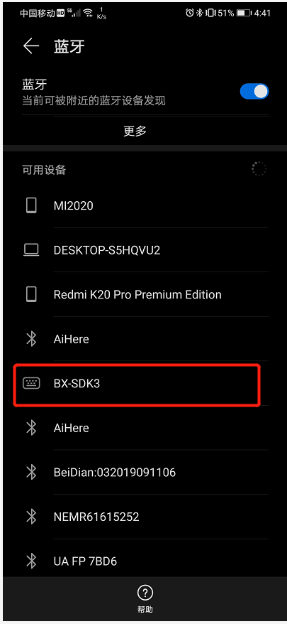
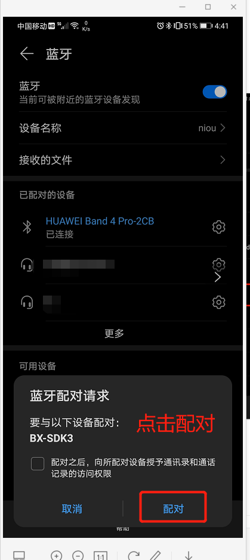
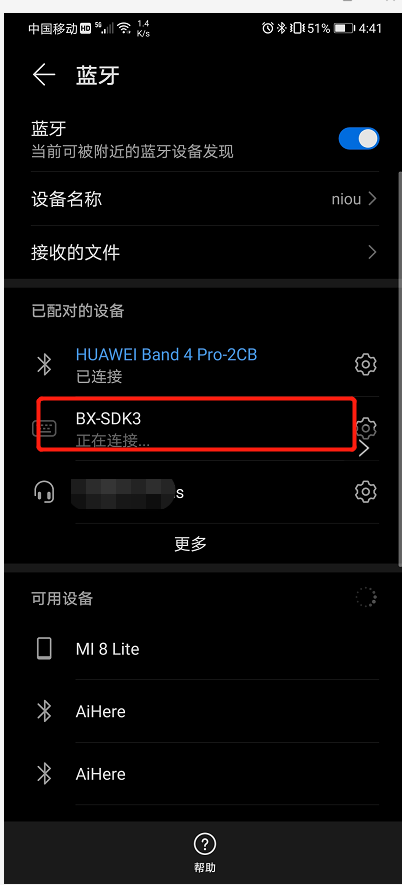
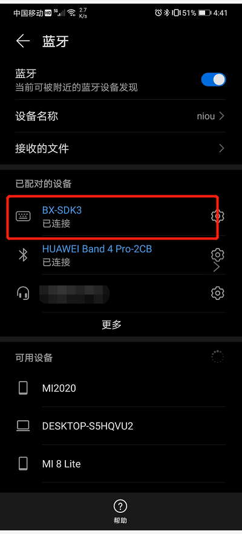

# 绑定配对例程的使用

## 1、概述

​		本文档介绍绑定配对使用。

## 2、工程目录

..\SDK3\examples\demo\bxe_bond\mdk

## 3、添加文件

- bx_kernel.h
- app_hid.h
- app_sec.h
- hogpd.h
- hogpd_task.h

## 4、编写代码

### 4.1 初始化

```c
//在bx_app_config.h文件中定义宏
#define CFG_PRF_HOGPD
```


```c
//添加hid profile
static const appm_add_svc_func_t appm_add_svc_func_list[] = {
    ...
    ( appm_add_svc_func_t )app_hid_add_hids,
};
//初始化hid 相关函数
/** ---------------------------------------------------------------------------
 * @brief   :
 * @note    :
 * @param   :
 * @retval  :
-----------------------------------------------------------------------------*/
void app_on_ble_init( void )
{
    ...
	//绑定初始化函数
    app_sec_init();
    //hid初始化函数
    app_hid_init();
}

```

### 4.2 代码实现

```c
/** ---------------------------------------------------------------------------
 * @brief   :
 * @note    :
 * @param   :
 * @retval  :
-----------------------------------------------------------------------------*/
static int gapc_connection_req_ind_handler( ke_msg_id_t const msgid,
        struct gapc_connection_req_ind const * param,
        ke_task_id_t const dest_id,
        ke_task_id_t const src_id )
{
    app_env.conidx = KE_IDX_GET( src_id );

    if ( app_env.conidx != GAP_INVALID_CONIDX ) {
        app_env.conhdl = param->conhdl;

        LOG_I( "gapc_connection_req_ind_handler" );

        // Clear the advertising timeout timer
        if ( ke_timer_active( APP_ADV_TIMEOUT_TIMER, TASK_APP ) ) {
            ke_timer_clear( APP_ADV_TIMEOUT_TIMER, TASK_APP );
        }

        struct gapc_connection_cfm * cfm = KE_MSG_ALLOC( GAPC_CONNECTION_CFM,
                                           KE_BUILD_ID( TASK_GAPC, app_env.conidx ), TASK_APP,
                                           gapc_connection_cfm );

//        秘钥参数配置
        cfm->auth      = app_sec_get_bond_status() ? GAP_AUTH_REQ_NO_MITM_BOND : GAP_AUTH_REQ_NO_MITM_NO_BOND;
        ke_msg_send( cfm );
		//若是未绑定过设备，请求绑定，交换秘钥
        if ( app_sec_get_bond_status() == false ) {
            //Ask for the peer device to either start encryption
            app_sec_send_security_req( app_env.conidx );

        }
    } else {
        app_on_ble_connect_fail();
    }

    return ( KE_MSG_CONSUMED );
}

```

```c
//添加sec以及hogpd handler
/** ---------------------------------------------------------------------------
 * @brief   :
 * @note    :
 * @param   :
 * @retval  :
-----------------------------------------------------------------------------*/
static int msg_default_handler( ke_msg_id_t const msgid,
                                void * param,
                                ke_task_id_t const dest_id,
                                ke_task_id_t const src_id )
{
    ke_task_id_t src_task_id = MSG_T( msgid );
    uint8_t msg_pol          = KE_MSG_CONSUMED;

    switch ( src_task_id ) {

        case TASK_ID_DISS:
            msg_pol = appm_get_handler( &app_dis_table_handler, msgid, param, src_id );
            break;

        case ( TASK_ID_GAPC ): {

            if ( ( msgid >= GAPC_BOND_CMD ) &&
                 ( msgid <= GAPC_SECURITY_IND ) ) {
                // Call the Security Module
                msg_pol = appm_get_handler( &app_sec_table_handler, msgid, param, src_id );
            }

        }
        break;

        case ( TASK_ID_HOGPD ): {
//            LOG_I("###################Call the Security Module\r\n");
            msg_pol = appm_get_handler( &app_hid_table_handler, msgid, param, src_id );
        }
        break;


        default:


            break;
    }
    return ( msg_pol );
}
```


## 5、功能演示

### 5.1 按照第4章代码实现

### 5.2 编译文件，然后烧录文件

### 5.3 演示结果

搜索到名称为 BX_SDK3 设备，点击连接

 

 

 

 

## 附录

```c
//app_sec处理绑定配对api交互，以下是对该文档中函数说明

//初始化绑定配对信息，判断设备是否已绑定
void app_sec_init(void)

//清除秘钥
void app_sec_remove_bond( void )
    
//保存秘钥
void app_sec_bond_data_save( void * data )

//更新连接参数
void app_sec_update_param( void * data )
    
//秘钥交互请求
void app_sec_send_security_req( uint8_t conidx )
    
//绑定参数配置设置
static int gapc_bond_req_ind_handler( ke_msg_id_t const msgid,
                                      struct gapc_bond_req_ind const * param,
                                      ke_task_id_t const dest_id,
                                      ke_task_id_t const src_id )
    
//绑定交互处理
static int gapc_bond_ind_handler( ke_msg_id_t const msgid,
                                  struct gapc_bond_ind const * param,
                                  ke_task_id_t const dest_id,
                                  ke_task_id_t const src_id )
    
//秘钥配置
static int gapc_encrypt_req_ind_handler( ke_msg_id_t const msgid,
        struct gapc_encrypt_req_ind const * param,
        ke_task_id_t const dest_id,
        ke_task_id_t const src_id )
    
//秘钥交互处理
static int gapc_encrypt_ind_handler( ke_msg_id_t const msgid,
                                     struct gapc_encrypt_ind const * param,
                                     ke_task_id_t const dest_id,
                                     ke_task_id_t const src_id )
    
    
//其他消息
static int app_sec_msg_dflt_handler( ke_msg_id_t const msgid,
                                     void * param,
                                     ke_task_id_t const dest_id,
                                     ke_task_id_t const src_id )
    
//交互返回事件
static void app_gapm_cmp_evt_handler( ke_msg_id_t const msgid, struct gapm_cmp_evt const * param, ke_task_id_t const dest_id, ke_task_id_t const src_id )
    
//断连事件
static int gapc_disconnect_ind_handler( ke_msg_id_t const msgid,
                                        struct gapc_disconnect_ind const * param,
                                        ke_task_id_t const dest_id,
                                        ke_task_id_t const src_id )
```


