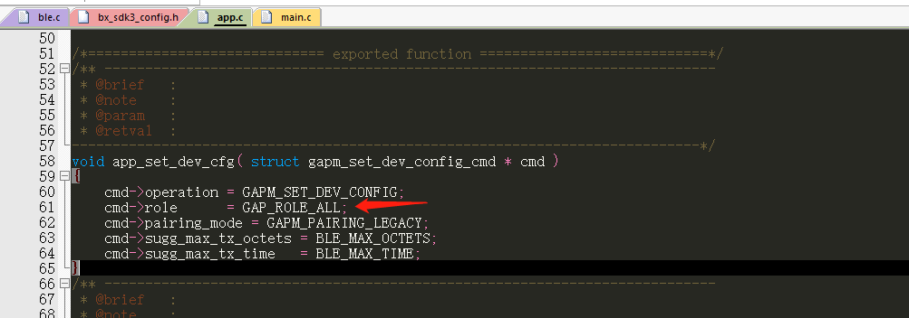
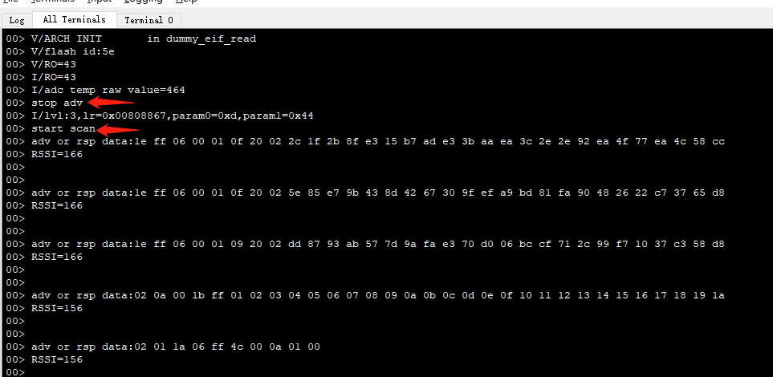

# 主从一体说明

## 1、概述

本章节主要讲述如何把工程配置成主从一体使设备可以发起广播也可以开启扫描


## 2、功能实现

想要配置成主从一体，首先需要配置设备的角色，找到app.c文件，在里面找到app_set_dev_cfg函数，把角色设置为all，这样就可以支持主从一体，如下所示

 


这样配置之后代码就同时支持主机和从机了


下面添加一些测试代码，方便演示主机和从机的功能，如下所示

在app.h中定义如下    

```c
enum user_msg_app {
    USM_APP_FIRST = BXM_FIRST_USER_MSG,
	USM_APP_STOP_ADV,
	USM_APP_START_SCAN
	};   
```
 

在app_init函数中添加如下

```c
/** ---------------------------------------------------------------------------
@brief   :
@note    :
@param   :
@retval  :
-----------------------------------------------------------------------------*/
void app_init( void )
{
 struct bx_service svc;
 svc.prop_set_func = NULL;
 svc.prop_get_func = NULL;
 svc.msg_handle_func = user_msg_handle_func;
 svc.name = "user service";
 user_service_id = bx_register( &svc );


 bx_defer( user_service_id, USM_APP_STOP_ADV, 0, 0, 10000 );

}
```


实现用户处理函数user_msg_handle_func

```c
/** ---------------------------------------------------------------------------

@brief   :

@note    :

@param   :

@retval  :
-----------------------------------------------------------------------------*/
bx_err_t user_msg_handle_func( s32 svc, u32 msg, u32 param0, u32 param1 )
{
 s32 msg_src = bx_msg_source();
 if( msg_src == user_service_id ) {
     switch( msg ) {
         case USM_APP_STOP_ADV:
             ble_advertising_stop();
             bx_defer( user_service_id, USM_APP_START_SCAN, 0, 0, 1000 );
             break;
         case USM_APP_START_SCAN:
             app_ble_scan();
             break;
     default:
         break;
 }

 }
 return BX_OK;
}
```

代码整个功能是上电默认开启广播，10s后关掉广播，1s之后开启扫描；扫描函数不了解请参考scan相关文档


## 3、功能验证


1、广播信号可以使用手机下载nrfconnect软件查看信号，这里名称是BX-SDK3

2、scan是否成功运行，可以看到RTT viewer的log，停止广播开启扫描之后，扫描到的广播和scan_rsp以及rssi数据，如下图所示

 


