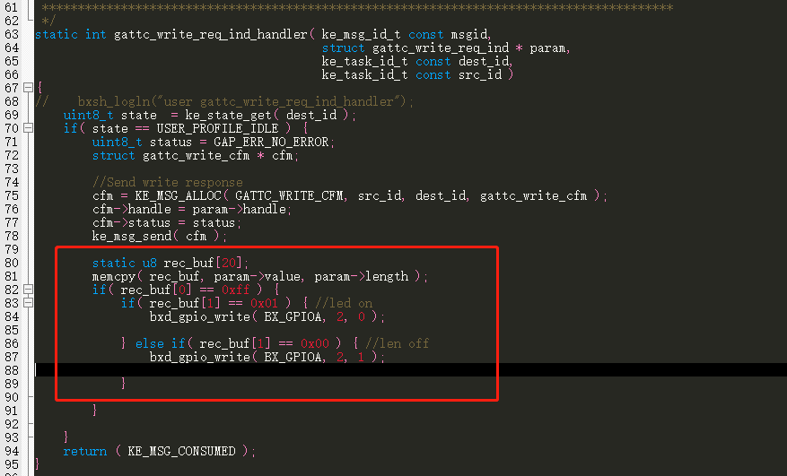
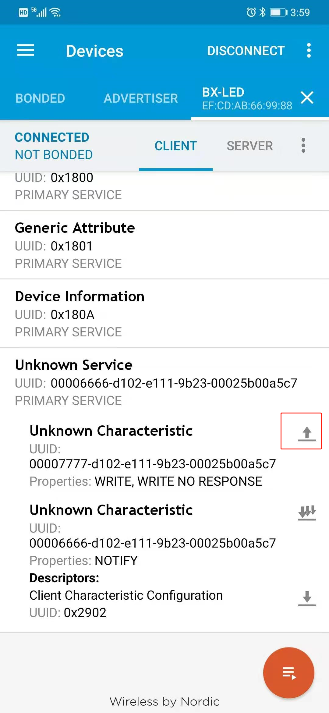
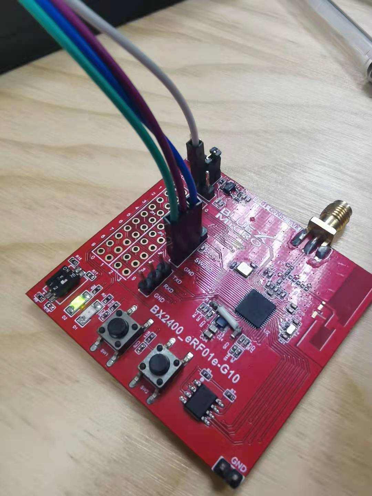

# ble控制点灯

## 1、概述

本章节主要讲述了如何在一个基础工程上新增一个profile，来实现手机通过ble控制点灯

## 2、代码实现

首先想要实现通过手机app控制led开关，首先需要一个用户自己的profile，添加profile不在这里说明，不熟悉的可以参考添加profile的相关文档

首先在app.c的app_init()中实现led所在io的初始化

```C
/** ---------------------------------------------------------------------------
@brief   :
@note    :
@param   :
@retval  :
-----------------------------------------------------------------------------*/
void app_init( void )
{

 bxd_gpio_open(BX_GPIOA);
 bxd_gpio_set_mode( BX_GPIOA, 2, BX_GPIO_MODE_OUTPUT );
 bxd_gpio_write(BX_GPIOA,2 ,1);

}
```

如上所示，将gpio2设置为输出高电平，这里使用RF01 evk作为演示，led低电平驱动

找到user_profile_task.c文件，找到里面的写回调函数gattc_write_req_ind_handler，手机发送给ble的数据在里面接收

在函数里面添加如下代码

 


到这里，代码已经添加完毕

## 3、功能验证

编译代码，将烧录文件烧录到evk中，可以看到广播信号，BX-LED，连接上如图所示点击uuid为6666的service可以看到write通道，

使用这一通道下发数据到ble设备端

 


点击上图中红色框中的地方，会弹出发送数据框，输入十六进制的FF01点亮LED

 


写入数据FF00会关掉LED