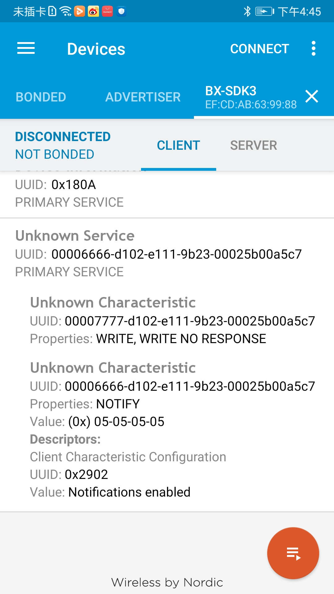
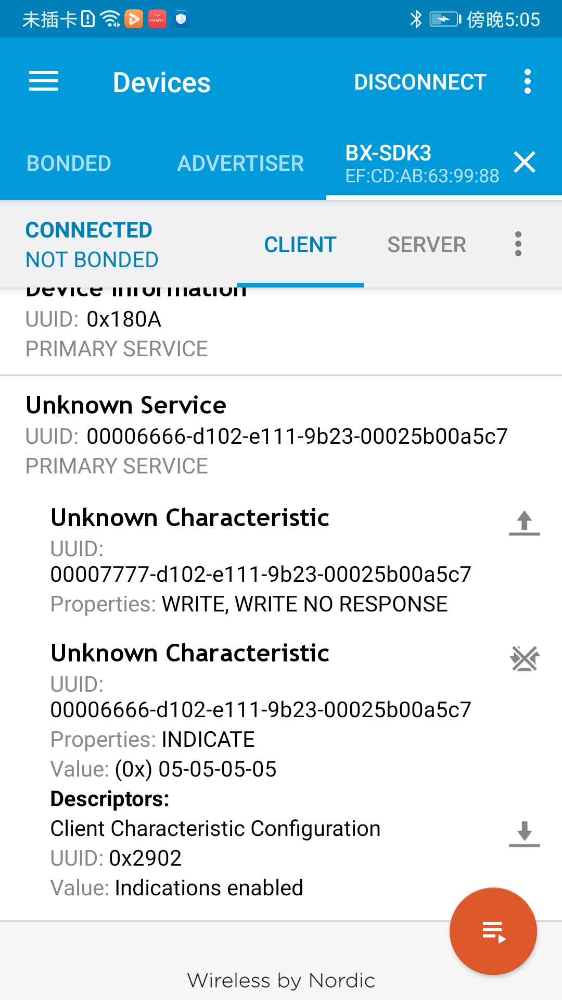
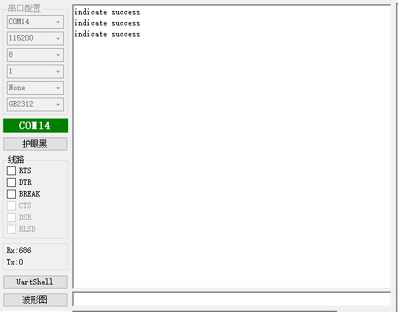

# 1.概述

​		本文档以一个自定义profile来介绍notify、indicate的使用，打开SDK3/examples/demo路径下的ble_report工程

## 注：

​	本例程需要根据文档说明先添加一个自定义的profile

# 2.NOTIFY

## 2.1 功能代码

在ble.c中

添加ble_send_data_notify()函数；代码示例如下：

```c
void ble_send_data_notify(u8 *data,u8 length,u16 handle)
{
    struct gattc_send_evt_cmd * notify_cmd = KE_MSG_ALLOC_DYN( GATTC_SEND_EVT_CMD,
											TASK_GATTC, TASK_APP,
											gattc_send_evt_cmd,length);

    static u16 notify_seq_num = 0;
    notify_cmd->operation = GATTC_NOTIFY;
    notify_cmd->seq_num = notify_seq_num++;
    notify_cmd->length = length;
    notify_cmd->handle = handle;
    
    memcpy( notify_cmd->value,data, length );
    	
    ke_msg_send( notify_cmd );
}
```

在user_profile.c中

需要将特征值改为INDICATE；代码示例如下：

```c
[PTS_SVC_IDX_TX_VAL] = {

    .uuid = PTS_SVC_TX_CHAR_UUID_128,
    .perm = PERM(NTF,ENABLE),		//改为NOTIFY使能
    .max_size = PTS_SVC_TX_BUF_SIZE,
    .ext_perm = PERM(UUID_LEN,UUID_128)|PERM(RI,ENABLE),
},
```

在app.c中

app_init()里的代码；代码示例如下：

```c
void app_init( void )
{
    bx_dwork(send_data,NULL,5000,-1);	//每隔5s调用bx_work函数
}
```

send_data()里的代码；代码示例如下：

```c
void send_data(void *arg)
{
    static u8 data[4];
    static u8 notify_data;    
    for(u8 i=0;i<4;i++){
        data[i] = notify_data;	
    }
    ble_send_data_notify(data,4,30);	//把数据发送到手机端
    if(notify_data == 5){
        bx_dwork_cancel(send_data);		//取消该定时函数
    }
    notify_data++;
}
```


## 注：

ble_send_data_notify()需要在头文件定义

## 2.2 功能演示

将代码编译通过后烧录到设备，连接设备蓝牙后，在手机上的nrf软件查看可以发现数据已经上传到手机了



# 3.INDICATE

## 3.1功能代码

在ble.c中

添加ble_send_data_indicate()函数；代码示例如下：

```c
void ble_send_data_indicate(u8 *data,u8 length,u16 handle)
{
    struct gattc_send_evt_cmd * indicate_cmd = KE_MSG_ALLOC_DYN( GATTC_SEND_EVT_CMD,
											TASK_GATTC, TASK_APP,
											gattc_send_evt_cmd,length);

    static u16 notify_seq_num = 0;
    indicate_cmd->operation = GATTC_INDICATE;
    indicate_cmd->seq_num = notify_seq_num++;
    indicate_cmd->length = length;
    indicate_cmd->handle = handle;
    
    memcpy( indicate_cmd->value,data, length );
    	
    ke_msg_send( indicate_cmd );

}
```


```c
static int gattc_cmp_evt_handler( ke_msg_id_t const msgid, struct gattc_cmp_evt const * param,ke_task_id_t const dest_id, ke_task_id_t const src_id )
{
    if(param->operation == GATTC_INDICATE){
        bx_logln("indicate success");	//判断indicate是否被成功接收，indicate被成功接收则会打印串口信息
    }
    return ( KE_MSG_CONSUMED );
}
```

在user_profile.c中

需要将特征值改为INDICATE；代码示例如下：

```c
[PTS_SVC_IDX_TX_VAL] = {

    .uuid = PTS_SVC_TX_CHAR_UUID_128,
    .perm = PERM(IND,ENABLE),		//改为INDICATE使能
    .max_size = PTS_SVC_TX_BUF_SIZE,
    .ext_perm = PERM(UUID_LEN,UUID_128)|PERM(RI,ENABLE),
},
```
app_init()里的代码；代码示例如下：

```c
void app_init( void )
{
    bx_dwork(send_data,NULL,5000,-1);	//每隔5s调用bx_work函数
}
```

send_data()里的代码；代码示例如下：

```c
void send_data(void *arg)
{
    static u8 data[4];
    static u8 notify_data;    
    for(u8 i=0;i<4;i++){
        data[i] = notify_data;	
    }
    ble_send_data_indicate(data,4,30);	//把数据发送到手机端
    if(notify_data == 5){
        bx_dwork_cancel(send_data);		//取消该定时函数
    }
    notify_data++;
}
```


## 注：

ble_send_data_indicate()需要在头文件定义

## 3.2 功能演示

将代码编译通过后烧录到设备，连接设备蓝牙后，在手机上的nrf软件查看可以发现数据已经上传到手机了，同时串口也打印接收成功的信息



