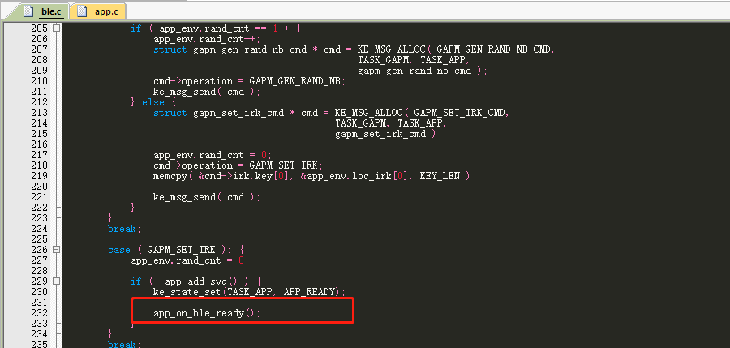
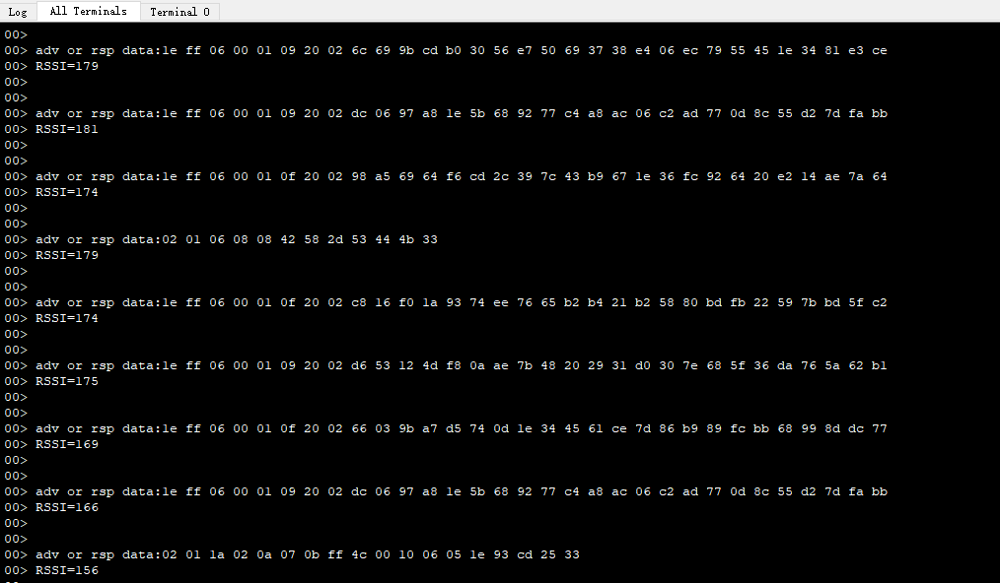

# ble_scan的使用说明

## 1、概述

本文档旨在说明ble的主机如何使用scan功能来找到广播并获取到相关广播数据


## 2、功能实现

本例子实现功能为上电开启扫描，并通过rtt viewer输出log数据包括adv和scan data以及rssi

1、首先找到app.c文件，找到里面的app_on_ble_ready函数，在函数里面添加如下代码

```c
#define DEFAULT_SCAN_OPCODE     GAPM_SCAN_ACTIVE
#define DEFAULT_SCAN_ADDR       GAPM_STATIC_ADDR
#define DEFAULT_SCAN_INTV       160 //unit is 0.625ms  48*0.625=30(ms)
#define DEFAULT_SCAN_WINDOW     80  //unit is 0.625ms
#define DEFAULT_SCAN_MODE       GAP_OBSERVER_MODE
#define DEFAULT_SCAN_FILTER_DUPLIC     SCAN_FILT_DUPLIC_DIS
#define DEFAULT_SCAN_FILT_POLICY       SCAN_ALLOW_ADV_ALL


/** ----------------------"vco restore to modem\n"-----------------------------------------------------
@brief   :
@note    :
@param   :
@retval  :
-----------------------------------------------------------------------------*/
void app_on_ble_ready( void )
{
 struct gapm_start_scan_cmd app_scan_param;
 app_scan_param.op.code = DEFAULT_SCAN_OPCODE;
 app_scan_param.op.addr_src = DEFAULT_SCAN_ADDR;
 app_scan_param.interval = DEFAULT_SCAN_INTV;
 app_scan_param.window = DEFAULT_SCAN_WINDOW;
 app_scan_param.mode = DEFAULT_SCAN_MODE;
 app_scan_param.filter_duplic = DEFAULT_SCAN_FILTER_DUPLIC; //filtering rule
 app_scan_param.filt_policy = DEFAULT_SCAN_FILT_POLICY;

 ble_scan_start( &app_scan_param );
}
```

需添加的头文件有

#include "gapm_task.h"


app_on_ble_ready函数会在ble.c中调用

 


添加scan的回调函数在app.c中，如下所示

```c
int app_on_scan_adv_report( ke_msg_id_t const msgid, adv_report_t const * param, ke_task_id_t const dest_id, ke_task_id_t const src_id )
{

 LOG_RAW( "adv or rsp data:" );
 for( u8 i = 0; i < param->data_len; i++ ) {
	LOG_RAW("%02x ", param->data[i]);

 }
LOG_RAW("\r\nRSSI=%u\r\n",param->rssi);
 LOG_RAW( "\r\n\r\n" );

 return ( KE_MSG_CONSUMED );
}
```

记得在头文件app.h中添加包含函数


把函数加入到ble.c的调度列表中

```c
const struct ke_msg_handler appm_default_state[] = {
    ...

​	...

​	{GAPM_ADV_REPORT_IND,       ( ke_msg_func_t )app_on_scan_adv_report},

​	...

};
```


## 3、功能验证

编译代码，烧录固件到开发板中，使用jlink rtt viewer连接设备可以看到如下信息打印


 

