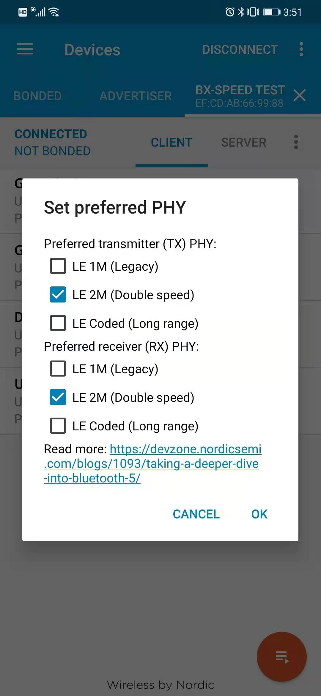

# ble速率测试说明

## 1、概述

本章节主要说明如何使用ble_speed_test工程来测试ble的传输速率

## 2、操作、测试

因为本工程是提供给大家测试使用，代码不多介绍，主要教如何测试速率

- 编译工程，编译成功后把烧录文件烧录到开发板中，使用jlink RTT Viewer连接板子可以看到如下情况

 

- 打开手机中的nrf_connect,搜索对应的名称，这里是BX-SPEED_TEST

  

- 点击连接，设置mtu为247

       

设置好之后，找到service开头为00006666的服务，点开，找到里面的写通道，写入命令0x0f可以看到rtt viewer上面的速率变化

 

在把连接间隔设置成如下所示

       

可以看到速率再一次提升

 

最后设置ble设备的phy速率为2mbps,可以看到速率达到最大

     

 