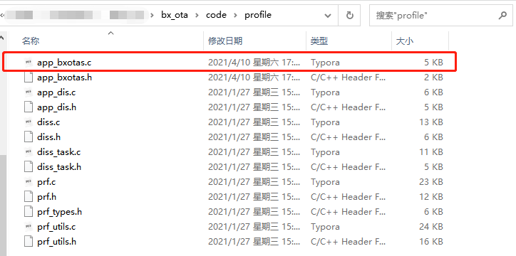
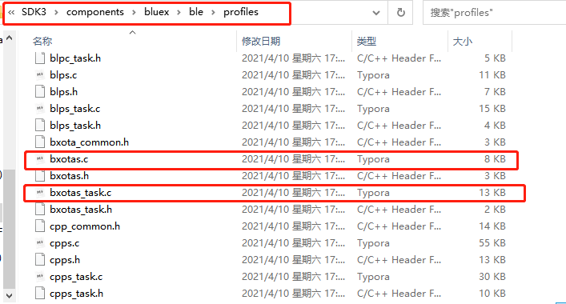
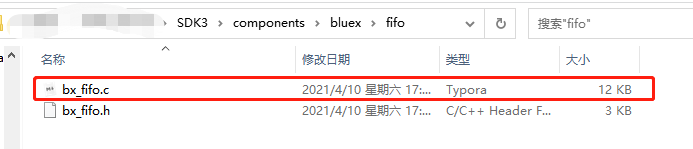
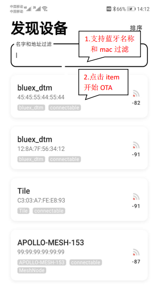
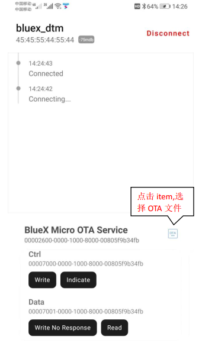
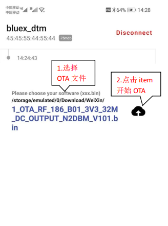
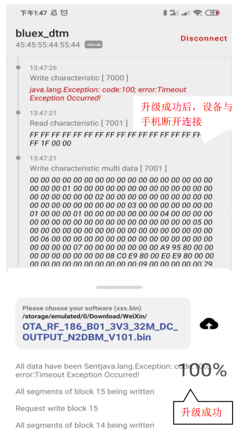

# OTA的使用

## 1.概述

​		本文档介绍添加OTA功能和OTA使用说明

## 2.代码实现

### 2.1 工程目录

SDK3/examples/demo/bx_ota/mdk

### 2.2 文件添加

添加工程目录下文件app_bxotas.c文件：



添加目录下bxotas.c和bxotas_task.c文件：



添加目录下bx_fifo.c文件



### 2.3 OTA代码编写

在bx_app_config.h中，添加以下三个宏定义：

```c
#define CFG_PRF_DISS
#define CFG_APP_DIS
#define CFG_PRF_BXOTAS
```

在app.c中：

```c
static const appm_add_svc_func_t appm_add_svc_func_list[] = {
    (appm_add_svc_func_t)app_dis_add_dis,
    (appm_add_svc_func_t)app_bxotas_add_ota		//列表里添加OTA服务
};
```

```c
void app_on_ble_init( void )
{
    app_dis_init();
    app_bxotas_init();		//OTA初始化
}
```

注：需要添加头文件app_bxotas.h


在ble.c中：

```c
static int gapm_profile_added_ind_handler( ke_msg_id_t const msgid,
        struct gapm_profile_added_ind * param,
        ke_task_id_t const dest_id,
        ke_task_id_t const src_id )
{

    uint8_t state = ke_state_get( dest_id );
    
    if ( state == APP_CREATE_DB ) {
    	if( param->prf_task_id == TASK_ID_BXOTAS ) {
            app_bxotas_config();	//对OTA功能的配置
        }
    } else {
        ASSERT_INFO( 0, state, src_id );
    }
    return KE_MSG_CONSUMED;

}
```

```c
static int msg_default_handler( ke_msg_id_t const msgid,
                                void * param,
                                ke_task_id_t const dest_id,
                                ke_task_id_t const src_id )
{
    ke_task_id_t src_task_id = MSG_T( msgid );
    uint8_t msg_pol          = KE_MSG_CONSUMED;

    switch ( src_task_id ) {
        
        case TASK_ID_DISS:
            msg_pol = appm_get_handler(&app_dis_table_handler, msgid, param, src_id);
            break;
        case TASK_ID_BXOTAS:
            msg_pol = appm_get_handler(&app_bxotas_table_handler, msgid, param, src_id);	
            break;
        default:
            break;
    }
    return ( msg_pol );

}
```

注：需要添加头文件app_bxotas.h

### 2.4 OTA使用

代码编译通过后，烧录到开发板，打开手机蓝牙，使用BLETools APP(AN_RF特性量测_DTM_by_OTA-V1.2.pdf)扫描设备，选择开发板进行连接



OTA与开发板连接成功后，可进行OTA升级相关参数设置：



选择OTA文件路径后点击升级：



开发板固件升级成功后，开发板与手机自动断开连接：

