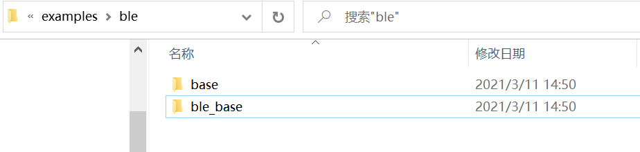
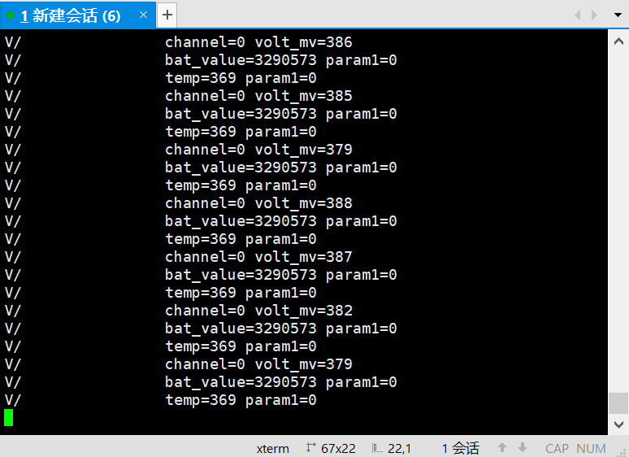

# 用库函数的方式介绍ADC的使用

## 1、概述

本文档使用库函数的方式介绍ADC的使用和功能，包括普通IO电压获取、电池电压、温度获取。

## 2、新建工程

1、新建工程，首先复制下图工程：



3、修改文件名为bxd_adc,将工程名修改为bxd_adc

4、打开工程添加文件

- bxd_adc.c
- bx_pm.h
- plf.h

## 3、编写代码

注意：要关掉休眠，将bx_sdk_config.h的BX_DEEP_SLEEP宏定义改成0。

```c
u32 bat_value;
u32 volt_mv;
u32 temp;
void app_init()
{
    	//启动adc基础驱动
		bx_pm_lock(BX_PM_ADC);/**/
		bxd_adc_open(BX_ADC);/**/
    
    	//没隔500ms获取一次IO电压、电池电压、温度，并输出
       bx_dwork(get_adc,NULL,500,BX_FOREVER);
}
void get_adc(void* arg)
{
    bxd_adc_get_volt(BX_ADC,0,&volt_mv);
    bx_logln("channel=%d volt_mv=%d\t",0,volt_mv);
    bxd_adc_get_battery(BX_ADC,&bat_value);
    bx_logln("bat_value=%d param1=%d\t",bat_value,0);
    bxd_adc_get_chip_temperature(BX_ADC,&temp);
    bx_logln("temp=%d param1=%d\t",temp,0);
    BX_DELAY_US(500000);
}
```

注意要在app.h中定义void get_adc(void* arg)该函数

## 4、功能演示

获取IO电压值、电池电压值、温度值

- 按照第三章3.1、3.2代码实现
- 编译文件，然后烧录文件
- 演示结果

volt_mv是IO电压值，bat_value是电池电压值，temp是温度值

