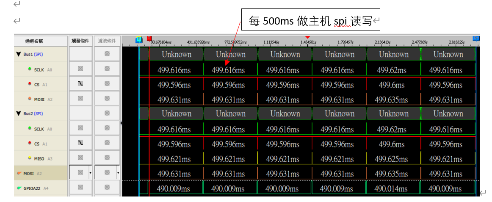
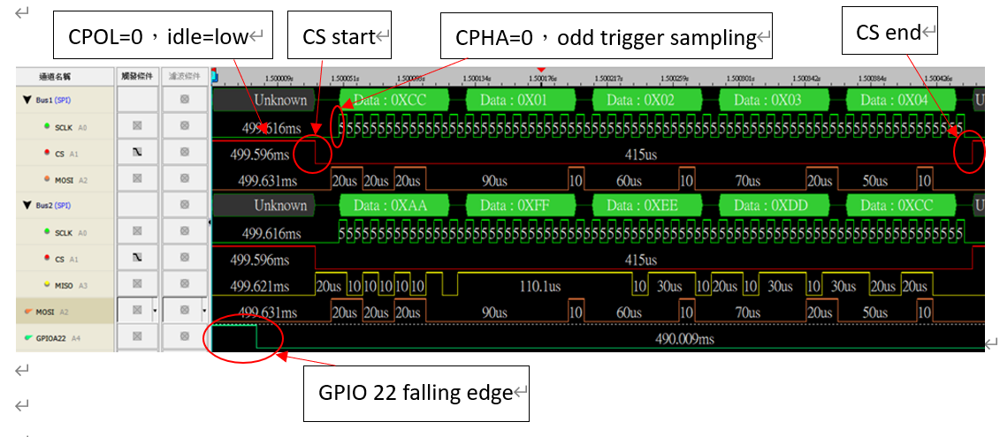
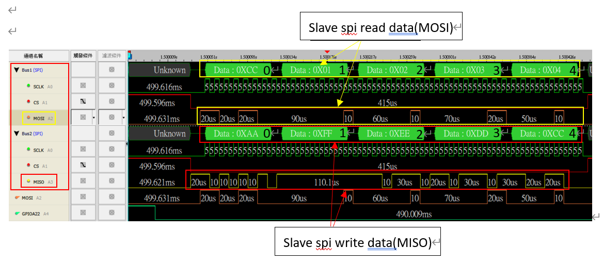
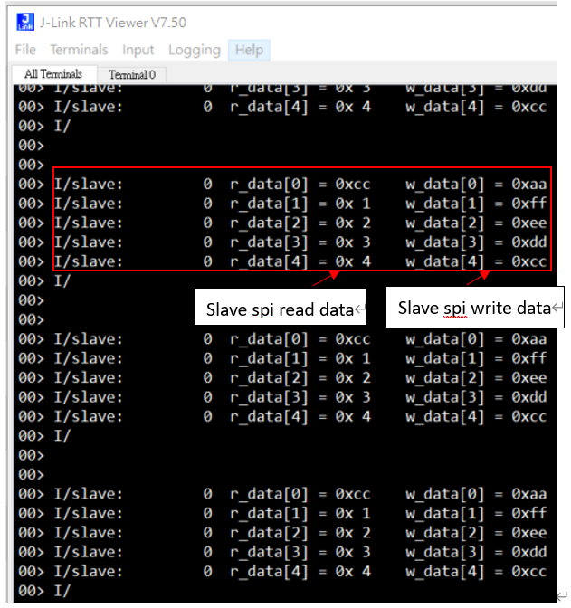

# spi主从搭配【从机例程】使用说明

## 1、概述

​		本文檔介紹spi從機功能例程，采用典型的中断方式进行data收發，此例程需與bxd_spim_intr搭配使用，需要準備兩塊開發板，一塊用作主機，另一塊用作從機。
 主要的设计思路为，上电后由从机每500ms发起GPIO22 10ms高电平的下降缘触发给主机，主机在GPIO外部中断函数做主机的spi读写从机，spi主机信号传递到从机，做从机的spi读写主机。

## 2、工程目录

..\SDK3\examples\demo\bxd_spis_intr\mdk

## 3、添加文件

- bxd_spis.h , bxd_spis.c

## 4、编写代码

### 4.1 初始化

app.h

```c
	#define	SPI_FIFO_DEPTH	2//spi 深度
```

app.c
	
```c
	uint8_t s_tx_len = 0;//spi tx 长度
	uint8_t s_rx_len = 0;//spi rx 长度
	uint8_t * s_p_tx_buff = 0;//spi tx buffer
	uint8_t * s_p_rx_buff = 0;//spi rx buffer

	struct user_service us_svc = {0};

	u8 w_data[5] = {0xAA, 0x22, 0x33, 0x44, 0x55}; //slave spi tx data
	u8 w_data1[5] = {0xAA, 0xBB, 0xCC, 0xDD, 0xEE};//slave spi tx data
	u8 r_data[5] = {0};			//slave spi rx data , feedback from master
	static bool send_flag = false;
	u32 tx_rx_count = 0;
```

### 4.2 app.c文件实现spi中断使用

```c
	//spi tx/rx fifo 深度
	void spis_fifo_depth( void )
	{
		BX_MODIFY_REG( BX_SPIS->TXFTL, SPIS_TXFTL_VAL, ( uint32_t ) ( SPI_FIFO_DEPTH / 2 ) );
		BX_MODIFY_REG( BX_SPIS->RXFTL, SPIS_RXFTL_VAL, ( uint32_t ) ( SPI_FIFO_DEPTH / 2 ) );
	}
	//slave spi中断mask
	void spis_intr_mask( void )
	{
		BX_SET_BIT( BX_SPIS->IM, SPIS_IM_MMC );
		BX_SET_BIT( BX_SPIS->IM, SPIS_IM_RFF ); //Receive FIFO Full Interrupt Mask
		BX_SET_BIT( BX_SPIS->IM, SPIS_IM_RFO );
		BX_SET_BIT( BX_SPIS->IM, SPIS_IM_RFU );
		BX_SET_BIT( BX_SPIS->IM, SPIS_IM_TFO );
		BX_SET_BIT( BX_SPIS->IM, SPIS_IM_TFE ); //Transmit FIFO Empty Interrupt Mask
	}

	//slave spi 初始化
	void spis_init( void )
	{
		NVIC_DisableIRQ( SPIS_IRQn );       //disable interrupt

		bxd_spis_open( BX_SPIS ); //初始化spis
		bxd_spis_set_data_bit( BX_SPIS, BX_SPI_DATA_BIT_8B ); //spi数据位，此处为8bit
		bxd_spis_set_cs_pin( BX_SPIS, 3 ); //设置设备上与片选引脚与之对应的引脚( 3->cs0 2->cs1 )


		spis_fifo_depth();
		spis_intr_mask();

		/*the last step*/
		NVIC_ClearPendingIRQ( SPIS_IRQn );  //clear  interrupt
		NVIC_EnableIRQ( SPIS_IRQn );        //enable interrupt
	}

	//slave spi tx
	bx_err_t spis_transmit_data( uint8_t * pbuff, uint32_t len )
	{
		s_tx_len = len;
		s_p_tx_buff = pbuff;

		/*open clock gate*/
		BX_PER->CLKG0 |= PER_CLKG0_32M_SET_SPIS;
		BX_PER->CLKG0 |= PER_CLKG0_PLL_SET_SPIS;

		BX_MODIFY_REG( BX_SPIS->CTRL, SPIS_CTRL_TM, SPIS_CTRL_TM_T_TX ); //Transmit Only

		/*start transfer*/
		BX_SET_BIT( BX_SPIS->IM, SPIS_IM_TFE  );  //Transmit FIFO Empty Interrupt Mask

		/*set ssie enable*/
		BX_SET_BIT( BX_SPIS->SSIE, SPIS_SSIE_BIT );

		return BX_OK;
	}
	//slave spi rx
	bx_err_t spis_receive_data( uint8_t * pbuff, uint32_t len )
	{

		s_rx_len = len;
		s_p_rx_buff = pbuff;


		/*open clock gate*/
		BX_PER->CLKG0 |= PER_CLKG0_32M_SET_SPIS;
		BX_PER->CLKG0 |= PER_CLKG0_PLL_SET_SPIS;

		BX_MODIFY_REG( BX_SPIS->CTRL, SPIS_CTRL_TM, SPIS_CTRL_TM_T_RX ); //Receive Only

		BX_SET_BIT( BX_SPIS->IM, SPIS_IM_TFE  ); //Transmit FIFO Empty Interrupt Mask
		BX_SET_BIT( BX_SPIS->IM, SPIS_IM_RFF  ); //Receive FIFO Full Interrupt Mask

		/*set ssie enable*/
		BX_SET_BIT( BX_SPIS->SSIE, SPIS_SSIE_BIT );

		return BX_OK;
	}

	//slave spi tx&rx
	bx_err_t spis_transmit_receive_data( uint8_t * tx_pbuff, uint32_t tx_len, uint8_t * rx_pbuff, uint32_t rx_len )
	{

		s_tx_len = tx_len;
		s_p_tx_buff = tx_pbuff;
		s_rx_len = rx_len;
		s_p_rx_buff = rx_pbuff;

		/*open clock gate*/
		BX_PER->CLKG0 |= PER_CLKG0_32M_SET_SPIS;
		BX_PER->CLKG0 |= PER_CLKG0_PLL_SET_SPIS;

		BX_MODIFY_REG( BX_SPIS->CTRL, SPIS_CTRL_TM, SPIS_CTRL_TM_T_TXRX ); //Transmit&Receive


		BX_SET_BIT( BX_SPIS->IM, SPIS_IM_TFE  ); //Transmit FIFO Empty Interrupt Mask
		BX_SET_BIT( BX_SPIS->IM, SPIS_IM_RFF  ); //Receive FIFO Full Interrupt Mask

		/*set ssie enable*/
		BX_SET_BIT( BX_SPIS->SSIE, SPIS_SSIE_BIT );


		return BX_OK;
	}

	/** ---------------------------------------------------------------------------
	 * @brief   :
	 * @note    :
	 * @param   :
	 * @retval  :
	-----------------------------------------------------------------------------*/
	void app_init( void )
	{
		//注册user服务
		struct bx_service svc;
		svc.prop_set_func = NULL;
		svc.prop_get_func = NULL;
		svc.msg_handle_func = user_msg_handle_func;
		svc.name = "user service";
		us_svc.id = bx_register( &svc );
		//slave spi 初始化
		spis_init();
		//setup GPIOA 22 OUTPUT
		bxd_gpio_open( BX_GPIOA );
		bxd_gpio_set_mode( BX_GPIOA, 22, BX_GPIO_MODE_OUTPUT );
		bxd_gpio_write( BX_GPIOA, 22, 0 );
		
		//every 500ms do spis_write_read_data
		bx_dwork( spis_write_read_data, NULL, 500, BX_FOREVER );
		//订阅消息
		bx_subscibe( us_svc.id, BXM_USER_TRANSMIT_DATA, 0, 0 );
		bx_subscibe( us_svc.id, BXM_USER_RECEIVE_DATA_END, 0, 0 );
	}
```
  Bx_dwork每500ms进入spis_write_read_data()发起GPIO 22 10ms高电平的下降缘(持续10ms高电平为方便识别下降缘信号)，
传递给主机的GPIO22触发主机的外部中断。在主机的外部中断回调函数，主机读写从机，再回到spis_write_read_data()，从机读写主机。

```c
	//slave spi tx/rx function
	void spis_write_read_data( void * arg )
	{

		//tx_rx_count++;
		//generate GPIOA 22 falling edge signal to master
		bxd_gpio_write( BX_GPIOA, 22, 1 );
		BX_DELAY_US( 10000 );//10ms high level
		bxd_gpio_write( BX_GPIOA, 22, 0 );//falling edge
		
		//slave write data[1-4]
		w_data[1] = 0xff;
		w_data[2] = 0xee;
		w_data[3] = 0xdd;
		w_data[4] = 0xcc;
		//slave spi tx/rx
		spis_transmit_receive_data( w_data, 5, r_data, 5 );

	}
```
  订阅BXM_USER_RECEIVE_DATA_END消息，在消息处理函数处理BXM_USER_RECEIVE_DATA_END消息，打印从机读写数据。
  
```c
	/** ---------------------------------------------------------------------------
	 * @brief   :
	 * @note    :
	 * @param   :
	 * @retval  :
	-----------------------------------------------------------------------------*/
	bx_err_t user_msg_handle_func( s32 svc, u32 msg, u32 param0, u32 param1 )
	{

		int intRegValue;

		s32 msg_src = bx_msg_source();
		if( msg_src == us_svc.id ) {
			switch( msg ) {
				case BXM_USER_TRANSMIT_DATA: {
				
				}
				break;

				case BXM_USER_RECEIVE_DATA_END: {

					for( u8 i = 0; i < 5; i++ ) {
						LOG_I( "slave:%10u\tr_data[%d] = 0x%2x\t\tw_data[%d] = 0x%2x", tx_rx_count, i, r_data[i], i, w_data[i] );
					}
					LOG_I( "\n\n" );
				}
				break;

				default:
					break;
			}
		}
		return BX_OK;
	}
```

### 4.3 bxd_spis.c文件实现slave spi初始化,TX,RX驱动API

```c
	/** ---------------------------------------------------------------------------
	 * @brief   :
	 * @note    :
	 * @param   :
	 * @retval  :
	-----------------------------------------------------------------------------*/
	//set slave spi cs/clock/mosi/miso pin,CPOL/CPHA/ and communication mode
	bx_err_t bxd_spis_open( void * hdl )
	{
		CHECK_HANDLE( hdl );
		reg_spis_t * BX_SPISx = ( reg_spis_t * )hdl;
		BX_SET_BIT( BX_PER->CLKG0, PER_CLKG0_32M_SET_SPIS );
		BX_SET_BIT( BX_PER->CLKG0, PER_CLKG0_PLL_SET_SPIS);
		//复位
		BX_SET_BIT( BX_PER->SRST, PER_SRST_CLR_SPIS );
		BX_SET_BIT( BX_PER->SRST, PER_SRST_SET_SPIS );


		//引脚配置
		BX_SET_BIT( BX_CPU->PSEN, CPU_PSEN_SPIS );//enable SPI slave
		//P03 slave_cs0,P04 slave_clk P05 slave_miso P06 slave_mosi
		BX_AWO->GPIOIS |= ( GPIO_PIN_3 | GPIO_PIN_4 | GPIO_PIN_5 | GPIO_PIN_6 );//gpio input select.
		BX_AWO->GPIOIE |= ( GPIO_PIN_3 | GPIO_PIN_4 | GPIO_PIN_5 | GPIO_PIN_6 );//gpio input enable.
		//上拉
		BX_AWO->GPIOPS |= ( GPIO_PIN_3 | GPIO_PIN_4 | GPIO_PIN_6 | GPIO_PIN_5 );//gpio pull select.
		BX_AWO->GPIOPE |= ( GPIO_PIN_3 | GPIO_PIN_4 | GPIO_PIN_6 | GPIO_PIN_5 );//gpio pull enable.


		//先关闭
		BX_CLR_BIT( BX_SPISx->SSIE, SPIS_SSIE_BIT );
        //When CPHA = 0, data are captured on the first edge of the serial clock.
		//0: Serial clock toggles in middle of first data bit
		BX_MODIFY_REG( BX_SPISx->CTRL, SPIS_CTRL_SCPH, SPIS_CTRL_SCPH_T_MIDDLE );//CPHA=0
		//0 – Inactive state of serial clock is low
		BX_MODIFY_REG( BX_SPISx->CTRL, SPIS_CTRL_SCPOL, SPIS_CTRL_SCPOL_T_LOW );//CPOL=0		
		BX_MODIFY_REG( BX_SPISx->CTRL, SPIS_CTRL_FF, SPIS_CTRL_FF_T_MOTOROLA_SPI );//00-Motorola SPI

		return BX_OK;
	}
```

### 4.4 bx_apollo00_it.c文件添加中断向量函数

```c
	/** ---------------------------------------------------------------------------
	 * @brief   :
	 * @note    :
	 * @param   :
	 * @retval  :
	-----------------------------------------------------------------------------*/
	static void spis_rx_full_isr( void )//slave spi rx接收中断回调函数
	{
		while( BX_READ_BIT( BX_SPIS->STA, SPIS_STA_RFNE ) >> SPIS_STA_RFNE_POS ) {
			if( BX_READ_BIT( BX_SPIS->CTRL, SPIS_CTRL_DFS32 ) <= SPIS_CTRL_DFS32_T_8_BITS ) {
				*( uint8_t * )s_p_rx_buff = BX_SPIS->DATA;
				s_p_rx_buff += 1;
			} else if( BX_READ_BIT( BX_SPIS->CTRL, SPIS_CTRL_DFS32 ) <= SPIS_CTRL_DFS32_T_16_BITS ) {
				*( uint16_t * )s_p_rx_buff = BX_SPIS->DATA;
				s_p_rx_buff += 2;
			} else {
				*( uint32_t * )s_p_rx_buff = BX_SPIS->DATA;
				s_p_rx_buff += 4;

			}
			--s_rx_len;

			if( s_rx_len == 0 ) {
				break;
			}
		}
		if( s_rx_len > 0 ) {
			BX_SPIS->RXFTL = s_rx_len > SPI_FIFO_DEPTH ? SPI_FIFO_DEPTH / 2 - 1 : s_rx_len - 1;
		} else {
			BX_CLR_BIT( BX_SPIS->SSIE, SPIM_SSIE_BIT );
			bx_public( us_svc.id, BXM_USER_RECEIVE_DATA_END, 0, 0 );
		}
	}
	/** ---------------------------------------------------------------------------
	 * @brief   :
	 * @note    :
	 * @param   :
	 * @retval  :
	-----------------------------------------------------------------------------*/
	static void spis_tx_empty_isr( void )//slave spi tx发送中断回调函数
	{

		if( s_tx_len ) {
			while( BX_READ_BIT( BX_SPIS->STA, SPIS_STA_TFNF ) >> SPIS_STA_TFNF_POS ) {
				if( BX_READ_BIT( BX_SPIS->CTRL, SPIS_CTRL_DFS32 ) <= SPIS_CTRL_DFS32_T_8_BITS ) {
					BX_SPIS->DATA = *( uint8_t * )s_p_tx_buff;
					s_p_tx_buff += 1;
				} else if( BX_READ_BIT( BX_SPIS->CTRL, SPIS_CTRL_DFS32 ) <= SPIS_CTRL_DFS32_T_16_BITS ) {
					BX_SPIS->DATA = *( uint16_t * )s_p_tx_buff;
					s_p_tx_buff += 2;
				} else {
					BX_SPIS->DATA = *( uint32_t * )s_p_tx_buff;
					s_p_tx_buff += 4;

				}
				--s_tx_len;

				if( s_tx_len == 0 ) {
					BX_MODIFY_REG( BX_SPIS->TXFTL, SPIS_TXFTL_VAL, ( uint32_t ) 0 );
					BX_SET_BIT( BX_SPIS->IM, SPIS_IM_TFE );					
					break;
				}
			}
		} else {
			if( BX_READ_REG( BX_SPIS->TXFL ) ) {
				BX_MODIFY_REG( BX_SPIS->TXFTL, SPIS_TXFTL_VAL, ( uint32_t ) 0 );
			} else {
				BX_CLR_BIT( BX_SPIS->IM, SPIS_IM_TFE );
				if( BX_READ_BIT( BX_SPIS->CTRL, SPIS_CTRL_TM ) == SPIS_CTRL_TM_T_TX ) {
					while( BX_READ_BIT( BX_SPIS->STA, SPIS_STA_BUSY ) == 1 ) {
						BX_CLR_BIT( BX_SPIS->SSIE, SPIS_SSIE_BIT );
					}
				   
				}
			}
		}
	}

	/*========================= end of private function ==========================*/

	/*============================ interrupt function ============================*/
	/** ---------------------------------------------------------------------------
	 * @brief   :
	 * @note    :
	 * @param   :
	 * @retval  :
	-----------------------------------------------------------------------------*/
	void SPIS_IRQHandler( void )//slave spi interrupt handler
	{
		{
			uint32_t irq_stat = BX_SPIS->IS;

			if( irq_stat == 0 ) {
				return;
			}
			if( irq_stat & SPIS_IS_MMC ) {
				BX_READ_REG( BX_SPIS->MMIC );
				LOG_W( "SPIS_IS_MMC\n" );
			}
			if( irq_stat & SPIS_IS_RFF ) {
				spis_rx_full_isr();//slave spi rx接收中断回调函数
			}
			if( irq_stat & SPIS_IS_RFO ) {
				BX_READ_REG( BX_SPIS->RXFOIC );
				LOG_W( "SPIS_IS_RFO\n" );
			}
			if( irq_stat & SPIS_IS_RFU ) {
				BX_READ_REG( BX_SPIS->RXFUIC );
				LOG_W( "SPIS_IS_RFU\n" );
			}
			if( irq_stat & SPIS_IS_TFE ) {
				spis_tx_empty_isr();//slave spi tx发送中断回调函数
			}
			if( irq_stat & SPIS_IS_TFO ) {
				BX_READ_REG( BX_SPIS->TXFOIC );
				LOG_W( "SPIS_IS_TFO\n" );
			}
		}
		if( BX_READ_BIT( BX_SPIS->SSIE, SPIS_SSIE_BIT ) == 0 ) {
			BX_PER->CLKG0 &= ~PER_CLKG0_32M_SET_SPIS;
			BX_PER->CLKG0 &= ~PER_CLKG0_PLL_SET_SPIS;
		}
	}
```


## 5、演示结果:
1.硬件: 
	将主从两开发板的CS/clk/miso/mosi及GPIO22互连。
2.软件:
	搭配bxd_spim_intr例程,从机每500ms呼叫spis_write_read_data 函数
GPIO22输出下降缘触发主机GPIO22外部下降缘中断，在主机例程的GPIO中断回调函数gpio_callback里的 spim_transmit_receive_data( w_data, 5, r_data, 5 )函数做spi主机读写，
再回到从机例程spis_write_read_data 函数里的 spis_transmit_receive_data( w_data, 5, r_data, 5 )函数做spi从机读写。

### 5.1 按照第4章编写代码并烧录

### 5.2 编译文件，然后烧录文件

### 5.3 演示结果
LA輸出







J-Link RTT输出 :订阅BXM_USER_RECEIVE_DATA_END消息在消息处理函数LOG输出spi读写数据


