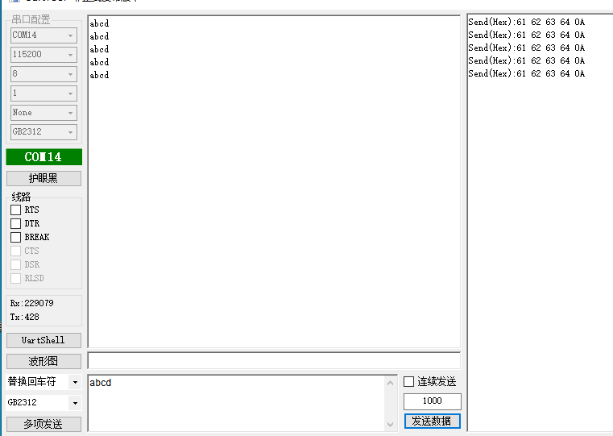
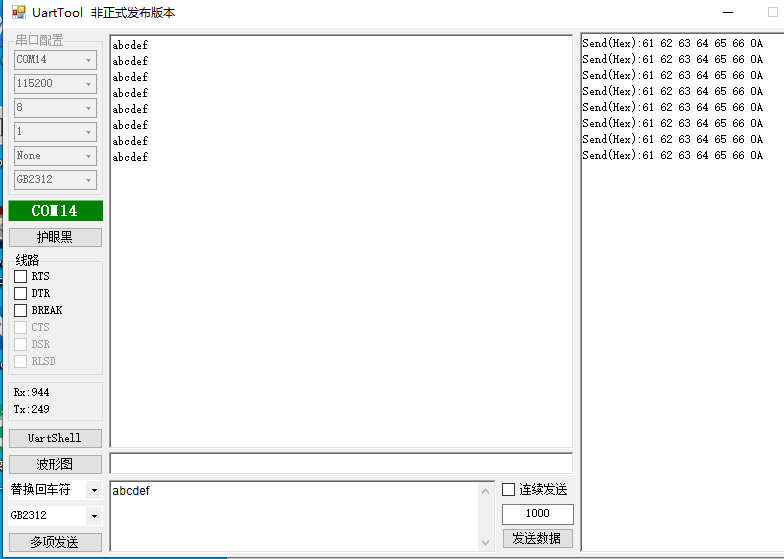

# 1.概述

​		本文档介绍库函数方式的GPIO外设例程，打开SDK3/examples/demo路径下的bxd_uart工程

# 2.一般收发数据

## 2.1 功能代码

在app.c文件中：

app_init()里的代码；代码示例如下

```c
void app_init( void )
{
    bx_pm_lock( BX_PM_UART );	
    bxd_uart_open(BX_UART1);	//打开时钟
    bxd_uart_set_tx_pin(BX_UART1,12);	//设置tx引脚
    bxd_uart_set_rx_pin(BX_UART1,13);	//设置rx引脚
    bxd_uart_set_data_bit( BX_UART1, BX_UART_DB_8B );	//设置数据位
    bxd_uart_set_speed( BX_UART1, BX_UART_BD_115200 );	//设置波特率
    bxd_uart_set_stop_bit( BX_UART1, BX_UART_SB_ONE );	//设置停止位
    bxd_uart_set_parity( BX_UART1, BX_UART_PARITY_NONE );	//设置奇偶校验位	
}
```

uart_receive()里的代码；代码示例如下

```c
void uart_receive( void )
{
	u8 recvbuff[5];
	
	bxd_uart_read(BX_UART1,recvbuff,5);		//从串口读取数据，param0为数据，param1为数据长度
	bx_delay_asm(10000);
	bxd_uart_write(BX_UART1,recvbuff,5);	//将数据发送到串口，param0为数据，param1为数据长度	
    
}
```

## 注：

uart_receive()需要在头文件定义；需要将uart_receive添加到main函数的while(1)里面；代码示例如下

```c
int main( void )
{
    ble_init();
    bx_kernel_init();

    app_init();
    
    while( 1 ) {
        ble_schedule();
        bx_kernel_schedule();
    	uart_receive();
    }

}
```

## 2.2 功能演示

在发送数据后，串口同样将数据发送回来



# 3. 中断接收数据

## 3.1 功能代码

在app.c文件中：

app_init()里的代码；代码示例如下

```c
void app_init( void )
{
    bx_pm_lock( BX_PM_UART );
    bxd_uart_open(BX_UART1);	//打开时钟
    bxd_uart_set_tx_pin(BX_UART1,12);	//设置tx引脚
    bxd_uart_set_rx_pin(BX_UART1,13);	//设置rx引脚
    bxd_uart_set_data_bit( BX_UART1, BX_UART_DB_8B );	//设置数据位
    bxd_uart_set_speed( BX_UART1, BX_UART_BD_115200 );	//设置波特率
    bxd_uart_set_stop_bit( BX_UART1, BX_UART_SB_ONE );	//设置停止位
    bxd_uart_set_parity( BX_UART1, BX_UART_PARITY_NONE );	//设置奇偶校验位
    bxd_uart_intr_read_start( BX_UART1 );	//开启中断读数据	
}
```

在bxs_uart.c文件中：

UART1_IRQHandler()里的代码；代码示例如下

```c
void UART1_IRQHandler( void )
{
    u8 irq_status = BX_READ_REG( BX_UART1->IF ) & 0x0F;
    u8 uart_len = 0;
    u8 data[256];
    switch( irq_status ) {
        case BX_UART_IRQ_RLS:
        case BX_UART_IRQ_CT:
        case BX_UART_IRQ_RDA: {
            while( 1 == BX_READ_BIT( BX_UART1->LS, UART_LS_DATA_READY ) ) {          
				data[uart_len] = BX_UART1->RTD;
				uart_len++;
            }
			bxd_uart_write(BX_UART1,data,uart_len);	//中断读取到数据后再将数据发送到串口
        }
        break;

        default:
        break;
    }

}
```

## 3.2 功能演示

在发送数据后，串口同样将数据发送回来

