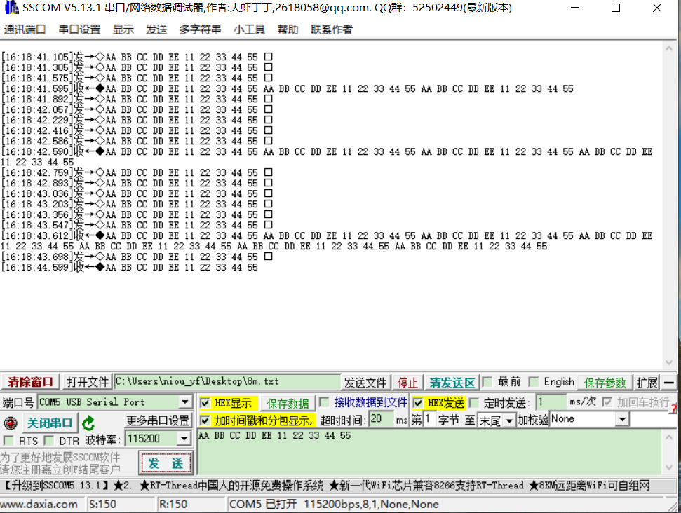

# 1.概述

​		本文档介绍库函数方式的UART串口中断例程，打开SDK3/examples/demo路径下的bxd_uart_intr工程

# 2.功能代码

在app.c文件中：

app_init()里的代码；代码示例如下

```c
void app_init( void )
{
    bx_pm_lock( BX_PM_UART );	
    bxd_uart_open(BX_UART1);	//打开时钟
    bxd_uart_set_tx_pin(BX_UART1,12);	//设置tx引脚
    bxd_uart_set_rx_pin(BX_UART1,13);	//设置rx引脚
    bxd_uart_set_data_bit( BX_UART1, BX_UART_DB_8B );	//设置数据位
    bxd_uart_set_speed( BX_UART1, BX_UART_BD_115200 );	//设置波特率
    bxd_uart_set_stop_bit( BX_UART1, BX_UART_SB_ONE );	//设置停止位
    bxd_uart_set_parity( BX_UART1, BX_UART_PARITY_NONE );	//设置奇偶校验位	
    
   	bxd_uart_set_intr_callback(BX_UART1,uart_callback);//设置uart callback
    bxd_uart_enable_intr( BX_UART1 );//使能中断模式
    bxd_uart_intr_read_start( BX_UART1 );//开启读取数据
    
    bx_fifo_init( &us_svc.rx_fifo, rx_buff, RXFIFO_MAX_LEN );//初始化uart 接收fifo
    bx_fifo_init( &us_svc.tx_fifo, tx_buff, TXFIFO_MAX_LEN );//初始化uart 发送fifo

    bx_dwork( uart_receive, NULL, 1000, BX_FOREVER );//间隔1s读取uart 接收fifo，若有数据通过uart输出
}
```

uart_receive()里的代码；代码示例如下

```c
void uart_receive( void * data )
{
    u8 rx_data[11520];
   
    us_svc.rx_len = bx_fifo_get_len( &( us_svc.rx_fifo ) );//读取uart 接收fifo数据长度
    if( us_svc.rx_len > 0 ) {//若有数据，输出

        bx_fifo_pop( &( us_svc.rx_fifo ), rx_data, us_svc.rx_len );//取出fifo 数据
        bxd_uart_write( BX_UART1, rx_data, us_svc.rx_len );//将取出的数据输出
    }

}
```


app_init()里接收回调函数；代码示例如下

```c
void uart_callback(void *hd,u8 data)
{
	bx_fifo_push( &( us_svc.rx_fifo ), &data, 1 ) ;//将接收的数据存进fifo
}
```

# 3功能演示

按上述代码编译烧录固件，在发送数据后，串口同样将数据发送回来：



