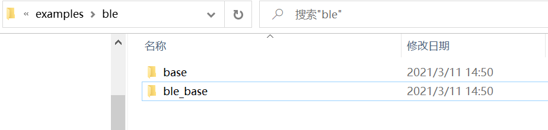

# 使用消息的方式介绍ADC的使用

## 1、概述

 		本文档使用的消息的方式介绍ADC的使用和功能，包括普通IO电压的获取、电池电压、温度获取。
 		

关于service的概念和定义以及相关的API请参考SDK3/doc目录下的<编程手册> [编程手册.pdf](..\..\编程手册.pdf) 

## 2、新建工程

1、新建工程，首先复制下图工程：



2、粘贴到SDK3\example目录下

3、修改文件名为bxs_adc,将工程名修改为bxs_adc

4、打开工程添加文件

- bxd_adc.c
- bxs_adc.c

## 3、编写代码

### 3.1、初始化

```c
u32 bat_value;	//定义bat_value变量存放电池电压
u32 volt_mv;	//定义volt_mv变量存放普通IO ADC
u32 temp;	//定义temp变量存放温度值
u32 channel=0;	//定义channel变量默认值为0
s32 us_svc; //存放注册svc到内核返回的id值
void app_init(void)
{
    //初始化用户服务
    struct bx_service svc;	//定义一个bx_service变量，用于处理用户的属性、消息等
    svc.prop_set_func = NULL;	//设置用户属性的入口，此处为空，可以自行修改
    svc.prop_get_func = NULL;	//获取用户属性的入口，此处为空，可以自行修改
    svc.msg_handle_func = user_msg_handle_func;	//用户消息的处理入口，默认为user_msg_handle_func,可以自行修改
    svc.name = "user service";	//svc的名称
    us_svc= bx_register( &svc );//将svc注册到内核，并返回id值
    
    //初始化adc服务
	bxs_adc_register();   
    //定时获取一次普通IO ADC、电池电压、温度
    s32 id=bxs_adc_id();
		bx_call(id,BXM_OPEN,0,0);	//启动adc服务
		bx_repeat(id,BXM_ADC_VOLT,channel,(u32)&volt_mv,500);	//每500ms向adc服务发送一次获取普通IO ADC的消息
		bx_repeat(id,BXM_ADC_BATTERY,(u32)&bat_value,0,500);	//每500ms向adc服务发送一次获取电池电压的消息
		bx_repeat(id,BXM_ADC_TEMPERATURE,(u32)&temp,0,500);		//每500ms向adc服务发送一次获取温度值的消息
		bx_subscibe(id,BXM_ADV_BAT_DATA_UPDATE,0,0);	//订阅BXM_ADV_BAT_DATA_UPDATE消息，只要adc服务发布该消息，就会被用户接收，然后执行app_msg_handle_func函数
		bx_subscibe(id,BXM_ADV_VOLT_DATA_UPDATE,0,0);	//订阅BXM_ADV_VOLT_DATA_UPDATE消息，只要adc服务发布该消息，就会被用户接收，然后执行app_msg_handle_func函数
		bx_subscibe(id,BXM_ADV_TEMP_DATA_UPDATE,0,0);	//订阅BXM_ADV_TEMP_DATA_UPDATE消息，只要adc服务发布该消息，就会被用户接收，然后执行app_msg_handle_func函数
}
```

添加user_msg_handle_func函数

```c

bx_err_t user_msg_handle_func(s32 id,u32 msg,u32 param0,u32 param1)
{
		if(bx_msg_source() != bxs_adc_id())		
//判断消息是否来源于adc服务
   	{
			bx_logln( "msg err\r\n\r\n");
		return 0;
   }
	
    switch( msg ) {
//判断接收到的消息            
        case BXM_ADV_VOLT_DATA_UPDATE:
//接收到的消息是BXM_ADV_VOLT_DATA_UPDATE
            bx_logln( "channel = %d volt_mv = %d\tvolt_mv = %d\t", param0, param1, volt_mv );	
//串口输出channel值和IO ADC
            break;
				
				case BXM_ADV_BAT_DATA_UPDATE:
//接收到的消息是BXM_ADV_BAT_DATA_UPDATE            
							bx_logln("bat_value= %d param1 = %d\t",param0,param1);
//串口输出电池电压值
							break;

				case BXM_ADV_TEMP_DATA_UPDATE:
//接收到的消息是BXM_ADV_TEMP_DATA_UPDATE
							bx_logln("temp = %d param1 = %d\t",param0,param1);
//串口输出温度值
							break;
				
        default:
            break;
    }
    return BX_OK;
}
```

## 4、功能演示

获取IO电压值、电池电压值、温度值

- 按照第三章3.1、3.2代码实现
- 编译文件，然后烧录文件
- 演示结果

volt_mv是IO电压值，bat_value是电池电压值，temp是温度值

