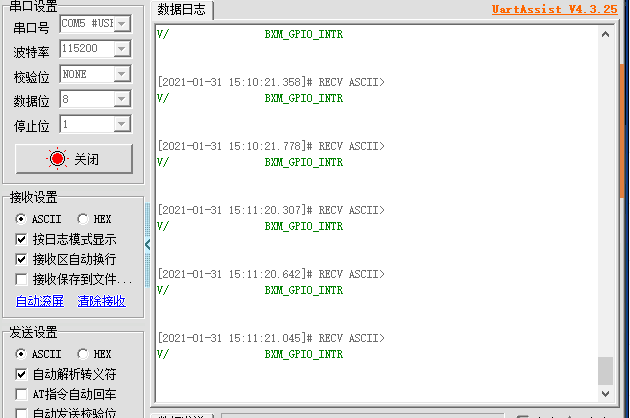

# 1.概述

本文档介绍消息方式的GPIO外设例程，打开SDK3/examples/demo路径下的bxs_gpio工程

关于service的概念和定义以及相关的API请参考SDK3/doc目录下的<编程手册> [编程手册.pdf](..\..\编程手册.pdf) 

# 2.OUTPUT

## 2.1 功能代码

在app.c文件中：

app_init()里的代码；代码示例如下

```c
void app_init( void )
{
    bxs_gpio_register();		//注册gpio服务
    s32 id = bxs_gpio_a_id();
    
    bx_call(id,BXM_OPEN,0,0);		//打开gpio服务
    bx_set(id,BXP_MODE,2,BX_GPIO_MODE_OUTPUT);		//设置引脚2为输出模式
	bx_call(id,BXM_WRITE,2,0);		//将引脚2电平拉高；0为高1为低；
}
```

## 2.2 功能演示

代码编译通过后烧入开发板，查看开发板的LED灯可发现LED灯已经被点亮


# 3.INPUT

## 3.1 功能代码

在app.c文件中：

app_init()里的代码；代码示例如下

```c
void app_init( void )
{
	struct bxs svc;
	svc.prop_set_func = NULL;
	svc.prop_get_func = NULL;
	svc.msg_handle_func = user_msg_handle_func;
	svc.name = "user service";
	user_service_id = bx_register(&svc);		//注册一个自己的服务
	
	bxs_gpio_register();		//注册gpio服务
	s32 id = bxs_gpio_a_id();
    
	bx_call(id,BXM_OPEN,0,0);		//打开gpio服务
	bx_set(id,BXP_MODE,2,BX_GPIO_MODE_OUTPUT);		//设置引脚2为输出模式
	bx_call(id,BXM_WRITE,2,0);		//将引脚2电平拉高；0为高1为低；
	bx_set(id,BXP_MODE,15,BX_GPIO_MODE_INPUT);		//设置引脚15为gpio输入模式
	bx_repeat(user_service_id,USER_GPIO_INPUT,0,0,10);		//循环向user_service_id发送消息
}
```

添加函数user_msg_handle_func( s32 id, u32 msg, u32 param0, u32 param1 )；代码示例如下：

```c
bx_err_t user_msg_handle_func( s32 id, u32 msg, u32 param0, u32 param1 )
{
    switch( msg ) {
        case BXM_GPIO_INTR:
            bx_logln( "BXM_GPIO_INTR" );
            break;
        case USER_GPIO_INPUT: {
            bx_call( bxs_gpio_a_id(), BXM_READ, ( u32 )&pin_value, 0 );  //读取p15的状态
            if( !( pin_value >> 15 & 0x01 ) ) {
               bx_call( bxs_gpio_a_id(), BXM_TOGGLE, 2, 0 );
            } 
        }
        break;
        default:
            break;
    }
    return BX_OK;
}
```

## 注：

需要在头文件里定义函数user_msg_handle_func；可通过按压pin15来改变gpio引脚电平；

变量pin_value与user_service_id需要在文件开头处定义；

## 3.2 功能演示

代码编译通过后烧入开发板，查看开发板的LED灯可发现LED灯在翻转

# 4.中断

## 4.1 功能代码

在app.c文件中：

app_init()里的代码；代码示例如下

```c
void app_init( void )
{
	struct bx_service svc;
	svc.prop_set_func = NULL;
	svc.prop_get_func = NULL;
	svc.msg_handle_func = user_msg_handle_func;
	svc.name = "user service";
	user_service_id = bx_register(&svc);		//注册一个服务
	
	bxs_gpio_register();		//注册gpio服务
    bx_it_init();   //初始化设置中断回调函数
	s32 id = bxs_gpio_a_id();
	
	bx_call(id,BXM_OPEN,0,0);		//打开gpio服务
    bx_set( id, BXP_MODE, 15, BX_GPIO_MODE_INPUT );
	bx_set( id, BXP_MODE, 15, BX_GPIO_MODE_EIT_FALLING );		//设置引脚15为具有下降沿触发检测的外部中断模式
	bx_subscibe(id, BXM_GPIO_INTR, 0, 0);		//订阅消息
	
}
```


添加函数user_msg_handle_func( s32 id, u32 msg, u32 param0, u32 param1 )；代码示例如下：

```c
bx_err_t user_msg_handle_func( s32 id, u32 msg, u32 param0, u32 param1 )
{
    switch(msg)
    {
        case BXM_GPIO_INTR:
            bx_logln("BXM_GPIO_INTR");		//触发中断，则串口打印信息
            break;


        default:
            break;
    }
    return BX_OK;

}
```

## 注：

需要在头文件里定义该函数；在bx_sdk3_config.h文件里，需要更改以下宏定义；

```c
#define BX_ENABLE_LOG                               1

#define BX_USE_UART_LOG                             1
```

变量user_service_id需要在文件开头处定义；

## 4.2 功能演示

当按下pin15时，可以看到串口打印相应信息；如图所示：



