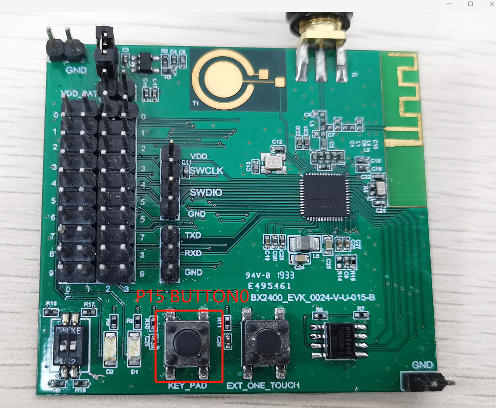

# 用消息的方式介绍PWM的使用

## 1、概述

​		本文档介绍PWM的使用，主频32Mhz下输出能高达160kHz。

关于service的概念和定义以及相关的API请参考SDK3/doc目录下的<编程手册> [编程手册.pdf](..\..\编程手册.pdf) 

## 2、新建工程

1、新建工程，首先复制下图工程


2、粘贴到SDK3\example目录下

3、修改文件名为bxs_pwm,将工程名修改为bxs_pwm

4、打开工程添加文件

- bxd_pwm.c
- bxs_pwm.c
- bxd_gpio.c
- bxs_gpio.c
- bxs_pwm.h
- bxs_gpio.h
- bxd_io_mux.c
- plf.h

## 3、编写代码

```c
#define    PWM0_PIN			2
#define    PWM1_PIN			3
#define    PWM2_PIN			4
#define    PWM3_PIN			5
#define	   PWM4_PIN			6
#define    BUTTON_0         15
s32 us_svc;
void app_init( void )
{
    //初始化用户服务
    struct bx_service svc;
    svc.prop_set_func = NULL;
    svc.prop_get_func = NULL;
    svc.msg_handle_func = user_msg_handle_func;
    svc.name = "user service";
    us_svc=bx_register(&svc);
    
    //初始化pwm服务、gpio服务
    bxs_pwm_register();
		bxs_gpio_register();
    
    //代码实现
    static u8 duty_value = 0;	//pwm占空比
	u32 pin_value;	//io value
	s32 id_gpio = bxs_gpio_a_id();
	
    s32 id0 = bxs_pwm0_id();
	s32 id1 = bxs_pwm1_id();
	s32 id2 = bxs_pwm2_id();
	s32 id3 = bxs_pwm3_id();
	s32 id4 = bxs_pwm4_id();

    //P15即BUTTON0初始化
	bx_call(id_gpio,BXM_OPEN,0,0);
	bx_set(id_gpio,BXP_MODE,15,BX_GPIO_MODE_INPUT);
	bx_set(id_gpio,BXP_GPIO_PULL,15,BX_GPIO_PULLUP);
	
    //开启PWM0~PWM4
    bx_call(id0,BXM_OPEN,0,0);
	bx_call(id1,BXM_OPEN,0,0);
	bx_call(id2,BXM_OPEN,0,0);
	bx_call(id3,BXM_OPEN,0,0);
	bx_call(id4,BXM_OPEN,0,0);
	
    //PWM0~PWM4 输出pin设置
	bx_set(id0,BXP_PIN,PWM0_PIN,0);
	bx_set(id1,BXP_PIN,PWM1_PIN,0);
	bx_set(id2,BXP_PIN,PWM2_PIN,0);	
	bx_set(id3,BXP_PIN,PWM3_PIN,0);	
	bx_set(id4,BXP_PIN,PWM4_PIN,0);

    //PWM0~PWM4 输出设置，包括频率、占空比
	bx_call(id0,BXM_START,1000,0);
	bx_call(id1,BXM_START,50000,20);
	bx_call(id2,BXM_START,160000,50);
	bx_call(id3,BXM_START,10000,40);
	bx_call(id4,BXM_START,1000,100);


	while(1)
	{
        //读取IO值
	    bx_call(id_gpio,BXM_READ,(u32)&pin_value,0);
		
       //BUTTON0即P15有按下，则PWM0 占空比每次递增10%，达到100%后又从0开始，如此循环
		if(!(pin_value>>15))
		{
		    if(duty_value >= 100)
				duty_value = 0;
			else
				duty_value += 10;

			
			
			bx_call(id0,BXM_START,1000,duty_value);

			BX_DELAY_US(1000*1000);
		}
	}
}
bx_err_t user_msg_handle_func(s32 id,u32 msg,u32 param0,u32 param1)
{
    
}
```


## 4、功能演示

### 4.1获取电池电压

- 按照第三章3.1、3.2代码实现
- 编译文件，然后烧录文件
- 演示结果


其中CH1为PWM3输出，CH2为PWM4输出，CH3为PWM1输出，CH4为PWM2输出，由于示波器仅有四个通道此处PWM0未显示在此处

