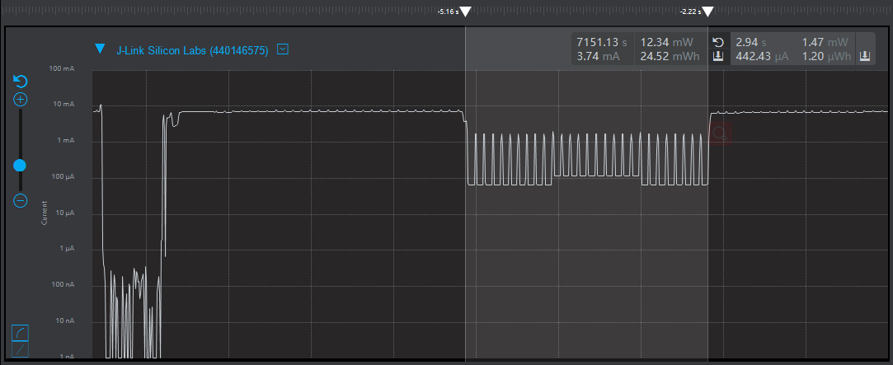

# 1.概述

​		本文档以消息的方式介绍BX设备如何进入休眠，以及唤醒后外设使用的注意事项；打开SDK3/examples/demo路径下的bxs_sleep工程

关于service的概念和定义以及相关的API请参考SDK3/doc目录下的<编程手册> [编程手册.pdf](..\..\编程手册.pdf) 

# 2. WAKEUP

### 2.1 功能代码

在app.c文件中：

app_init()里的代码;代码示例如下

```c
void app_init( void )
{
    struct bx_service svc;
    svc.prop_set_func = NULL;
    svc.prop_get_func = NULL;
    svc.msg_handle_func = user_msg_handle_func;
    svc.name = "user service";
    user_service_id = bx_register( &svc );		//自定义一个服务
    
    bxs_gpio_register();	//注册服务
    bx_call(bxs_gpio_a_id(),BXM_OPEN,0,0);		//启动服务
    bx_set(bxs_gpio_a_id(),BXP_MODE,2,BX_GPIO_MODE_OUTPUT);		//将引脚2的模式设置为输出模式
    bx_call(bxs_gpio_a_id(),BXM_WRITE,1,0);		//将引脚2电平拉高
    bx_defer(user_service_id,BXM_SLEEP_UNLOCK,0,0,3000);	//3s后向内核发送一条休眠的消息
}
```


```c
bx_err_t user_msg_handle_func( s32 id, u32 msg, u32 param0, u32 param1 )
{
    if( bx_msg_source() != user_service_id ) {
        return 0;
    }

    switch( msg ) {
        case BXM_SLEEP_UNLOCK: {
    		bx_defer(user_service_id, BXM_SLEEP_LOCK, 0, 0, 3000);	//3s后将设备唤醒
            bx_call(bxs_gpio_a_id(),BXM_CLOSE,0,0);		//关闭服务，设备进入休眠
        }
        break;
        case BXM_SLEEP_LOCK: {	//收到唤醒的消息后，设备必须重新启动服务，设置模式
            bx_call(bxs_gpio_a_id(),BXM_OPEN,0,0);		//启动服务
    		bx_set(bxs_gpio_a_id(),BXP_MODE,2,BX_GPIO_MODE_OUTPUT);		//将引脚2的模式设置为输出模式
    		bx_call(bxs_gpio_a_id(),BXM_WRITE,2,0);		//将引脚2电平拉高
        }
        break;
        default:
            break;
    }
    return BX_OK;

}
```


在app_on_ble_ready()与app_on_ble_disconnect()中，修改广播间隔时间来改变进入休眠函数的时间；代码示例如下

```C
adv_data.intv_max   = 160;//unit is 625 us
adv_data.intv_min   = 160;//unit is 625 us
```
## 注：

需要自己定义一个变量s32 user_service_id；在头文件自定义消息；设备进入休眠还需要在bx_sdk3_config.h配置文件里将宏定义BX_DEEP_SLEEP 设置为1


# 3.功能演示

- 按照以上代码实现

- 编译文件，然后烧录文件

- 演示结果

  可发现开发板的led灯常亮3s之后熄灭3s，然后再次点亮；查看设备功耗也可发现设备休眠3s后便被唤醒；如图所示



