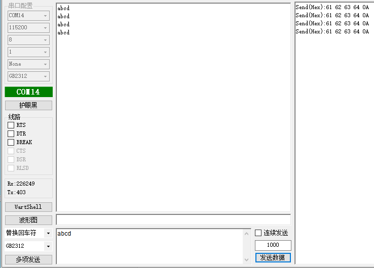

# 1.概述

​		本文档介绍消息方式的uart外设例程，打开SDK3/examples/demo路径下的bxs_uart工程


# 2.收发数据

## 2.1 功能代码

在app.c文件中：

app_init()里的代码；代码示例如下

```c
void app_init( void )
{
	bxs_uart_register();	//注册串口服务
	s32 id = bxs_uart0_id();
	

	bx_call(id,BXM_OPEN,0,0);	//打开串口服务
	bx_set(id,BXP_UART_TX_PIN,12,0);	//设置tx引脚
	bx_set(id,BXP_UART_RX_PIN,13,0);	//设置rx引脚
	bx_set(id,BXP_UART_115200_8_1_N,0,0);	//设置串口参数	

}
```

uart_receive()里的代码；代码示例如下

```c
void uart_receive( void )
{
	u8 recvbuff[5];
	
	bx_post(bxs_uart0_id(),BXM_READ,( u32 )recvbuff,5);		//从串口读取数据，param0为数据，param1为数据长度
	bx_delay_asm(10000);
	bx_post(bxs_uart0_id(),BXM_WRITE,( u32 )recvbuff,5);	//将数据发送到串口，param0为数据，param1为数据长度

}
```

## 注：

uart_receive()需要在头文件定义；需要将uart_receive添加到main函数的while(1)里面；代码示例如下

```c
int main( void )
{
    ble_init();
    bx_kernel_init();

    app_init();
    
    while( 1 ) {
        ble_schedule();
        bx_kernel_schedule();
    	uart_receive();
    }

}
```

## 2.2 功能演示

在发送数据后，串口同样将数据发送回来

