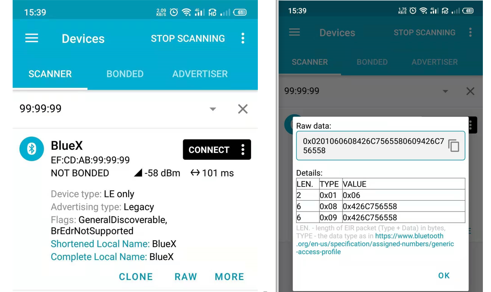

## 概述

介绍 gapm_start_advertise_cmd 命令的使用，以及gapm_update_advertise_data_cmd的使用，实现动态更新广播，上电广播一段时间后，更新广播内容

# 1.新建工程

1、新建工程，首先复制下图ble_base工程


2、粘贴到SDK3\example目录下

3、修改文件夹为ble_adv_base,将工程名修改为ble_adv_base


# 2.功能代码

## 2.1开启广播

在app.c中

以下为上电后广播配置

```c
/* private variables ---------------------------------------------------------*/
uint8_t user_scan_rsp_data[] = {
    0x08,   // length of this data
    GAP_AD_TYPE_COMPLETE_NAME, //type of this data
    'B','X', '-', 'S', 'D', 'K', '3'
};

// GAP - Advertisement data (max size = (28) bytes)
uint8_t user_adv_data[] = {
    0x08,// length of this data
    GAP_AD_TYPE_SHORTENED_NAME,//type of this data
    'B','X', '-', 'S', 'D', 'K', '3'
};
```

```c
void app_on_ble_ready( void )
{
    struct gapm_start_advertise_cmd adv_data;
    adv_data.op.addr_src    = GAPM_STATIC_ADDR;
    adv_data.channel_map    = ADV_ALL_CHNLS_EN;
    adv_data.intv_max   = 160;//unit is 625 us
    adv_data.intv_min   = 160;//unit is 625 us
    adv_data.op.code    = GAPM_ADV_UNDIRECT;
    adv_data.info.host.mode = GAP_GEN_DISCOVERABLE;
    adv_data.info.host.adv_data_len = sizeof( ble_adv_data );
    adv_data.info.host.scan_rsp_data_len  = sizeof( ble_scan_rsp_data );
    adv_data.info.host.adv_filt_policy = ADV_ALLOW_SCAN_ANY_CON_ANY;
    memcpy( adv_data.info.host.adv_data, ble_adv_data, sizeof( ble_adv_data ) );
    memcpy( adv_data.info.host.scan_rsp_data, ble_scan_rsp_data, sizeof( ble_scan_rsp_data ) );

    ble_advertising_start( &adv_data );

}

```

## 2.2更新广播

在ble.c中，添加函数ble_advertising_advdata_update，注意在ble.h中声明

```c
void ble_advertising_advdata_update ( struct gapm_update_advertise_data_cmd * p_new_advdata_buf )
    {
    struct gapm_update_advertise_data_cmd * update_cmd = KE_MSG_ALLOC( GAPM_UPDATE_ADVERTISE_DATA_CMD,
        TASK_GAPM,TASK_APP, gapm_update_advertise_data_cmd ) ;
    
    
    
    memcpy( update_cmd->adv_data,p_new_advdata_buf->adv_data,p_new_advdata_buf->adv_data_len );
    memcpy( update_cmd->scan_rsp_data,p_new_advdata_buf->scan_rsp_data,p_new_advdata_buf->scan_rsp_data_len );
    
    update_cmd->operation = GAPM_UPDATE_ADVERTISE_DATA;
    update_cmd->adv_data_len = p_new_advdata_buf->adv_data_len;
    
    update_cmd->scan_rsp_data_len = p_new_advdata_buf->scan_rsp_data_len;
    
    ke_msg_send ( update_cmd ) ;
}
```


在app.c中

添加更新广播函数update_adv_data，如下

```c
void update_adv_data(void)
{
    struct gapm_update_advertise_data_cmd adv_update_data;
	adv_update_data.operation  = GAPM_STATIC_ADDR;
    
    //添加更新广播内容
    static uint8_t ble_adv_data[] = {
        0x06,// 数据长度
        GAP_AD_TYPE_SHORTENED_NAME,//数据类型
        'B','l', 'u', 'e', 'X'
    };
    adv_update_data.adv_data_len = sizeof(ble_adv_data);
    memcpy( adv_update_data.adv_data, ble_adv_data, sizeof( ble_adv_data ) );
    
    //添加更新扫描回复内容
    static uint8_t ble_scan_rsp_data[] = {
        0x06,   // 数据长度
        GAP_AD_TYPE_COMPLETE_NAME, //数据类型
        'B','l', 'u', 'e', 'X'
    };

	adv_update_data.scan_rsp_data_len = sizeof(ble_scan_rsp_data);
	memcpy( adv_update_data.scan_rsp_data, ble_scan_rsp_data, sizeof( ble_scan_rsp_data ) );
    //开启更新
    ble_advertising_advdata_update(&adv_update_data);
}

```


在app.c中

添加用户service id，用户消息类型USER_BLE_ADV_UPDATE

```c
/* exported variables --------------------------------------------------------*/
s32 user_service_id;

enum user_msg_ble{

	USER_BLE_ADV_UPDATE,
    
};
```


在app_init函数中，添加用户service

```c
void app_init(void)
{
	struct bx_service svc;
    svc.prop_set_func = NULL;
    svc.prop_get_func = NULL;
    svc.msg_handle_func = user_msg_handle_func;
    svc.name = "user service";
    user_service_id = bx_register(&svc);
	//10秒后向user_service_id发送消息USER_BLE_ADV_UPDATE
	bx_defer(user_service_id,USER_BLE_ADV_UPDATE,0,0,5000);
}
```


在app.c中，添加用户消息处理函数user_msg_handle_func

```c
bx_err_t user_msg_handle_func( s32 svc, u32 msg, u32 param0, u32 param1 )

{
	s32 src_id = bx_msg_source();
	
	if(src_id == user_service_id)
	{
			switch( msg ){
			//在此消息下调用update_adv_data()
			case USER_BLE_ADV_UPDATE:
				update_adv_data();
				bx_logln("update_adv_data\r\n");
			break;
			
			default:
            break;
		}
	}
	return 0;
	
}
```


# 3.功能演示

上电后程序自动广播，5秒后更改广播内容，无需停止广播。效果图如下

## 3.1上电默认广播


## 3.2上电5秒后更新广播

