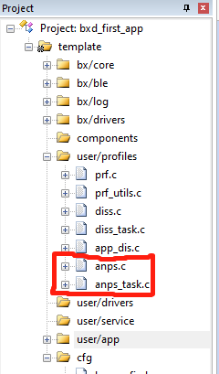
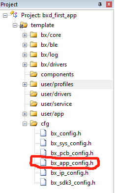
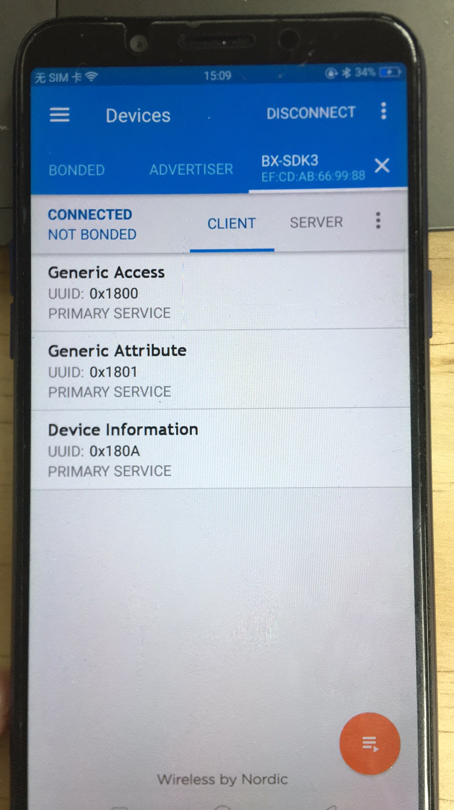

# 添加一个标准的profile

## 1、概述

本文档介绍如何添加一个标准的profile

## 2、新建工程

1、新建工程，首先复制下图工程：


2、粘贴到SDK3\example目录下

3、修改文件名为add_profile_demo,将工程名修改为add_profile_demo

4、打开工程添加文件

## 3、添加文件

下面以添加一个anps的profile为例来说明，需要添加的文件有

- anps.c
- anps.h
- anps_task.h
- anps_task.c

文件路径在SDK3\components\bluex\ble\profiles中，别忘了在kile中添加文件路径



添加文件之后在bx_app_config.h中添加如下定义

```c
#define CFG_PRF_ANPS
```



- 这一服务的任务id默认已经在rwip_task.h中的枚举TASK_API_ID中了，prf.c中也默认调用了导出函数所以不需要额外定义

## 4、profile添加到列表

- 在user/profiles分组中找到app_dis.c文件中添加如下代码

```c
#include "anps.h"
#include "anps_task.h"
```

```c
void app_anps_add_profile(void)
{
    struct anps_db_cfg* db_cfg;
    // Allocate the DISS_CREATE_DB_REQ
    struct gapm_profile_task_add_cmd *req = KE_MSG_ALLOC_DYN(GAPM_PROFILE_TASK_ADD_CMD,
                                                  TASK_GAPM, TASK_APP,
                                                  gapm_profile_task_add_cmd,sizeof(struct anps_db_cfg));
    // Fill message
    req->operation = GAPM_PROFILE_TASK_ADD;
    req->sec_lvl = PERM(SVC_AUTH, NO_AUTH);
    req->prf_task_id = TASK_ID_ANPS;
    req->app_task = TASK_APP;
    req->start_hdl = 0;
	// Set parameters
	db_cfg = (struct anps_db_cfg* ) req->param;
	db_cfg->supp_new_alert_cat.cat_id_mask_0=1;
	db_cfg->supp_new_alert_cat.cat_id_mask_1=1;
	db_cfg->supp_unread_alert_cat.cat_id_mask_0=0;
	db_cfg->supp_unread_alert_cat.cat_id_mask_1=0;
	// Send the message
	ke_msg_send(req);
}
```

- 在app_dis.h文件中定义函数app_anps_add_profile

```c
void app_anps_add_profile(void);
```

- 在app.c的appm_add_svc_func_list[] 里面调用上面的app_test_add_profile函数，如下所示

```c
static const appm_add_svc_func_t appm_add_svc_func_list[] = {
    (appm_add_svc_func_t)app_dis_add_dis,
	(appm_add_svc_func_t)app_anps_add_profile,
};
```

## 5、演示

- 编译烧录程序到开发板里面，复位之后使用nrf找到我们的设备连接上去之后可以看到如下图，多了一个service，到此我们的标准profile就添加成功了




可以看到上面两张图，前面的是没有新增profile，后面是添加了新的profile，可以看到多了一个Alert Notification Service