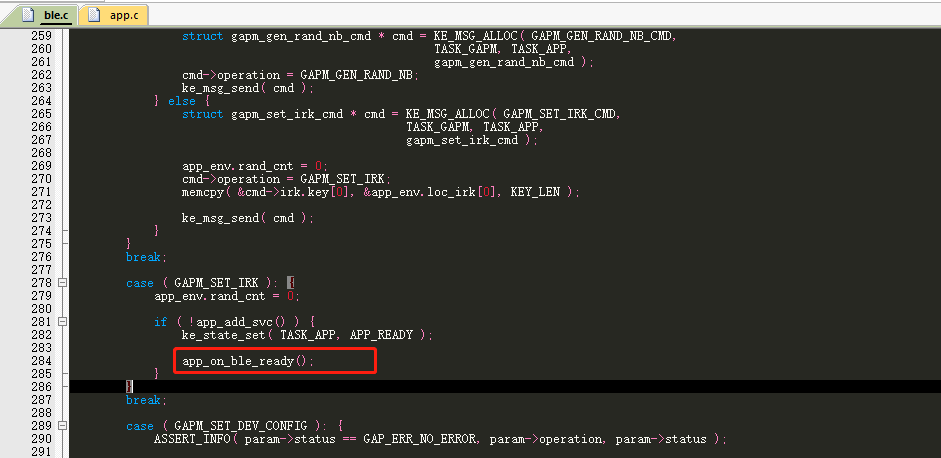
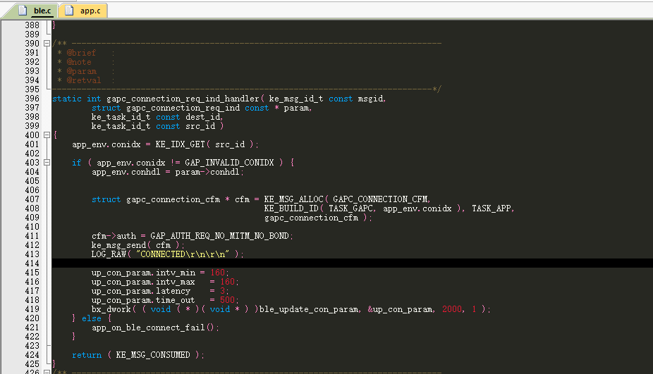
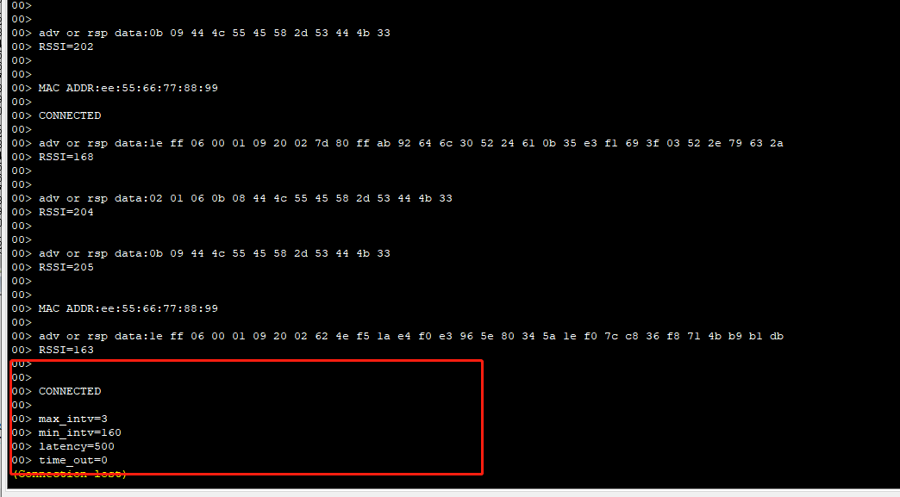

# 主机连接从机说明

## 1、概述

本章节说明介绍ble作为一个主机设备如何在scan到 想要的从机设备之后去连接上从机设备


## 2、功能实现

首先说明，主机想要连接从，正常流程是主机开启扫描，扫描到想要的设备，停止扫描，主动去连接这设备，这里对scan功能不清楚的请参考ble_scan的文档

1、在ble.c中添加连接函数

```c
/** ---------------------------------------------------------------------------
@brief   :
@note    :
@param   :
@retval  :
-----------------------------------------------------------------------------*/
void ble_connect_start( u8 * addr )
{
     struct gapm_start_connection_cmd * connect_cmd = KE_MSG_ALLOC_DYN( GAPM_START_CONNECTION_CMD, TASK_GAPM, TASK_APP, gapm_start_connection_cmd, sizeof( struct gap_bdaddr ) );

     connect_cmd->op.code = GAPM_CONNECTION_DIRECT;
     connect_cmd->op.addr_src = GAPM_STATIC_ADDR;
     connect_cmd->op.state = 0;
     connect_cmd->scan_interval = 160;
     connect_cmd->scan_window = 80;
     connect_cmd->con_intv_min = 400;
     connect_cmd->con_intv_max = 400;
     connect_cmd->con_latency = 0;
     connect_cmd->superv_to = 300;
     connect_cmd->ce_len_min = 0xffff;
     connect_cmd->ce_len_max = 0xffff;
     connect_cmd->nb_peers = 1;

     connect_cmd->peers[0].addr_type = 0;
     memcpy( connect_cmd->peers[0].addr.addr, addr, 6 );

     ke_msg_send( connect_cmd );
}
```

2、在ble的协议栈运行ready之后调用扫描函数

 

3、在扫描回调里面添加如下代码


```c
int app_on_scan_adv_report( ke_msg_id_t const msgid, adv_report_t const * param, ke_task_id_t const dest_id, ke_task_id_t const src_id )
{

    LOG_RAW( "adv or rsp data:" );
    for( u8 i = 0; i < param->data_len; i++ ) {
        LOG_RAW( "%02x ", param->data[i] );

    }
    LOG_RAW( "\r\nRSSI=%u\r\n", param->rssi );
    LOG_RAW( "\r\n\r\n" );


    if( param->data[0] == 0x0b && param->data[1] == GAP_AD_TYPE_COMPLETE_NAME ) {
        if( param->data[2] == 'D' && param->data[3] == 'L' && param->data[4] == 'U' && param->data[5] == 'E' && param->data[6] == 'X' ) {
            LOG_RAW( "MAC ADDR:%02x:%02x:%02x:%02x:%02x:%02x\r\n\r\n", param->adv_addr.addr[0], param->adv_addr.addr[1], param->adv_addr.addr[2], param->adv_addr.addr[3], param->adv_addr.addr[4], param->adv_addr.addr[5] );
            con_mac_buf[0] = param->adv_addr.addr[0];
            con_mac_buf[1] = param->adv_addr.addr[1];
            con_mac_buf[2] = param->adv_addr.addr[2];
            con_mac_buf[3] = param->adv_addr.addr[3];
            con_mac_buf[4] = param->adv_addr.addr[4];
            con_mac_buf[5] = param->adv_addr.addr[5];
            ble_scan_stop();

            bx_dwork( ( void ( * )( void * ) )ble_connect_start, con_mac_buf, 500, 1 );   //Execute the function ble_connect_start after 500ms


        }
    }


    return ( KE_MSG_CONSUMED );
}
```


如图所示，判断是否是用户想要的设备的条件可以由用户自定义，这里使用的是设备名称

这里特别说明，上图中bx_dwork函数的作用是延时执行一个函数，这里的意思是500ms后执行1次ble_connect_start函数，连接成功之后会进入连接回调函数可以加入打印便于验证

 


在连接上的同时主机主动更新连接参数，更新连接参数的函数如下所示

```c
void ble_update_con_param( struct gapc_conn_param * conn_param )
{
    // Prepare the GAPC_PARAM_UPDATE_CMD message
    struct gapc_param_update_cmd * cmd = KE_MSG_ALLOC( GAPC_PARAM_UPDATE_CMD, TASK_GAPC, TASK_APP, gapc_param_update_cmd );
    cmd->operation  = GAPC_UPDATE_PARAMS;
    cmd->intv_min   = conn_param->intv_min;
    cmd->intv_max   = conn_param->intv_max;
    cmd->latency    = conn_param->latency;
    cmd->time_out   = conn_param->time_out;

    // not used by a slave device
    cmd->ce_len_min = 0xFFFF;
    cmd->ce_len_max = 0xFFFF;

    // Send the message
    ke_msg_send( cmd );
}
```
更新连接参数最好把更新连接参数的回调函数添加上，方便知道有没有更新，如下所示

```c
/** ---------------------------------------------------------------------------
@brief   :
@note    :
@param   :
@retval  :
-----------------------------------------------------------------------------*/
static int gapc_con_param_ind_handler( ke_msg_id_t const msgid, struct gapc_param_update_req_ind const * param, ke_task_id_t const dest_id, ke_task_id_t const src_id )
{
 LOG_RAW( "max_intv=%d\r\n", param->intv_max );
 LOG_RAW( "min_intv=%d\r\n", param->intv_min );
 LOG_RAW( "latency=%d\r\n", param->latency );
 LOG_RAW( "time_out=%d\r\n", param->time_out );

 return ( KE_MSG_CONSUMED );
}
```


把回调函数添加到ble.c中的appm_default_state数组里面，如下所示

```
const struct ke_msg_handler appm_default_state[] = {
	...
	...
   {GAPC_PARAM_UPDATED_IND,    ( ke_msg_func_t )gapc_con_param_ind_handler},
	...
	...

};
```

添加到里面之后，更新连接参数成功了，数据才能正常反馈到回调中来

代码写到这已经全部完成，下面验证一下功能

## 3、功能验证

烧录代码，连接上jlink,可以看到扫描到想要的数据之后，停止扫描并且连接设备和主动更新连接参数

 


