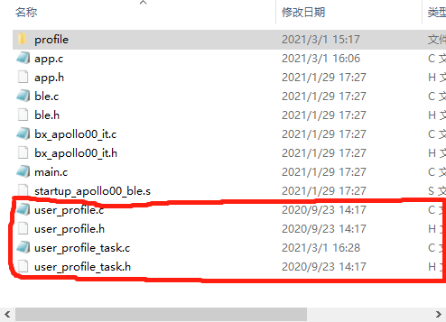
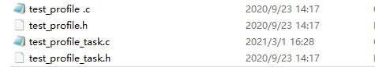
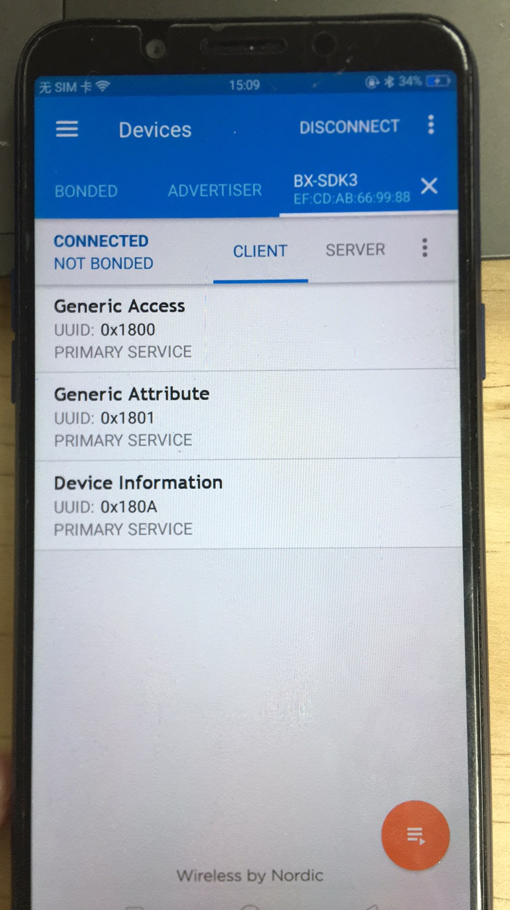
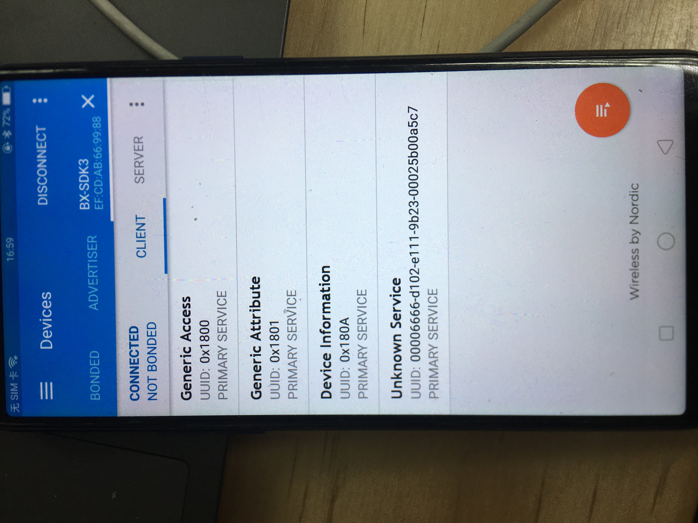

# 添加一个自定义的profile

## 1、概述

本文档介绍如何添加一个自定义的profile

## 2、新建工程

1、新建工程，首先复制下图工程：


2、粘贴到SDK3\example目录下

3、修改文件名为add_user_profile,将工程名修改为add_user_profile

4、打开工程添加文件

## 3、添加文件

### 3.1、复制文件

- 首先打开SDK3\examples\demo\add_profile\code路径，复制use_profile.c、user_profile_task.c、use_profile.h和user_profile_task.h文件，如下



粘贴在本路径下改成自己的名称，例如

- test_profile.c
- test_profile.h
- test_profile_task.c
- test_profile_task.h



- 打开工程，把test_profile.c和test_profile_task.c以及头文件添加到add_profile_demo工程中

### 3.2、修改profile

- 把两个文件中的user替换成test
- 在rwip_task.h中的枚举TASK_API_ID里面定义一个全新的id TASK_ID_TEST

```c
enum TASK_API_ID
{
  ...
  ...
  ...
  TASK_ID_TEST = 253,
  ...
  ...
  ...
};
```

- 把test_profile的导出函数在prf.c的prf_itf_get函数里面调用,导出函数位置在test_profile.c最后面,如下所示

```c
/*

 * EXPORTED FUNCTIONS DEFINITIONS

****************************************************************************************

 */

const struct prf_task_cbs* test_profile_prf_itf_get(void)
{
   return &test_itf;
}
```

- prf.c文件中添加头文件和新建profile的导出函数test_profile_prf_itf_get()

```c
#include "test_profile.h"
```

```c
/**

****************************************************************************************

@brief Retrieve profile interface

****************************************************************************************

 */
static const struct prf_task_cbs * prf_itf_get(uint16_t task_id)
{
    const struct prf_task_cbs* prf_cbs = NULL;
    switch(KE_TYPE_GET(task_id))
    {
		case TASK_ID_TEST:
            prf_cbs = test_profile_prf_itf_get();
            break;
            
            
 }
```

- 到这一步用户自定义的profile的修改已经完成，但想要烧入程序使用nrf看到新增的profile还需要做如下操作

### 3.3、profile添加到列表

- 在user/profile分组中找到app_dis.c文件中添加如下代码

```c
#include "test_profile.h"
#include "test_profile_task.h"
```

```c
void app_test_add_profile(void)
{
    struct test_db_cfg* db_cfg;
    // Allocate the DISS_CREATE_DB_REQ
    struct gapm_profile_task_add_cmd *req = KE_MSG_ALLOC_DYN(GAPM_PROFILE_TASK_ADD_CMD,
                                                  TASK_GAPM, TASK_APP,
                                                  gapm_profile_task_add_cmd,sizeof(struct test_db_cfg));
    // Fill message
    req->operation = GAPM_PROFILE_TASK_ADD;
    req->sec_lvl = PERM(SVC_AUTH, NO_AUTH);
    req->prf_task_id = TASK_ID_test;
    req->app_task = TASK_APP;
    req->start_hdl = 0;
// Set parameters
db_cfg = (struct test_db_cfg* ) req->param;
db_cfg->features = test_ALL_SUP;

// Send the message
ke_msg_send(req);
}
```

此函数是用来将自定义的profile添加到列表中，让手机app能够搜索到这个profile，记得将函数添加到app_dis.h头文件中

- 在app.c的appm_add_svc_func_list[] 里面调用上面的app_test_add_profile函数，如下所示

```c
static const appm_add_svc_func_t appm_add_svc_func_list[APPM_SVC_LIST_STOP] =
{
    (appm_add_svc_func_t)app_dis_add_dis,
	(appm_add_svc_func_t)app_test_add_profile,
};
```

## 4、演示

- 编译烧录程序到开发板里面，复位之后使用nrf找到我们的设备连接上去之后可以看到如下图，多了一个service（图一为未新增profile，图二为新增了profile)





可以看到上面两张图，前面的是没有新增profile，后面是添加了新的profile，可以看到多了一个Unknown service