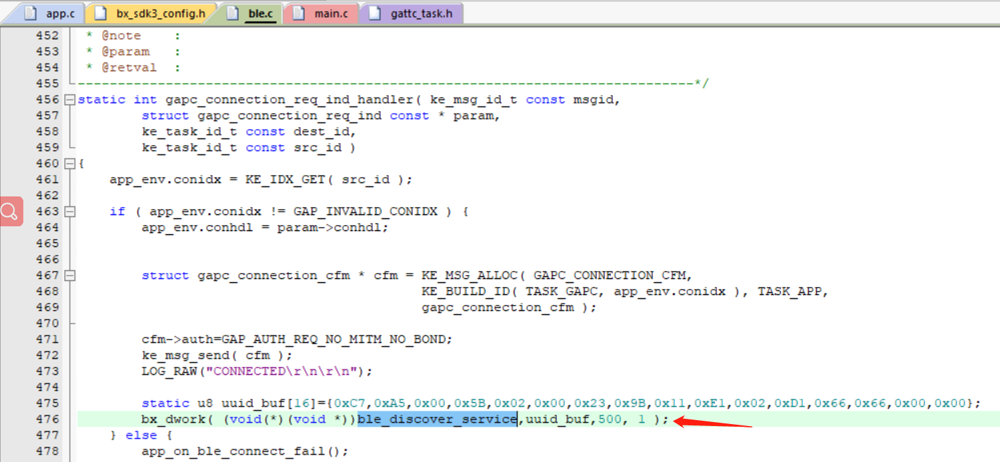

# 主机发现服务

## 1、概述

本章节讲述了bel主机连接了对应的从机之后如何发现服务以及特征值并且通过发现的handle来和从机通信


## 2、代码实现

要实现发现服务的操作，首先要清楚发现服务是主机端在scan、connect之后才能执行的操作，目的在于发现被连接设备的对应特征值的handle方便用来通信，对scan和connect操作不熟悉的请参考对应的文档和例程

在ble.c中增加发现服务的函数，如下所示

```c
/** ---------------------------------------------------------------------------
 * @brief   :
 * @note    :
 * @param   :
 * @retval  :
-----------------------------------------------------------------------------*/
void ble_discover_service(u8 *uuid)
{
	struct gattc_sdp_svc_disc_cmd* disc_cmd  = KE_MSG_ALLOC( GATTC_SDP_SVC_DISC_CMD,TASK_GATTC, TASK_APP,gattc_sdp_svc_disc_cmd );
	
	static u16 dis_seq_num;
	disc_cmd->operation=GATTC_SDP_DISC_SVC;
	disc_cmd->uuid_len=16;
	disc_cmd->seq_num=dis_seq_num++;
	disc_cmd->start_hdl=0x01;
	disc_cmd->end_hdl=0xffff;
	memcpy(disc_cmd->uuid,uuid,16);
	ke_msg_send( disc_cmd );

}
```

在发起scan并且搜索对应设备并且连接上设备之后，开始执行发现服务的函数，如下图所示

 

上图中的意思是连接之后delay 500ms开始执行发现服务的函数(ble_discover_service)

在发现服务成功后会进入回调函数gattc_sdp_svc_ind_handler，在回调函数里可以获取到需要的信息，如read,write,notify等属性和对应的handle值，

获取到从机对应属性的hanle值，就可以执行读写操作。

在ble.c中添加read和write的函数

```c
/** ---------------------------------------------------------------------------
 * @brief   :Used for wtite data from the central to the peripheral
 * @note    :
 * @param   :
 * @retval  :
-----------------------------------------------------------------------------*/
void ble_gatt_write(u8 operation,u8 length,u8 handle,u8 *pdata)
{
	static u16 write_seq_num = 0;
    struct gattc_write_cmd* write_cmd  = KE_MSG_ALLOC_DYN(GATTC_WRITE_CMD, TASK_GATTC,TASK_APP, gattc_write_cmd, length);
	
	write_cmd->operation=operation;
	write_cmd->auto_execute=1;
	write_cmd->seq_num=write_seq_num++;
	write_cmd->handle=handle;
	write_cmd->offset=0;
	write_cmd->length=length;
	memcpy(write_cmd->value, pdata, length);

	ke_msg_send(write_cmd);
}


/** ---------------------------------------------------------------------------
 * @brief   :Used to read data from the central to the peripheral
 * @note    :
 * @param   :
 * @retval  :
-----------------------------------------------------------------------------*/
void ble_gatt_read(u8 operation,u8 length,u8 handle)
{
	static u16 read_seq_num = 0;
    struct gattc_read_cmd* read_cmd  = KE_MSG_ALLOC( GATTC_READ_CMD,TASK_GATTC, TASK_APP,gattc_read_cmd );
	
	read_cmd->operation=operation;
	read_cmd->nb=0;
	read_cmd->seq_num=read_seq_num++;
	read_cmd->req.simple.handle=handle;
	read_cmd->req.simple.offset=0;
	read_cmd->req.simple.length=length;
		
	ke_msg_send(read_cmd);
}

```

使用上面2个函数就可以在主机主动连接上从机之后，执行读或者写的操作


## 3、功能验证

