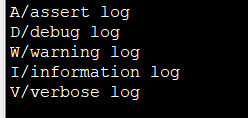
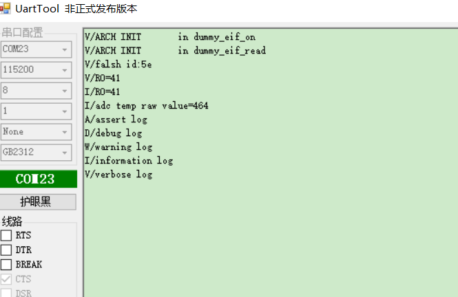

# uart以及rtt的使用

## 1、概述

目前我们的log输出可支持uart以及rtt输出

## 2、log的使用说明

- LOG_A：断言assert消息输出
- LOG_D：仅输出debug调试的意思，但他会输出上层的信息
- LOG_E：error错误消息输出
- LOG_W：warning警告消息输出
- LOG_I：一般提示性的消息information输出
- LOG_V：任何消息都会输出，这里的v代表verbose的意思

## 3、代码实现

### 3.1 工程目录

..\SDK3.3\SDK3\examples\demo\log\mdk

### 3.2 rtt代码编写

```c
//在bx_sdk3_cfg.h文件中配置

//1：要把休眠关闭
#define BX_DEEP_SLEEP                                   ( 0 )

//2：使能log输出
#define BX_ENABLE_LOG                                   1

#if ( BX_ENABLE_LOG > 0 )
    //配置log size 
    #define LOG_PRINTF_BUFFER_SIZE                      64
	//log输出级数
    #define GLOBAL_LOG_LVL                              5
    
    //uart、rtt log输出只能选择其中一种，否则会报错
    #define BX_USE_RTT_LOG                              1
    #define BX_USE_UART_LOG                             0
    #if ( BX_USE_RTT_LOG && BX_USE_UART_LOG )
        #error "You can only choose one. RTT or UART"
    #endif
    //结束符
    //#define BX_DATA_NEWLINE_SIGN                        "\r"
    #define BX_DATA_NEWLINE_SIGN                        "\n"
    //#define BX_DATA_NEWLINE_SIGN                        "\r\n"
#else
    #define GLOBAL_LOG_LVL                              (-1)
#endif 


```


```c
#include “log.h”

/** ---------------------------------------------------------------------------
 * @brief   :
 * @note    :
 * @param   :
 * @retval  :
-----------------------------------------------------------------------------*/
void app_init( void )
{

    LOG_A("assert log ");
    LOG_D("debug log");
    LOG_W("warning log");
    LOG_I("information log");
    LOG_V("verbose log");

}
```

按上述编写，烧录并运行，如下图：

 


### 3.3、uart代码编写

```c
//在bx_sdk3_cfg.h文件中配置

//1：要把休眠关闭
#define BX_DEEP_SLEEP                                   ( 0 )

//2：使能log输出
#define BX_ENABLE_LOG                                   1

#if ( BX_ENABLE_LOG > 0 )
    //配置log size 
    #define LOG_PRINTF_BUFFER_SIZE                      64
	//log输出级数
    #define GLOBAL_LOG_LVL                              5
    
    //uart、rtt log输出只能选择其中一种，否则会报错
    #define BX_USE_RTT_LOG                              0
    #define BX_USE_UART_LOG                             1
    #if ( BX_USE_RTT_LOG && BX_USE_UART_LOG )
        #error "You can only choose one. RTT or UART"
    #endif
    //结束符
    //#define BX_DATA_NEWLINE_SIGN                        "\r"
    #define BX_DATA_NEWLINE_SIGN                        "\n"
    //#define BX_DATA_NEWLINE_SIGN                        "\r\n"
#else
    #define GLOBAL_LOG_LVL                              (-1)
#endif 


```


```c
#include “log.h”

/** ---------------------------------------------------------------------------
 * @brief   :
 * @note    :
 * @param   :
 * @retval  :
-----------------------------------------------------------------------------*/
void app_init( void )
{

    LOG_A("assert log ");
    LOG_D("debug log");
    LOG_W("warning log");
    LOG_I("information log");
    LOG_V("verbose log");

}
```

按上述编写，烧录并运行，如下图：

 

