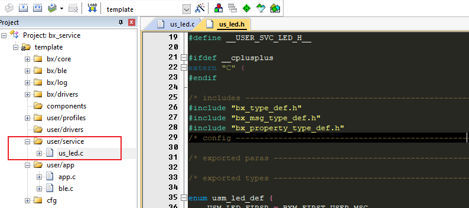

# bx_service

## 1、概述

本文介绍的是基于BX服务框架的service，并非BLE中的service，如需指导如何添加BLE的service，请查看ble_dis例程以及ble_custom_profile例程。

本文以一个LED服务为例，介绍如何从0开始新建一个service，并且使用它，同时阐述service的意义，并介绍与service相关的配置

## 2、新建service

- 新建us_led.c和us_led.h文档
- 确定好service需要的消息和属性
- 将服务注册到系统中

## 3、实现

- 复制模板

复制模板文件us_xxx.h和us_xxx.c，并把名称替换为us_led.h和us_led.c，把文件内容中的"xxx"替换成“led”，“XXX”替换成“LED”（注意区分大小写），然后直接把模板文件添加到工程。

 

完成以上步骤，再把服务注册到系统中，就可以在系统用使用它了：

```c
/** ---------------------------------------------------------------------------
 * @brief   :
 * @note    :
 * @param   :
 * @retval  :
-----------------------------------------------------------------------------*/
void app_init( void )
{
    us_led_register();
    
    struct bx_service * p_svc = bx_get_service( us_led_id() );
    if( p_svc != NULL ) {
        bx_logln("%s",p_svc->name);
    }else{
        bx_logln("not found");
    }
}
//可以得到输出结果为“led service”
```

### 模块化

实际上每个service都可以是单独的一个模块，如文中的us_led，就可以是一个独立的led模块，可以试想一下这个led模块会有哪些功能：

- 点亮
- 熄灭
- 闪烁
- 有很多个led
- 有很多种闪烁模式
- 可以调节闪烁速度
- ...

service一个比较重要的意义就是可以很方便地实现模块化，代码隔离，逻辑隔离


## 4、相关配置

| 宏名称                           | 含义                     | 备注 |
| -------------------------------- | ------------------------ | ---- |
| BXKE_SERVICE_CONFIG_MAX_COUNT    | 系统支持的服务的最大数量 |      |
| BXKE_SERVICE_CONFIG_NAME_MAX_LEN | 服务名称的最大字符串长度 |      |
| BXKE_MSG_CONFIG_MAX_COUNT        | 一般消息的最大并发量     |      |
| BXKE_DELAY_MSG_CONFIG_MAX_COUNT  | 延迟消息的最大并发量     |      |
| BX_SUBSCIBE_MAX_COUNT            | 消息可被订阅的最大总个数 |      |

以上配置，均保存在bx_kernel_config.h中