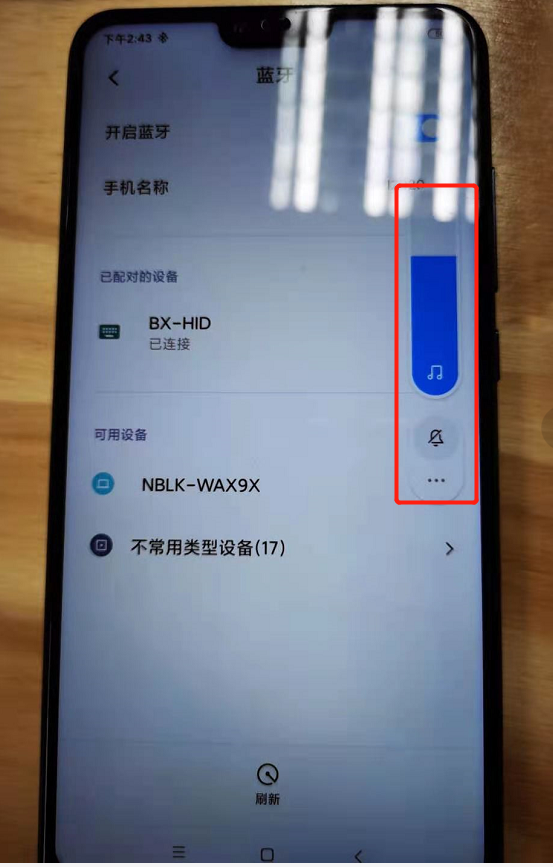

# hid例程的使用

## 1、概述

​		本文档介绍hid的使用，其中包括音量±，上下左右键等。

## 2、工程目录

..\SDK3\examples\demo\bxa_hid\mdk

## 3、添加文件

- bx_kernel.h
- app_hid.h
- app_sec.h
- bxe_matrix_keyboard_wakeup.h
- flexible_button.h

## 4、编写代码

### 4.1 初始化

```c
//定义user服务的结构体 
struct user_service {
    s32 id;

};
//定义user 服务的消息
enum user_app_msg {
    USM_APP_FIRST = BXM_FIRST_USER_MSG,
    //button事件消息
    USM_BTN_EVENT,
};

//设定按键键值
#define POWER_ON_OFF        0x30
#define UP_CMD              0x42
#define MOUSE_CMD           0x00
#define RIGHT_CMD           0x45
#define MENU_CMD            0x223
#define SETTING_CMD         0x40
#define RETURN_CMD          0x224
#define VOLUME_DOWN_CMD     0xEA
#define VOLUME_UP_CMD       0xE9
#define OK_CMD              0x41
#define LEFT_CMD            0x44
#define DOWN_CMD            0x43
//定义键值表
uint16_t button_buf[] = {POWER_ON_OFF, MENU_CMD, LEFT_CMD, UP_CMD,
                         SETTING_CMD, OK_CMD, MOUSE_CMD, RETURN_CMD,
                         VOLUME_UP_CMD, RIGHT_CMD, VOLUME_DOWN_CMD, DOWN_CMD
                        };

//添加hid profile
static const appm_add_svc_func_t appm_add_svc_func_list[] = {
    ...
    ( appm_add_svc_func_t )app_hid_add_hids,
};
//初始化hid 相关函数
/** ---------------------------------------------------------------------------
 * @brief   :
 * @note    :
 * @param   :
 * @retval  :
-----------------------------------------------------------------------------*/
void app_on_ble_init( void )
{
    ...
	//绑定初始化函数
    app_sec_init();
    //hid初始化函数
    app_hid_init();
}

/** ---------------------------------------------------------------------------
 * @brief   :
 * @note    :
 * @param   :
 * @retval  :
-----------------------------------------------------------------------------*/
void app_init( void )
{
    //创建user service 服务
    struct bx_service svc;
    svc.prop_set_func = NULL;
    svc.prop_get_func = NULL;
    svc.msg_handle_func = user_msg_handle_func;
    svc.name = "user service";
    us_svc.id = bx_register( &svc );
	//按键初始化
    key_init();
    //订阅按键事件消息
    bx_subscibe( us_svc.id, USM_BTN_EVENT, 0, 0 );
}
```

### 4.2 代码实现

```c
//hid report,关于按键处理部分，参考按键demo，参数btn_event表示触发的事件，参数btn_id表示触发的按键
bx_err_t hid_report_process( u32 btn_event, u32 btn_id )
{
    //按键事件
    switch( btn_event ) {
		//短按、长按、按住不放事件
        case FLEX_BTN_PRESS_SHORT_START:
        case FLEX_BTN_PRESS_LONG_START:
        case FLEX_BTN_PRESS_LONG_HOLD: {
            //按键键值设定
            u8 temp[REPORT_LENGTH_ID0] = {0};
            temp[0] = button_buf[btn_id];
            temp[1] = button_buf[btn_id] >> 8;
			//report 按键消息
            app_hid_send_keyboard_report( &temp[0] );
        }
        break;
		//短按释放、长按释放、按住不放释放事件
        case FLEX_BTN_PRESS_SHORT_UP:
        case FLEX_BTN_PRESS_LONG_UP:
        case FLEX_BTN_PRESS_LONG_HOLD_UP: {
            //按键键值设定
            u8 temp[REPORT_LENGTH_ID0] = {0};
			//report 按键消息
            app_hid_send_keyboard_report( &temp[0] );
        }
        break;

    }
}

bx_err_t user_msg_handle_func( s32 id, u32 msg, u32 param0, u32 param1 )
{
    s32 msg_src = bx_msg_source();

    if( msg_src == us_svc.id ) {
        switch( msg ) {
            //按键触发消息
            case USM_BTN_EVENT: {
                //按键处理
                hid_report_process( param0, param1 );
            }
            break;

            default:
                break;
        }

    }
    return BX_OK;
}

```

```c
//在按键回调函数里增加按键触发事件发布消息，有关按键的处理可参考按键demo
/** ---------------------------------------------------------------------------
 * @brief   :
 * @note    :
 * @param   :
 * @retval  :
-----------------------------------------------------------------------------*/
static void common_btn_evt_cb( void * arg )
{
    flex_button_t * btn = ( flex_button_t * )arg;
	//发布按键触发事件消息
    bx_public( us_svc.id, USM_BTN_EVENT, btn->event, btn->id  );


    switch( btn->event ) {
      ...
    }

}
```

## 5、功能演示

### 5.1 按照第4章代码实现

### 5.2 编译文件，然后烧录文件

### 5.3 演示结果

下图是按键8的效果




## 附录

### 1、消息参数说明

#### 1 消息表

| 消息          | 含义         | 方向 |
| ------------- | ------------ | ---- |
| USM_BTN_EVENT | 按键触发事件 | 外发 |

接收/外发的方向是对于服务来说的，比如GPIO的，应用层发消息给GPIO，对于GPIO来说就是接收消息，GPIO发布一个消息，就是外发。下同

##### 1.2.1 USM_BTN_EVENT

| 参数   | 含义           | 值范围                  | 备注 |
| ------ | -------------- | ----------------------- | ---- |
| param0 | 按键触发的事件 | 参见flex_button_event_t |      |
| param1 | 按键值         | 0 ~ USER_BUTTON_MAX     |      |

