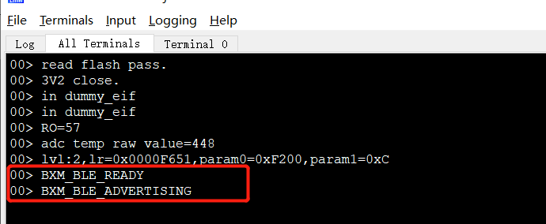
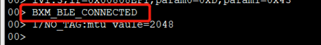
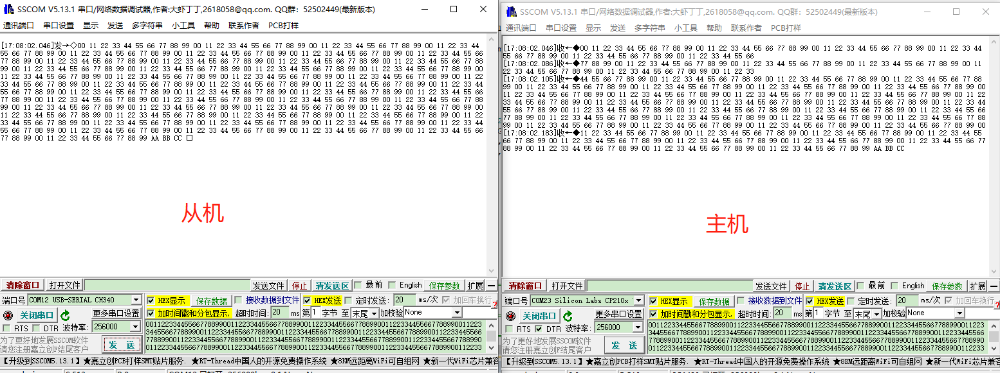
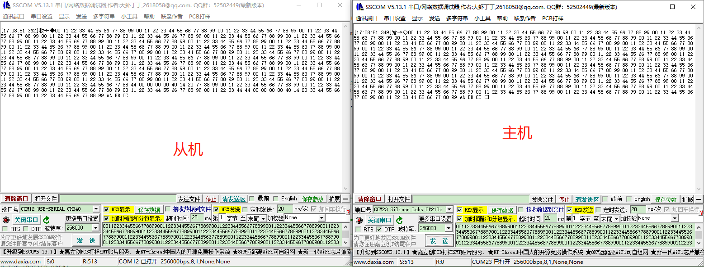
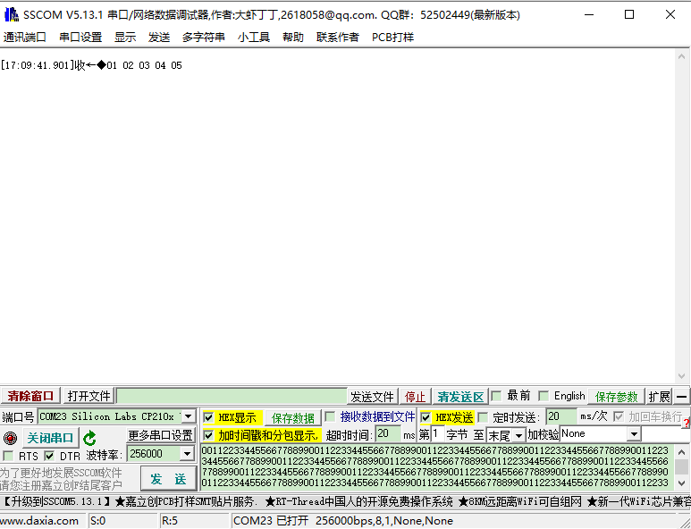
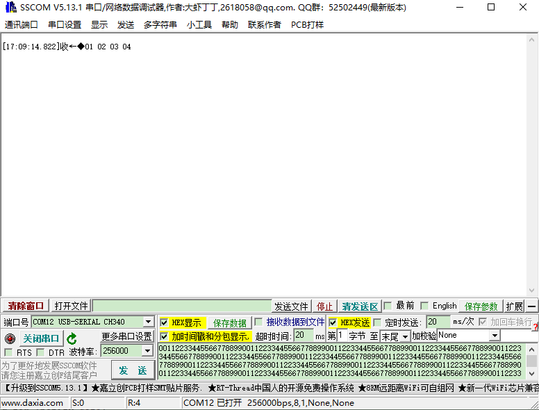

# 透传从机端使用说明

## 1、概述

​		本文档介绍透传的从机端使用，包括主机端下发数据最终通过从机端透传输出，从机端透传输出到主机端，下文以串口透传为例。

## 2、工程目录

..\SDK3\examples\demo\bxa_tt\mdk

## 3、添加文件

- bxd_uart.h
- bxd_tim.h
- bxd_gpio.h
- gattc.h
- bx_apollo00_it.h
- bx_pm.h

## 4、编写代码

### 4.1 初始化

```c
//选择其中一种透传方式，1为开启，0为关闭
#define TT_UART	1
#define TT_SPI	0
#define TT_IIC	0

//P13为uart_rx，P12为uart_tx，波特率：256000，8bit，1停止位，没有奇偶校验位
#define UART_TX_PIN    12// 串口发送pin
#define UART_RX_PIN     13//串口接收pin
//rx接收到数据，notify出去每个包的最大长度
#define RX_MAX_NOTIFY_LEN        240
//tx发送数据每次数据最大的包长度
#define TX_MAX_DEPTH        32
//串口波特率
#define UART_BOND   256000
//rx接收超时时间，单位时间：ms
#define RX_IDLE_COUNT_MAX  (8*1000*RX_MAX_NOTIFY_LEN/UART_BOND+1)//1//uint:ms
//最小连接间隔
#define CONN_INTERVAL_MIN   16//  // Unit:1.25ms
//最大连接间隔
#define CONN_INTERVAL_MAX   16//   // Unit:1.25ms
//连接latency
#define SLAVE_LATENCY       0//
//连接超时
#define CONN_TIMEOUT        200// //unit:10ms
//uart rx buffer
#define RXFIFO_MAX_LEN	20480
static u8 rx_buff[RXFIFO_MAX_LEN];
//uart tx buffer
#define TXFIFO_MAX_LEN 20480
static u8 tx_buff[TXFIFO_MAX_LEN];
//定义并初始化user service
struct user_service us_svc = {0} ;

struct user_service {
    s32 id;//服务id
    u8 notify_start;//notify data标志位，1：正在notify，0：notify结束
    u32 notify_len;//notify 包的长度
    u32 notify_idle_count;//notify idle 计数器
    u8  tx_busy;//0:idle 1:busy
    u32 rx_len;//当前rx_fifo 长度
    u32 tx_len;//当前tx_fifo长度
    uint16_t max_notify_len;//notify 最大包的长度

    struct bx_fifo rx_fifo;//rx fifo
    struct bx_fifo tx_fifo;//tx fifo
};

```

### 4.2 app.c文件实现透传

```c
/** ---------------------------------------------------------------------------
 * @brief   :关闭uart
 * @note    :
 * @param   :
 * @retval  :
-----------------------------------------------------------------------------*/
void uart_uninit( void )
{
    bxd_uart_close( BX_UART1 );
}
/** ---------------------------------------------------------------------------
 * @brief   :初始化uart
 * @note    :
 * @param   :
 * @retval  :
-----------------------------------------------------------------------------*/
void uart_init( void )
{
    //开启uart
    bxd_uart_open( BX_UART1 );
    //配置tx pin
    bxd_uart_set_tx_pin( BX_UART1, UART_TX_PIN );
    //配置rx pin
    bxd_uart_set_rx_pin( BX_UART1, UART_RX_PIN );
	//设置数据位
    bxd_uart_set_data_bit( BX_UART1, BX_UART_DB_8B );
    //设置波特率
    bxd_uart_set_speed( BX_UART1, BX_UART_BD_256000 );
    //设置停止位
    bxd_uart_set_stop_bit( BX_UART1, BX_UART_SB_ONE );
    //设置奇偶校验位
    bxd_uart_set_parity( BX_UART1, BX_UART_PARITY_NONE );
	//初始化rx fifo
    bx_fifo_init( &us_svc.rx_fifo, rx_buff, RXFIFO_MAX_LEN );
    //初始化tx fifo
    bx_fifo_init( &us_svc.tx_fifo, tx_buff, TXFIFO_MAX_LEN );
	//开启uart read
    bxd_uart_intr_read_start( BX_UART1 );
    bxd_uart_enable_intr( BX_UART1 );
}
/** ---------------------------------------------------------------------------
 * @brief   :开启tim0
 * @note    :
 * @param   :
 * @retval  :
-----------------------------------------------------------------------------*/
void tim0_start( void )
{
    //开启tim0
    bxd_timer_open( BX_TIM0 );
    //设置tim0周期为1100ms
    bxd_timer_start( BX_TIM0, 1100 );
}
/** ---------------------------------------------------------------------------
 * @brief   :关闭tim0
 * @note    :
 * @param   :
 * @retval  :
-----------------------------------------------------------------------------*/
void tim0_close( void )
{
    bxd_timer_close( BX_TIM0 );
}

/** ---------------------------------------------------------------------------
 * @brief   :初始化gpio
 * @note    :
 * @param   :
 * @retval  :
-----------------------------------------------------------------------------*/
void gpio_init( void )
{
    //开启gpio
    bxd_gpio_open( BX_GPIOA );
	//设置P15为输入模式
    bxd_gpio_set_mode( BX_GPIOA, 15, BX_GPIO_MODE_INPUT );
    //设置P15为上拉
    bxd_gpio_set_pull( BX_GPIOA, 15, BX_GPIO_PULLUP );
    //设置P15为外部中断下降沿触发模式
    bxd_gpio_set_mode( BX_GPIOA, 15, BX_GPIO_MODE_EIT_FALLING );
	//设置P17为输入模式
    bxd_gpio_set_mode( BX_GPIOA, 17, BX_GPIO_MODE_INPUT );
    //设置P17为上拉
    bxd_gpio_set_pull( BX_GPIOA, 17, BX_GPIO_PULLUP );
    //设置P17为外部中断下降沿触发模式
    bxd_gpio_set_mode( BX_GPIOA, 17, BX_GPIO_MODE_EIT_FALLING );
}
/** ---------------------------------------------------------------------------
 * @brief   :关闭gpio
 * @note    :
 * @param   :
 * @retval  :
-----------------------------------------------------------------------------*/
void gpio_uninit( void )
{
    bxd_gpio_close( BX_GPIOA );
}

/** ---------------------------------------------------------------------------
 * @brief   :服务notify data
 * @note    :
 * @param   :
 * @retval  :
-----------------------------------------------------------------------------*/
void notify_data( u32 data_len )
{
    u8 rx_data[250];
    //取出fifo数据
    bx_fifo_pop( &( us_svc.rx_fifo ), rx_data, data_len );
	//notify data start标志位
    us_svc.notify_start = 1;
    //notify data
    ble_send_data_notify( &rx_data[0], data_len, 30 );
}

/** ---------------------------------------------------------------------------
 * @brief   :uart tx data
 * @note    :
 * @param   :
 * @retval  :
-----------------------------------------------------------------------------*/
void tx_data( u32 data_len )
{
    u8 tx_data[50] = {0};
	//uart tx标志位置1
    us_svc.tx_busy = 1;

	//取出fifo数据
    bx_fifo_pop( &( us_svc.tx_fifo ), tx_data, data_len );
	//uart tx data
    bxd_uart_write( BX_UART1, tx_data, data_len );
	//清除uart tx标志位
    us_svc.tx_busy = 0;
}
/** ---------------------------------------------------------------------------
 * @brief   :
 * @note    :
 * @param   :
 * @retval  :
-----------------------------------------------------------------------------*/
void app_init( void )
{
    bx_it_init();
    //注册user service
    struct bx_service svc;
    svc.prop_set_func = NULL;
    svc.prop_get_func = NULL;
    svc.msg_handle_func = user_msg_handle_func;
    svc.name = "user service";
    us_svc.id = bx_register( &svc );
	//订阅BLE连接消息
    bx_subscibe( us_svc.id, BXM_USER_BLE_CONNECTED, 0, 0 );
    //订阅BLE断开消息
    bx_subscibe( us_svc.id, BXM_USER_BLE_DISCONNECTED, 0, 0 );
    //订阅BLE notify结束消息
    bx_subscibe( us_svc.id, BXM_USER_BLE_NOTIFY_END, 0, 0 );
    //订阅TIM0中断触发消息
    bx_subscibe( us_svc.id, BXM_USER_TIM0_INTR, 0, 0 );
    //订阅GPIO中断触发消息
    bx_subscibe( us_svc.id, BXM_USER_GPIO_INTR, 0, 0 );   
}
/** ---------------------------------------------------------------------------
 * @brief   :user 消息处理
 * @note    :
 * @param   :
 * @retval  :
-----------------------------------------------------------------------------*/
bx_err_t user_msg_handle_func( s32 svc, u32 msg, u32 param0, u32 param1 )
{

    s32 msg_src = bx_msg_source();
    if( msg_src == us_svc.id ) {
        switch( msg ) {
            //ble 连接上消息
            case BXM_USER_BLE_CONNECTED:
                bx_pm_lock( BX_PM_ALL );
                LOG_RAW( "BXM_BLE_CONNECTED\r\n" );
                //初始化tim0
                tim0_start();
                //初始化gpio
                gpio_init();
                //初始化uart
                uart_init();
                //交换mtu
                ble_exchange_mtu();
				//delay 4000ms更新连接参数
                bx_dwork( appm_update_param, NULL, 4000, 1 );
                break;
			//ble 断开连接消息
            case BXM_USER_BLE_DISCONNECTED:
                LOG_RAW( "BXM_BLE_DISCONNECTED\r\n" );
                //关闭uart
                uart_uninit();
                //关闭tim0
                tim0_close();
                //关闭gpio
                gpio_uninit();
                
                bx_pm_unlock( BX_PM_ALL );

                break;
			//ble notify data 结束消息
            case BXM_USER_BLE_NOTIFY_END:
                //清除notify data start 标志位
                us_svc.notify_start = 0;
                break;
			//tim0 中断触发消息
            case BXM_USER_TIM0_INTR: {
                //notify 标志位
                bool send_now = false;

                // 检查notify 最大包的长度
                if( ( gattc_get_mtu( 0 ) - 3 ) > RX_MAX_NOTIFY_LEN ) {
                    us_svc.max_notify_len = RX_MAX_NOTIFY_LEN;
                } else {
                    us_svc.max_notify_len = ( gattc_get_mtu( 0 ) - 3 );
                }

                //notify idle 计数器
                us_svc.notify_idle_count++;
				//获取当前rx fifo 长度
                us_svc.rx_len = bx_fifo_get_len( &( us_svc.rx_fifo ) );
                //若当前rx fifo长度大于最大notify包，notify data标志位置1
                if(  us_svc.rx_len >= us_svc.max_notify_len ) {
                    us_svc.notify_len = us_svc.max_notify_len;
                    send_now = true;
                    us_svc.notify_idle_count = 0;
                }

                if( !send_now ) {
                    //check if idle for long time

                    if( us_svc.rx_len == 0 ) {
                        us_svc.notify_idle_count = 0;
                    } else if( ( us_svc.notify_idle_count > RX_IDLE_COUNT_MAX ) ) {//若当前rx fifo长度>0,并且计数器大于设置的阈值，notify标志位置1
                        us_svc.notify_len = us_svc.rx_len;
                        us_svc.notify_idle_count = 0;
                        send_now = true;
                    }
                }
				//当前属于空闲状态并且notify data标志位被置1，马上notify
                if( ( send_now ) && ( !us_svc.notify_start ) ) {
                    notify_data( us_svc.notify_len );
                }
				//uart tx 的长度
                uint16_t tx_len = 0;
                //uart tx 标示位
                bool tx_now = false;
				//若当前uart tx属于空闲状态，并且TX_FIFO not full，执行下面动作
                if(  ( !us_svc.tx_busy ) && ( BX_READ_BIT( BX_UART1->US, UART_US_TX_FIFO_NOT_FULL ) >> UART_US_TX_FIFO_NOT_FULL_POS != 0 )   ) {
                    //获取当前uart tx fifo 长度
                    us_svc.tx_len = bx_fifo_get_len( &( us_svc.tx_fifo ) );
                    //若当前uart tx fifo长度大于所设置的最大阈值，tx标志位置1，并设置当次最大tx数据包=阈值
                    if( us_svc.tx_len > TX_MAX_DEPTH ) {
                        tx_len = TX_MAX_DEPTH;
                        tx_now = true;
                    } else if( us_svc.tx_len > 0 ) {//若当前uart tx fifo长度>0，tx标志位置1，并设置当次tx数据包=当前tx fifo长度
                        tx_len = us_svc.tx_len;
                        tx_now = true;
                    }
					//uart tx 标志位被置1，马上tx
                    if( tx_now ) {
                        tx_data( tx_len );
                    }
                }
            }
            break;
			//gpio 外部中断触发消息
            case BXM_USER_GPIO_INTR:
                if( param0 == 0x8000 ) {
                    LOG_RAW( "BXM_GPIO15_EXT_INTR\r\n" );
//                    bx_post( us_ble_id(), BXM_BLE_ADV_START, 0, 0 );
                } else if( param0 == 0x20000 ) {
                    LOG_RAW( "BXM_GPIO17_EXT_INTR\r\n" );
                    static u8 test_data[5] = {1, 2, 3, 4, 5};
                    us_svc.notify_start = 1;
                    //notify 数据
                    ble_send_data_notify( test_data, 5, 30 );
                }
                break;

            default:
                break;
        }

    }
    return BX_OK;
}
```

### 4.3 bx_apollo00_it.c文件添加中断向量函数

```c
/** ---------------------------------------------------------------------------
 * @brief   :外部中断状态转换为pin state
 * @note    :
 * @param   :
 * @retval  :
-----------------------------------------------------------------------------*/
u32 ext_int_stat_2_pin_state( u32 ext_int_stat )
{
    u32 ret = 0;
    u32 temp = 0;


    for( u32 i = 0; i < 5; i++ ) {
        if( ext_int_stat & ( 0x01 << i ) ) {
            switch( i ) {
                case 0:{
                    temp = 0x01 << 15;
                }
                    break;

                case 1:
                    temp = 0x01 << 16;
                    break;

                case 2:
                    temp = 0x01 << 17;
                    break;

                case 3:
                    temp = 0x01 << 22;
                    break;

                case 4:
                    temp = 0x01 << 23;
                    break;

                default:
                    break;
            }
        }
        ret |= temp;
    }
    return ret;
}
/*========================= end of private function ==========================*/

/*============================ interrupt function ============================*/
/** ---------------------------------------------------------------------------
 * @brief   :gpio外部中断处理
 * @note    :
 * @param   :
 * @retval  :
-----------------------------------------------------------------------------*/

void EXT_INTR_IRQHandler( void )
{
    uint8_t ext_int_stat = BX_FIELD_RD( BX_AWO->EIVAL, AWO_EIVAL_VAL ) ;
    BX_AWO->EICLR |= ext_int_stat;
    u32 pin_state = ext_int_stat_2_pin_state( ext_int_stat );
    //发布外部中断触发消息
    bx_public( us_svc.id, BXM_USER_GPIO_INTR, pin_state, 0);
//    LOG_I( "EXT_INTR_IRQHandler,ext_int_stat=%d" ,ext_int_stat);
}

/** ---------------------------------------------------------------------------
 * @brief   :
 * @note    :
 * @param   :
 * @retval  :
-----------------------------------------------------------------------------*/
/** ---------------------------------------------------------------------------
 * @brief   :timer 中断处理
 * @note    :
 * @param   :
 * @retval  :
-----------------------------------------------------------------------------*/
void TIMER_IRQHandler( void )
{
    uint32_t timer_isr_status0, timer_isr_status1;

    timer_isr_status0 = BX_TIM0->IS & 0x01;
    timer_isr_status1 = BX_TIM1->IS & 0x01;

    if( timer_isr_status0 ) {
        BX_READ_REG( BX_TIM0->EOI );
        //发布tim0中断触发消息
        bx_public( us_svc.id, BXM_USER_TIM0_INTR, 0, 0 );
    }

    if( timer_isr_status1 ) {
        BX_READ_REG( BX_TIM1->EOI );
//        bx_public( us_svc.id, BXM_USER_TIM1_INTR, 0, 0 );
    }
}

/** ---------------------------------------------------------------------------
 * @brief   :uart1中断处理
 * @note    :
 * @param   :
 * @retval  :
-----------------------------------------------------------------------------*/
void UART1_IRQHandler( void )
{

    u8 irq_status = BX_READ_REG( BX_UART1->IF ) & 0x0F;

    switch( irq_status ) {
        case BX_UART_IRQ_RLS:
        case BX_UART_IRQ_CT:
        case BX_UART_IRQ_RDA: {
            while( 1 == BX_READ_BIT( BX_UART1->LS, UART_LS_DATA_READY ) ) {
                u8 data = BX_UART1->RTD;
                //把接收到的数据放入fifo中
                bx_fifo_push( &( us_svc.rx_fifo ), &data, 1 ) ;
            }
 
        }
        break;

        default:
            break;
    }
}
```

### 4.4 ble 增加的消息处理

```c
/** ---------------------------------------------------------------------------
 * @brief   :
 * @note    :
 * @param   :
 * @retval  :
-----------------------------------------------------------------------------*/
static int gattc_cmp_evt_handler( ke_msg_id_t const msgid, struct gattc_cmp_evt const * param,
                                  ke_task_id_t const dest_id, ke_task_id_t const src_id )
{
    //发布write data 结束消息
    bx_public( us_svc.id, BXM_USER_BLE_NOTIFY_END, 0, 0 );
    return ( KE_MSG_CONSUMED );
}
/**
 ****************************************************************************************
 * @brief Handles reception of the @ref GATT_CODE_ATT_WR_CMD_IND message.
 * The handler compares the new values with current ones and notifies them if they changed.
 * @param[in] msgid Id of the message received (probably unused).
 * @param[in] param Pointer to the parameters of the message.
 * @param[in] dest_id ID of the receiving task instance (probably unused).
 * @param[in] src_id ID of the sending task instance.
 * @return If the message was consumed or not.
 ****************************************************************************************
 */
static int gattc_write_req_ind_handler( ke_msg_id_t const msgid,
                                        struct gattc_write_req_ind * param,
                                        ke_task_id_t const dest_id,
                                        ke_task_id_t const src_id )
{
//    LOG_I( "user gattc_write_req_ind_handler\thandle = %d", param->handle );
    uint8_t state  = ke_state_get( dest_id );
    if( state == USER_PROFILE_IDLE ) {
        uint8_t status = GAP_ERR_NO_ERROR;
        struct gattc_write_cfm * cfm;

        //Send write response
        cfm = KE_MSG_ALLOC( GATTC_WRITE_CFM, src_id, dest_id, gattc_write_cfm );
        cfm->handle = param->handle;
        cfm->status = status;
        ke_msg_send( cfm );
		//把接收到的数据放到fifo
        bx_fifo_push( &( us_svc.tx_fifo ), &param->value[0], param->length );
    }
    return ( KE_MSG_CONSUMED );
}
```


## 5、演示结果

### 5.1 按照第4章编写代码并烧录

### 5.2 编译文件，然后烧录文件

### 5.3 演示结果

#### 5.3.1 从机上电进入广播状态，等待主机连接



#### 5.3.2 主机上电靠近从机，进入连接



#### 5.3.3 从机把串口接收到的数据上传给主机



#### 5.3.4 主机把串口接收到的数据下发给从机



#### 5.3.5 从机按下P17把数据传给主机



#### 6.3.6主机按下P17把数据传给从机




