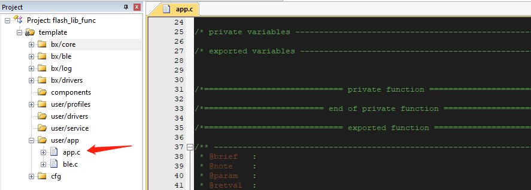
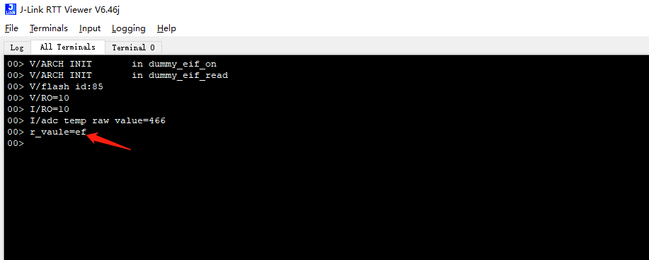

# flash的库函数使用

## 1、概述

本文档主要介绍如何在SDK3中使用flash的库函数接口来实现数据的擦除、读、写等操作


## 2、功能实现

复制一个ble_base工程，并修改名称为bxd_flash 

找到app.c文件，文件在工程的位置如下

 

在app.c中添加头文件flash_wrapper.h和log.h

前者是flash的库函数h文件，后者是为了输出log


找到app.c中的app_init函数添加如下代码

```c
#define user_flash_adress   0x20000

u8 w_value = 0xef;
u8 r_value = 0x00;
flash_erase( user_flash_adress, Sector_Erase );

flash_program( user_flash_adress, 1, &w_value );

flash_multi_read( user_flash_adress, 1, &r_value );
LOG_RAW( "r_vaule=%02x\r\n\r\n", r_value );
```
注意：这里操作的flash地址可以看到是0x20000,实际上0x20000是地址的offset,芯片的起始地址是0x800000,所以操作得到flash地址实际上是0x820000;

flash的存储位置是否可以用取决于用户本身的程序大小，至少要大于程序的位置；


## 3、功能测试

- 代码添加完毕，编译代码使之通过
- 连接jlink，烧录程序到开发板中，打开rtt可以看到输出log的效果

 

由此可以得知数据确实被写入到flash中了