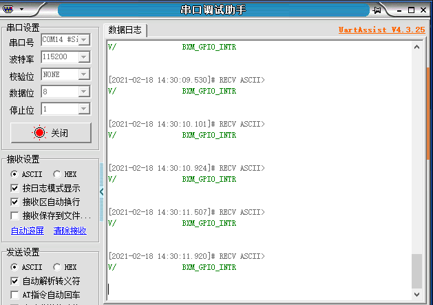

# 1.概述

​		本文档介绍库函数方式的GPIO外设例程，打开SDK3/examples/demo路径下的bxd_gpio工程

# 2.OUTPUT

## 2.1 功能代码

在app.c文件中：

app_init()里的以下代码；代码示例如下

```c
void app_init( void )
{
    bx_pm_lock( BX_PM_GPIO );
    bxd_gpio_open( BX_GPIOA );      //打开时钟
    bxd_gpio_set_mode( BX_GPIOA, 2, BX_GPIO_MODE_OUTPUT );  //设置引脚2为输出模式
    bxd_gpio_write( BX_GPIOA, 2, 0 ); //将引脚2电平拉高；0为高1为低；
}
```

## 2.2 功能演示

代码编译通过后烧入开发板，查看开发板的LED灯可发现LED灯已经被点亮

# 3.INPUT

## 3.1 功能代码

在app.c文件中：

app_init()里的以下代码；代码示例如下

```c
void read_pin( void * data )
{
    bxd_gpio_read( BX_GPIOA, &pin_value );  //读取gpio引脚电平
    if( !( pin_value >> 15 & 0x01 ) ) {
        bxd_gpio_write( BX_GPIOA, 2, 0 );   //p15引脚电平为高则点亮led灯
    } else {
        bxd_gpio_write( BX_GPIOA, 2, 1 );   //p15引脚电平为低则熄灭led灯
    }
}
void app_init( void )
{
    bx_pm_lock( BX_PM_GPIO );
    bxd_gpio_open( BX_GPIOA );
    bxd_gpio_set_mode( BX_GPIOA, 2, BX_GPIO_MODE_OUTPUT );  //设置p02为输出
    bxd_gpio_write( BX_GPIOA, 2, 0 );  //置0点亮led
    bxd_gpio_set_mode( BX_GPIOA, 15, BX_GPIO_MODE_INPUT );  //p15输入
    bxd_gpio_set_mode( BX_GPIOA, 15, BX_GPIO_MODE_IT_FALLING );  //设置为下降沿触发中断
    bxd_gpio_enable_intr( BX_GPIOA );  //使能中断
    bx_dwork( read_pin, NULL, 10, -1 );  //定时调用read_pin

}
```

## 注：

可通过按压pin15来改变gpio引脚电平；

## 3.2 功能演示

代码编译通过后烧入开发板，查看开发板的LED灯可发现LED灯在翻转

# 4.中断

## 4.1 功能代码

在app.c文件中：

app_init()里的以下代码；代码示例如下

```c
void app_init( void )
{
    bx_pm_lock( BX_PM_GPIO );
    bxd_gpio_open( BX_GPIOA );      //打开时钟
    bxd_gpio_set_mode( BX_GPIOA, 2, BX_GPIO_MODE_OUTPUT );  //设置引脚2为输出模式
    bxd_gpio_write( BX_GPIOA, 2, 0 );   //将引脚2电平拉高；0为高1为低；
    bxd_gpio_set_mode( BX_GPIOA, 15, BX_GPIO_MODE_IT_FALLING ); //设置引脚15为具有下降沿触发检测的中断模式
    bxd_gpio_enable_intr( BX_GPIOA );//使能中断
}
```

添加两个中断函数；代码示例如下

```c
void GPIO_IRQHandler( void )
{
    uint32_t int_stat = BX_GPIOA->IS;
    BX_GPIOA->EOI |= int_stat;
    bx_logln( "BXM_GPIO_INTR" );    //触发中断，则串口打印信息
}
```

```c
u32 ext_int_stat_2_pin_state( u32 ext_int_stat )
{
    u32 ret = 0;
    u32 temp = 0;
    for( u32 i = 0; i < 5; i++ ) {
        if( ext_int_stat & ( 0x01 << i ) ) {
            switch( i ) {
                case 0:
                    temp = 0x01 << 15;
                    break;

                case 1:
                    temp = 0x01 << 16;
                    break;

                case 2:
                    temp = 0x01 << 17;
                    break;

                case 3:
                    temp = 0x01 << 22;
                    break;

                case 4:
                    temp = 0x01 << 23;
                    break;

                default:
                    break;
            }
        }
        ret |= temp;
    }
    return ret;
}
```

## 4.2 功能演示

当按下pin15时，可以看到串口打印相应信息；如图所示：

