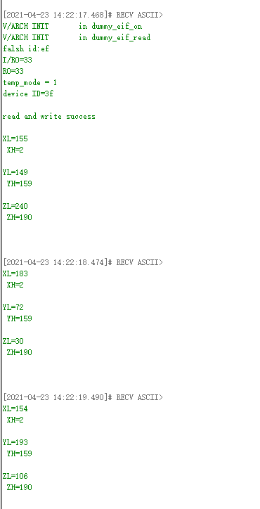

# 1.概述

本文档介绍库函数方式的IIC外设例程，打开SDK3/examples/demo路径下的bxd_gpio工程

# 2.IIC功能实现

## 2.1功能代码

添加文件

- bxd_iic.c

- bxd_iic.h

- bx_pm.c

- lis3dsh_iic.c

- lis3dsh_iic.h

  

  在app.c文件中代码如下：

  ```c
  #include "app.h"
  #include "bx_pm.h"
  #include "bxd_iic.h"
  #include "lis3dsh_iic.h"
  #include "plf.h"
  
      uint8_t iic_data[3] = {0x77, 0x02, 0x04};
      uint8_t iic_readbuf[3] = {0};
      uint8_t lis3_data[2] = {0x8f, 0x00};
  
  
      extern app_iic_param_t iic_param;
  
      void app_init( void ) {
          bx_pm_lock( BX_PM_IIC );//打开IIC时钟源
          bxd_iic_open( BX_IIC0 ); //选择IIC类型（IIC0或IIC1）
          bxd_iic_set_scl( BX_IIC0, 2 ); //设置P02为时钟线
          bxd_iic_set_sda( BX_IIC0, 3 ); //设置P03为数据线
          bxd_iic_set_addr_bit( BX_IIC0, BX_IIC_ADDR_BIT_7B ); //选择7位地址寻址模式
          bxd_iic_set_speed( BX_IIC0, BX_IIC_SPEED_STANDARD ); //选择标准输出速率
          bxd_iic_set_mode( BX_IIC0, BX_IIC_MODE_MASTER ); //选择IIC主机模式
  
  
          //以下使用lis3dsh三轴加速度模块做演示范例
          iic_read_lis3dsh( 0x0f, iic_readbuf, 3 );//获取WHO_AM_I的值
          if( iic_readbuf[0] == UC_WHO_AM_I_DEFAULT_VALUE ) {
              bx_logln( "device ID=%02x\r\n", iic_readbuf[0] );
              iic_write_lis3dsh( ADD_REG_CTRL_4, iic_data, 3 );//向从机寄存器写数据
              iic_read_lis3dsh( ADD_REG_CTRL_4, iic_readbuf, 3 );//从寄存器读数据
              if( iic_readbuf[0] == 0x77 ) {
                  bx_logln( "read and write success\r\n" );//确认读写成功
                  bx_dwork( read_lis3dsh, NULL, 1000, BX_FOREVER );//IIC读取加速度数据
  
              }
  
          } else {
              bx_logln( "device get failed\r\n" );
          }
  
      }
  
  void read_lis3dsh( void * arg )
  {
      iic_read_lis3dsh( 0x28, iic_readbuf, 1 );
      bx_logln( "XL=%d", iic_readbuf[0] );
      iic_read_lis3dsh( 0x29, iic_readbuf, 1 );
      bx_logln( " XH=%d\r\n", iic_readbuf[0] );
      iic_read_lis3dsh( 0x2a, iic_readbuf, 1 );
      bx_logln( "YL=%d", iic_readbuf[0] );
      iic_read_lis3dsh( 0x2b, iic_readbuf, 1 );
      bx_logln( " YH=%d\r\n", iic_readbuf[0] );
      iic_read_lis3dsh( 0x2c, iic_readbuf, 1 );
      bx_logln( "ZL=%d", iic_readbuf[0] );
      iic_read_lis3dsh( 0x2d, iic_readbuf, 1 );
      bx_logln( " ZH=%d\r\n", iic_readbuf[0] );
  }
  ```
  
  

## 2.2功能演示

 


