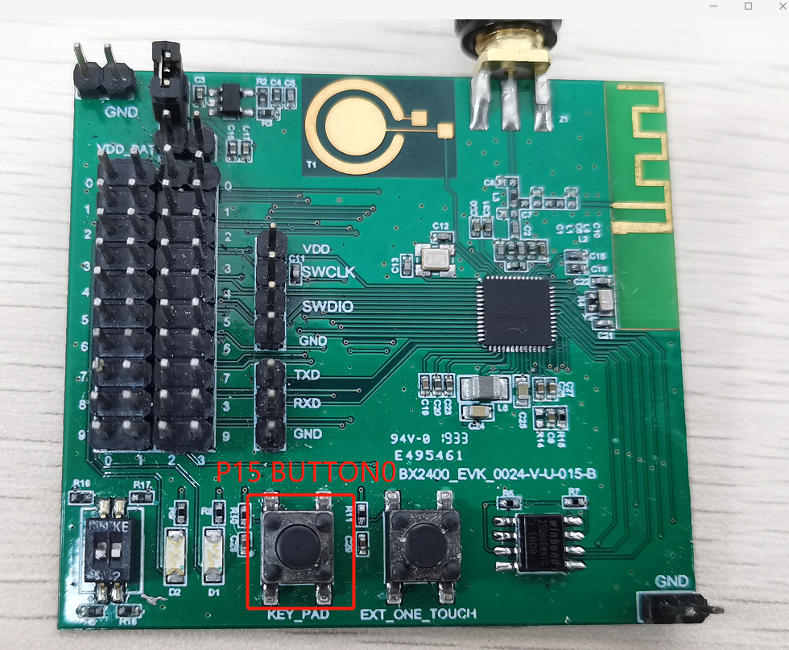

# 用库函数的方式介绍PWM的使用

## 1、概述

​		本文档介绍PWM的使用，主频32Mhz下输出能高达160kHz。

## 2、新建工程

1、新建工程，首先复制下图工程


2、粘贴到SDK3\example目录下

3、修改文件名为bxd_pwm,将工程名修改为bxd_pwm

4、打开工程添加文件

- bxd_pwm.h
- bxd_gpio.h
- plf.h
- bx_pm.h

## 3、编写代码

添加以下代码

```c
#define    PWM0_PIN			2
#define    PWM1_PIN			3
#define    PWM2_PIN			4
#define    PWM3_PIN			5
#define	   PWM4_PIN			6
#define    BUTTON_0         15
void app_init(void)
{
		static u8 duty_value=0;	//pwm占空比
		u32 pin_value;	//io value
		
		bx_pm_lock(BX_PM_GPIO);
		bxd_gpio_open(BX_GPIOA);		//打开GPIO驱动
		bxd_gpio_set_mode(BX_GPIOA,15,BX_GPIO_MODE_INPUT);	//将15号引脚设置为输入模式，15引脚对应的是按钮1
		bx_drv_gpio_set_pull(BX_GPIOA,15,BX_GPIO_PULLUP);
    //将15号引脚拉高
	
		bx_pm_lock(BX_PM_PWM);
		bxd_pwm_open(BX_PWM0);	//打开pwm0的驱动
		bxd_pwm_open(BX_PWM1);	//打开pwm1的驱动
		bxd_pwm_open(BX_PWM2);	//打开pwm2的驱动
		bxd_pwm_open(BX_PWM3);	//打开pwm3的驱动
		bxd_pwm_open(BX_PWM4);	//打开pwm4的驱动
	
    	bxd_pwm_set_clock_div( 2 );
    
		bxd_pwm_set_pin(BX_PWM0,PWM0_PIN);	//设置pwm0控制的是引脚是PWM0_PIN，具体对应几号引脚前面有定义
		bxd_pwm_set_pin(BX_PWM1,PWM1_PIN);	//设置pwm1控制的引脚是PWM1_PIN
		bxd_pwm_set_pin(BX_PWM2,PWM2_PIN);	//设置pwm2控制的引脚是PWM2_PIN
		bxd_pwm_set_pin(BX_PWM3,PWM3_PIN);	//设置pwm3控制的引脚是PWM3_PIN
		bxd_pwm_set_pin(BX_PWM4,PWM4_PIN);	//设置pwm4控制的引脚是PWM4_PIN
		
    	//PWM0~PWM4 输出设置，包括频率、占空比
		bxd_pwm_start(BX_PWM0,1000,0);	//pwm0开始输出，输出频率为1000，占空比为0
		bxd_pwm_start(BX_PWM1,50000,20);
		bxd_pwm_start(BX_PWM2,160000,50);
		bxd_pwm_start(BX_PWM3,10000,40);
		bxd_pwm_start(BX_PWM4,1000,100);
		
		while(1)
		{
            	//读取IO值
				bxd_gpio_read(BX_GPIOA,(u32*)&pin_value);
			
            //BUTTON0即P15有按下，则PWM0 占空比每次递增10%，达到100%后又从0开始，如此循环
			if( !( pin_value >> 15 ) ) {
            if( duty_value >= 100 ) {
                duty_value = 0;
            } else {
                duty_value += 10;
            }

            bxd_pwm_start( BX_PWM0, 1000, duty_value );

            BX_DELAY_US( 1000 * 1000 );
        }
		}
	
}
```

## 4、功能演示

4.1获取电池电压

- 按照第三章代码实现
- 编译文件，然后烧录文件
- 演示结果


其中CH1为PWM3输出，CH2为PWM4输出，CH3为PWM1输出，CH4为PWM2输出，由于示波器仅有四个通道此处PWM0未显示在此处

