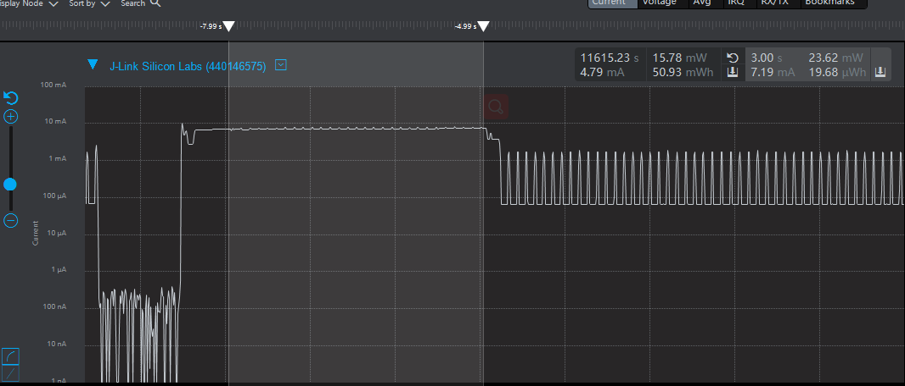
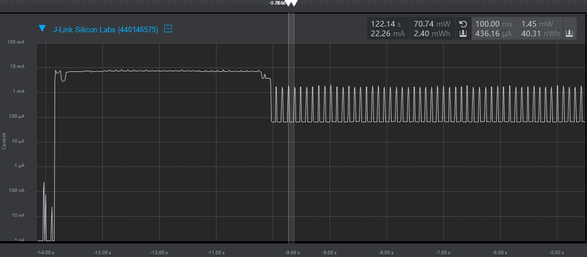
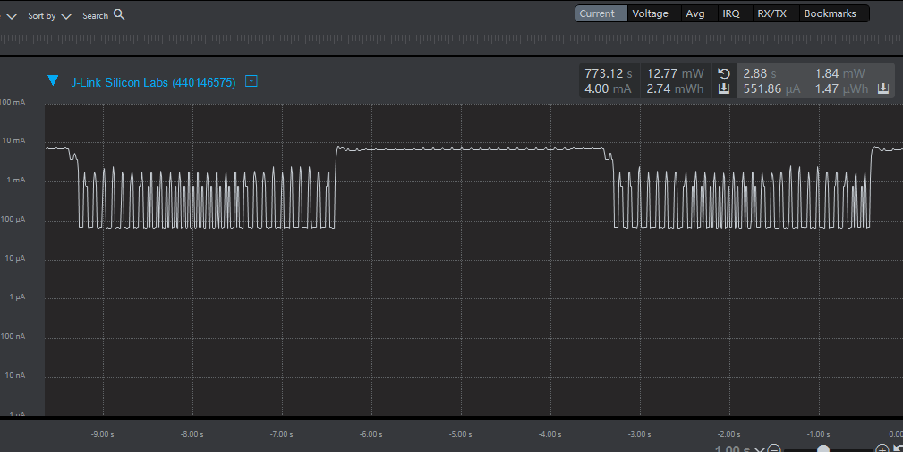
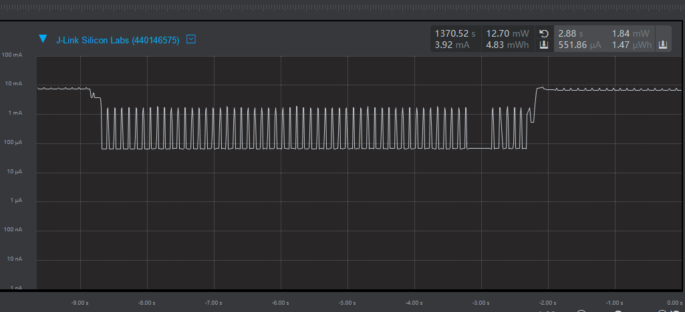

# 1.概述

​		本文档介绍BX设备如何进入休眠，以及唤醒后外设使用的注意事项；打开SDK3/examples/demo路径下的bxd_sleep工程

# 2.进入休眠

## 2.1 功能代码

在app.c文件中

app_init()里的代码；代码示例如下：

```c
void app_init( void )
{
    bx_pm_lock( BX_PM_GPIO );	
    bxd_gpio_open( BX_GPIOA );	//打开时钟
    bxd_gpio_set_mode( BX_GPIOA, 2, BX_GPIO_MODE_OUTPUT );	//将引脚2的模式设置为输出模式
    bxd_gpio_write( BX_GPIOA, 2, 0 );	//将引脚2电平拉高
    
    bx_dwork(device_sleep,NULL,100,-1);		//每隔100ms调用函数device_sleep()
}
```


device_sleep()里的代码，代码示例如下：

```c
void device_sleep(void *arg)
{
    sleep++;	//设置一个变量用来统计多少秒
    if(sleep >=30)	//当3s后则执行下面的函数
    {
        sleep = 0;	
        bx_pm_unlock(BX_PM_ALL);	//设备进入休眠
        bx_dwork_cancel(device_sleep);	//取消定时调用函数
    }
}
```

### 注：

需要自己定义变量sleep；


## 2.2 功能演示

按照以上代码编译通过后将文件烧录到设备，可发现开发板的led在常亮3s后熄灭；查看设备功耗可以发现设备在3s后便进入休眠；如图所示




# 3.BLE唤醒

在app.c中

app_on_ble_ready()里的代码，代码示例如下：

```c
void app_on_ble_ready( void )
{
    struct gapm_start_advertise_cmd adv_data;
    adv_data.op.addr_src    = GAPM_STATIC_ADDR;
    adv_data.channel_map    = ADV_ALL_CHNLS_EN;
    adv_data.intv_max   = 160;//unit is 625 us
    adv_data.intv_min   = 160;//unit is 625 us
    adv_data.op.code    = GAPM_ADV_UNDIRECT;
    adv_data.info.host.mode = GAP_GEN_DISCOVERABLE;
    adv_data.info.host.adv_data_len = sizeof( user_adv_data );
    adv_data.info.host.scan_rsp_data_len  = sizeof( user_scan_rsp_data );
    adv_data.info.host.adv_filt_policy = ADV_ALLOW_SCAN_ANY_CON_ANY;
    memcpy( adv_data.info.host.adv_data, user_adv_data, sizeof( user_adv_data ) );
    memcpy( adv_data.info.host.scan_rsp_data, user_scan_rsp_data, sizeof( user_scan_rsp_data ) );

    ble_advertising_start( &adv_data );

}	//开启广播
```


app_init()里的代码；代码示例如下：

```c
void app_init( void )
{
    bx_pm_lock( BX_PM_GPIO );
    bxd_gpio_open( BX_GPIOA );	//打开时钟
    bxd_gpio_set_mode( BX_GPIOA, 2, BX_GPIO_MODE_OUTPUT );	//将引脚2的模式设置为输出模式
    bxd_gpio_write( BX_GPIOA, 2, 0 );	//将引脚2电平拉高
    
    bx_dwork(device_sleep,NULL,100,-1);		//每隔100ms调用函数device_sleep()
}
```


## 3.2 功能演示

按照以上代码编译通过后将文件烧录到设备，可发现开发板的led在常亮3s后熄灭；查看设备功耗可以发现设备在3s后便进入休眠，进入休眠后每隔100ms便会唤醒一次；如图所示




# 4.bx_timer唤醒

## 4.1 功能代码

在app.c中

app_init()里的代码；代码示例如下：

```c
void app_init( void )
{
    bx_pm_lock( BX_PM_GPIO );
    bxd_gpio_open( BX_GPIOA );		//打开时钟
    bxd_gpio_set_mode( BX_GPIOA, 2, BX_GPIO_MODE_OUTPUT );	//将引脚2的模式设置为输出模式
    bxd_gpio_write( BX_GPIOA, 2, 0 );	//将引脚2电平拉高

    bx_dwork(device_sleep,NULL,100,-1);		//每隔100ms调用函数device_sleep()
}
```


device_sleep()里的代码；代码示例如下：

```c
void device_sleep(void *arg)
{
    sleep++;	//设置一个变量用来统计多少秒
    if(sleep >=30)	//当3s后则执行下面的函数
    {
        sleep = 0;
        bx_dwork(device_timer_wakeup,NULL,100,-1);		//每隔100ms调用函数device_timer_wakeup()
        bx_pm_unlock(BX_PM_ALL);	//设备进入休眠
        bx_dwork_cancel(device_sleep);	//取消定时调用函数
    }
}
```


device_timer_wakeup()里的代码；代码示例如下：

```c
void device_timer_wakeup(void *arg)
{
    wakeup++;	//设置一个变量用来统计多少秒
    if(wakeup >=30)		//当3s后则执行下面的函数
    {
        wakeup = 0;
        bx_pm_lock( BX_PM_GPIO );
        bxd_gpio_open( BX_GPIOA );	//打开时钟
        bxd_gpio_set_mode( BX_GPIOA, 2, BX_GPIO_MODE_OUTPUT );	//将引脚2的模式设置为输出模式
        bxd_gpio_write( BX_GPIOA, 2, 0 );	//将引脚2电平拉高
        bx_dwork(device_sleep,NULL,100,-1);  //每隔100ms调用函数device_sleep()
        bx_dwork_cancel(device_timer_wakeup);	//取消定时调用函数
    }
}
```

### 注：

需要自己定义变量sleep，wakeup；

## 4.2 功能演示

按照以上代码编译通过后将文件烧录到设备，可发现开发板的led在常亮3s后熄灭，如此循环；查看设备功耗可以发现设备在3s后便进入休眠，进入休眠后再隔3s便被唤醒；如图所示




# 5.外部中断唤醒

## 5.1 功能代码

在app.c中

app_init()里的代码；代码示例如下：

```c
void app_init( void )
{
    bx_pm_lock( BX_PM_GPIO );
    bxd_gpio_open( BX_GPIOA );	//打开时钟
    bxd_gpio_set_mode( BX_GPIOA, 2, BX_GPIO_MODE_OUTPUT );	//将引脚2的模式设置为输出模式
    bxd_gpio_write( BX_GPIOA, 2, 0 );	//将引脚2电平拉高
    
    bxd_gpio_set_pull( BX_GPIOA, 15, BX_GPIO_PULLUP );	//将引脚15拉高
    bxd_gpio_set_mode( BX_GPIOA, 15, BX_GPIO_MODE_EIT_FALLING );	//将引脚15的模式设置为具有外部中断下降沿模式
    
    bx_dwork(device_sleep,NULL,100,-1);		//每隔100ms调用函数device_sleep()
}
```


EXT_INTR_IRQHandler()里的代码；代码示例如下：

```c
void EXT_INTR_IRQHandler( void )
{
    uint8_t ext_int_stat = BX_FIELD_RD( BX_AWO->EIVAL, AWO_EIVAL_VAL ) ;
    BX_AWO->EICLR |= ext_int_stat;
	
	bx_dwork(device_wakeup,NULL,100,1);	//触发外部中断后，每隔100ms调用函数device_wakeup()
}
```


device_wakeup()里的代码；代码示例如下：

```c
void device_wakeup(void *arg)
{
    bx_pm_lock( BX_PM_GPIO );
    bxd_gpio_open( BX_GPIOA );	//打开时钟
    bxd_gpio_set_mode( BX_GPIOA, 2, BX_GPIO_MODE_OUTPUT );	//将引脚2的模式设置为输出模式
    bxd_gpio_write( BX_GPIOA, 2, 0 );	//将引脚2电平拉高	
}
```

### 注：

需要自己添加外部中断函数；

## 5.2 功能演示

按照以上代码编译通过后将文件烧录到设备，可发现开发板的led在常亮3s后熄灭；查看设备功耗可以发现设备在3s后便进入休眠；按下按键PIN15，设备被唤醒；如图所示

