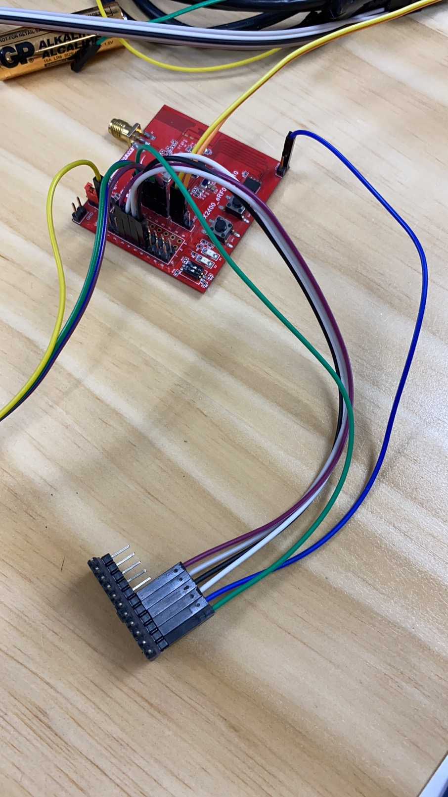
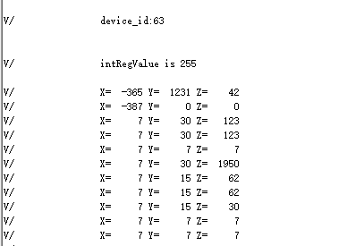

# 1.概述

​		本文的介绍库函数方式的spi主机功能例程，打开SDK3/examples/demo路径下的bxd_spi工程


# 2. SPI使用

## 2.1 功能代码

在bxd_spim.h文件中：

添加以下宏定义

```c
#define ADD_REG_WHO_AM_I				0x0F
#define ADD_REG_CTRL_4					0x20
#define ADD_REG_OUT_X_L					0x28
#define ADD_REG_OUT_X_H					0x29
#define ADD_REG_OUT_Y_L					0x2A
#define ADD_REG_OUT_Y_H					0x2B
#define ADD_REG_OUT_Z_L					0x2C
#define ADD_REG_OUT_Z_H					0x2D

#define UC_WHO_AM_I_DEFAULT_VALUE		0x3F
#define UC_ADD_REG_CTRL_4_CFG_VALUE		0x77

#define SENS_2G_RANGE_MG_PER_DIGIT		((float)0.06)
#define SET_READ_SINGLE_CMD(x)			(x | 0x80)
#define SET_WRITE_SINGLE_CMD(x)			(x & (~(0xC0)))
```

在app.c文件中：

app_init()里的代码；对spi初始化；代码示例如下

```c
    void app_init( void ) {
        uint8_t device_id;
        int intRegValue;
        int intValueMgX, intValueMgY, intValueMgZ;


        bx_pm_lock( BX_PM_SPIM );
        bxd_spim_open( BX_SPIM0 );  //打开时钟
        bxd_spim_set_speed( BX_SPIM0, 100000 ); //设置传输速度
        bxd_spim_set_data_bit( BX_SPIM0, BX_SPI_DATA_BIT_8B );  //设置数据为8bit
        bxd_spim_use_cs( BX_SPIM0, 0x01 );  //设置片选引脚( 0x01->cs0 0x02->cs1)
        bxd_spim_set_cs1_pin( BX_SPIM0, 3 ); //设置设备上与片选引脚与之对应的引脚( 3->cs0 2->cs1 )

        device_id = LIS3DSH_read_reg( ADD_REG_WHO_AM_I );
        bx_logln( "device_id:%d\r\n", device_id );
        if( device_id == UC_WHO_AM_I_DEFAULT_VALUE ) {
            bx_logln( "device_id:%d\r\n", device_id );
            LIS3DSH_write_reg( ADD_REG_CTRL_4, UC_ADD_REG_CTRL_4_CFG_VALUE );
            intRegValue = LIS3DSH_read_reg( ADD_REG_CTRL_4 );
            if( intRegValue != UC_ADD_REG_CTRL_4_CFG_VALUE ) {
                bx_logln( "intRegValue is %d\r\n", intRegValue );
            }
            bx_dwork( read_lis3dsh, NULL, 2000, BX_FOREVER );
        } else {
            bx_logln( "device get failed\r\n" );
        }

    }
    void read_lis3dsh( void * arg ) {
        int intValueMgX, intValueMgY, intValueMgZ;
        intValueMgX = ( ( LIS3DSH_read_reg( ADD_REG_OUT_X_H ) << 8 ) |   LIS3DSH_read_reg( ADD_REG_OUT_X_L ) );
        intValueMgY = ( ( LIS3DSH_read_reg( ADD_REG_OUT_Y_H ) << 8 ) | LIS3DSH_read_reg( ADD_REG_OUT_Y_L ) );
        intValueMgZ = ( ( LIS3DSH_read_reg( ADD_REG_OUT_Z_H ) << 8 ) | LIS3DSH_read_reg( ADD_REG_OUT_Z_L ) );

        intValueMgX = twoComplToInt16( intValueMgX );
        intValueMgX = intValueMgX * SENS_2G_RANGE_MG_PER_DIGIT;

        intValueMgY = twoComplToInt16( intValueMgY );
        intValueMgY = intValueMgY * SENS_2G_RANGE_MG_PER_DIGIT;

        intValueMgZ = twoComplToInt16( intValueMgZ );
        intValueMgZ = intValueMgZ * SENS_2G_RANGE_MG_PER_DIGIT;
        bx_log( "X=%6d Y=%6d Z=%6d \r\n", intValueMgX, intValueMgY, intValueMgZ );
        bx_delay_asm( 20000000 );
    }
```

spi读写代码；代码示例如下：

```c
uint8_t iic_data[3]={0x66,0x02,0x04};
uint8_t iic_readbuf[3]={0x01,0x02,0x03};
uint8_t lis3_data[2]={0x8f,0x00};

uint8_t lis3_rx_data[2]={0x01,0x02};
uint8_t lis3_rx_data2[2]={0x01,0x02};


void LIS3DSH_write_reg(int reg, int data)
{
	  lis3_data[0] = SET_WRITE_SINGLE_CMD(reg);
		lis3_data[1] = data;
	

	 bxd_spim_write(BX_SPIM0,( u8 * )lis3_data,2);

}

int LIS3DSH_read_reg(int reg)
{	
    lis3_data[0] = SET_READ_SINGLE_CMD(reg);
	lis3_data[1] =0xff;

	bxd_spim_write(BX_SPIM0,( u8 * )lis3_data,1);
	bxd_spim_read(BX_SPIM0,( u8 * )lis3_rx_data,2);
	
	return lis3_rx_data[1];

}

int twoComplToInt16(int twoComplValue)
{
	  int int16Value = 0;
	  /* conversion */
	  if(twoComplValue > 32768)
	  {
		    int16Value = -(((~twoComplValue) & 0xFFFF) + 1);
	  }
	  else
	  {
		    int16Value = twoComplValue;
	  }

	  return int16Value;

}
```

## 2.2 功能演示

连接好开发板硬件，板子上再连接一个lis3dsh三轴传感器，如图所示：



烧入对应的烧录文件，打开串口工具，复位开发板可以看到串口工具上会不停的打印x,y,z的数据

