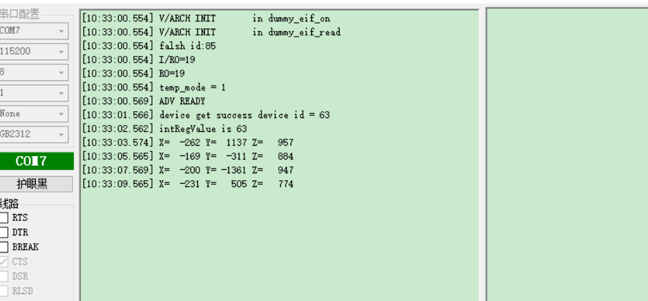

# spi中断使用说明

## 1、概述

​		本文档介绍spi中断使用，下文以三轴传感器为例。

## 2、工程目录

..\SDK3\examples\demo\ble_spi_intr\mdk

## 3、添加文件

- bxd_spim.h

## 4、编写代码

### 4.1 初始化

```c
#define ADD_REG_WHO_AM_I                0x0F//设备id寄存器地址
#define ADD_REG_CTRL_4                  0x20//ctrk4寄存器地址
#define ADD_REG_OUT_X_L                 0x28//X轴低八位寄存器地址
#define ADD_REG_OUT_X_H                 0x29//X轴高八位寄存器地址
#define ADD_REG_OUT_Y_L                 0x2A//Y轴低八位寄存器地址
#define ADD_REG_OUT_Y_H                 0x2B//Y轴高八位寄存器地址
#define ADD_REG_OUT_Z_L                 0x2C//Z轴低八位寄存器地址
#define ADD_REG_OUT_Z_H                 0x2D//Z轴高八位寄存器地址

#define UC_WHO_AM_I_DEFAULT_VALUE       0x3F//设备数据
#define UC_ADD_REG_CTRL_4_CFG_VALUE     0x77//ctrl4数据

#define SENS_2G_RANGE_MG_PER_DIGIT      ((float)0.06)
#define SET_READ_SINGLE_CMD(x)          (x | 0x80)//设备读指令

#define SET_WRITE_SINGLE_CMD(x)         (x & (~(0xC0)))//设备写指令
#define	SPI_FIFO_DEPTH	2//spi 深度
struct user_service {
    s32 id;//服务id
	bool m_lock;//spi master lock
	u8 spi_state;//spi 状态
	u8 xyz_state;//x/y/z轴状态
};

uint8_t m_tx_len = 0;//spi tx 长度
uint8_t m_rx_len = 0;//spi rx 长度
uint8_t * m_p_tx_buff = 0;//spi tx buffer
uint8_t * m_p_rx_buff = 0;//spi rx buffer

struct user_service us_svc = {0};

uint8_t lis3_data[2] = {0x8f, 0x00};//spi tx cmd/data

uint8_t lis3_rx_data[2] = {0x01, 0x02};//spi rx buffer

uint8_t device_id;//设备id
int intValueMgX, intValueMgY, intValueMgZ;//x、y、z轴value


```

### 4.2 app.c文件实现spi中断使用

```c
//spi tx/rx fifo 深度
void spim_fifo_depth( void )
{
    BX_MODIFY_REG( BX_SPIM0->TXFTL, SPIM_TXFTL_VAL, ( uint32_t ) ( SPI_FIFO_DEPTH / 2 ) );
    BX_MODIFY_REG( BX_SPIM0->RXFTL, SPIM_RXFTL_VAL, ( uint32_t ) ( SPI_FIFO_DEPTH / 2 ) );
}
//spi 中断mask
void spim_intr_mask( void )
{
    BX_SET_BIT( BX_SPIM0->IM, SPIM_IM_MMC );
    BX_SET_BIT( BX_SPIM0->IM, SPIM_IM_RFF );
    BX_SET_BIT( BX_SPIM0->IM, SPIM_IM_RFO );
    BX_SET_BIT( BX_SPIM0->IM, SPIM_IM_RFU );
    BX_SET_BIT( BX_SPIM0->IM, SPIM_IM_TFO );
    BX_SET_BIT( BX_SPIM0->IM, SPIM_IM_TFE );
}

//spi 初始化
void spim_init( void )
{
    NVIC_DisableIRQ( SPIM0_IRQn );       //disable interrupt

    bxd_spim_open( BX_SPIM0 );//初始化spim0
    bxd_spim_set_speed( BX_SPIM0, 100000 );//设置spi传输速度，单位：hz，此处设为100khz
    bxd_spim_set_data_bit( BX_SPIM0, BX_SPI_DATA_BIT_8B );//spi数据位，此处为8bit
    bxd_spim_use_cs( BX_SPIM0, 0x01 );//spi cs选择
    bxd_spim_set_cs1_pin( BX_SPIM0, 2 );//cs pin

    spim_fifo_depth();
    spim_intr_mask();

    /*the last step*/
    NVIC_ClearPendingIRQ( SPIM0_IRQn );  //clear  interrupt
    NVIC_EnableIRQ( SPIM0_IRQn );        //enable interrupt
}

//spi tx
bx_err_t spim_transmit_data( uint8_t * pbuff, uint32_t len )
{
    if( us_svc.m_lock == true ) {
        return -1;
    }

    us_svc.m_lock = true;

    m_tx_len = len;
    m_p_tx_buff = pbuff;

    /*open clock gate*/
    BX_PER->CLKG0 |= PER_CLKG0_32M_SET_SPIM0;
    BX_PER->CLKG0 |= PER_CLKG0_PLL_SET_SPIM0;

    BX_MODIFY_REG( BX_SPIM0->CTRL, SPIM_CTRL_TM, SPIM_CTRL_TM_T_TX );

    /*start transfer*/
    BX_SET_BIT( BX_SPIM0->IM, SPIM_IM_TFE  );

    /*set ssie enable*/
    BX_SET_BIT( BX_SPIM0->SSIE, SPIM_SSIE_BIT );

    return BX_OK;
}
//spi rx
bx_err_t spim_receive_data( uint8_t * pbuff, uint32_t len )
{
    if( us_svc.m_lock == true ) {
        return -1;
    }

    us_svc.m_lock = true;

    m_rx_len = len;
    m_p_rx_buff = pbuff;


    /*open clock gate*/
    BX_PER->CLKG0 |= PER_CLKG0_32M_SET_SPIM0;
    BX_PER->CLKG0 |= PER_CLKG0_PLL_SET_SPIM0;

    BX_MODIFY_REG( BX_SPIM0->CTRL, SPIM_CTRL_TM, SPIM_CTRL_TM_T_RX );

    BX_SET_BIT( BX_SPIM0->IM, SPIM_IM_TFE  );
    BX_SET_BIT( BX_SPIM0->IM, SPIM_IM_RFF  );

    /*set ssie enable*/
    BX_SET_BIT( BX_SPIM0->SSIE, SPIM_SSIE_BIT );

    return BX_OK;
}
//spi tx&rx
bx_err_t spim_transmit_receive_data( uint8_t * tx_pbuff, uint32_t tx_len, uint8_t * rx_pbuff, uint32_t rx_len )
{
    if( us_svc.m_lock == true ) {
        return -1;
    }
//    LOG_RAW( "spim_transmit_receive_data\n" );

    us_svc.m_lock = true;
    m_tx_len = tx_len;
    m_p_tx_buff = tx_pbuff;
    m_rx_len = rx_len;
    m_p_rx_buff = rx_pbuff;

    /*open clock gate*/
    BX_PER->CLKG0 |= PER_CLKG0_32M_SET_SPIM0;
    BX_PER->CLKG0 |= PER_CLKG0_PLL_SET_SPIM0;

    BX_MODIFY_REG( BX_SPIM0->CTRL, SPIM_CTRL_TM, SPIM_CTRL_TM_T_TXRX );


    BX_SET_BIT( BX_SPIM0->IM, SPIM_IM_TFE  );
    BX_SET_BIT( BX_SPIM0->IM, SPIM_IM_RFF  );

    /*set ssie enable*/
    BX_SET_BIT( BX_SPIM0->SSIE, SPIM_SSIE_BIT );


    return BX_OK;
}

//三轴传感器写数据
void LIS3DSH_write_reg( int reg, int data )
{
    lis3_data[0] = SET_WRITE_SINGLE_CMD( reg );
    lis3_data[1] = data;

    spim_transmit_data( lis3_data, 2 );

}
//三轴传感器读数据
int LIS3DSH_read_reg( int reg )
{
    lis3_data[0] = SET_READ_SINGLE_CMD( reg );
    lis3_data[1] = 0xff;

    spim_transmit_receive_data( lis3_data, 2, lis3_rx_data, 2 );

    return lis3_rx_data[1];
}
//16位整型有字符转换
int twoComplToInt16( int twoComplValue )
{
    int int16Value = 0;
    /* conversion */
    if( twoComplValue > 32768 ) {
        int16Value = -( ( ( ~twoComplValue ) & 0xFFFF ) + 1 );
    } else {
        int16Value = twoComplValue;
    }

    return int16Value;
}
/** ---------------------------------------------------------------------------
 * @brief   :
 * @note    :
 * @param   :
 * @retval  :
-----------------------------------------------------------------------------*/
void app_init( void )
{
    //注册user服务
    struct bx_service svc;
    svc.prop_set_func = NULL;
    svc.prop_get_func = NULL;
    svc.msg_handle_func = user_msg_handle_func;
    svc.name = "user service";
    us_svc.id = bx_register( &svc );
    //spi 初始化
    spim_init();
	//1s 定时器
    bx_repeat( us_svc.id, BXM_USER_TRANSMIT_DATA, 0, 0, 1000 );
	//订阅消息
    bx_subscibe( us_svc.id, BXM_USER_TRANSMIT_DATA, 0, 0 );
    bx_subscibe( us_svc.id, BXM_USER_RECEIVE_DATA_END, 0, 0 );
    //读取设备id
    LIS3DSH_read_reg( ADD_REG_WHO_AM_I );
    us_svc.spi_state = SPI_STA_DEVICE_ID;
}

/** ---------------------------------------------------------------------------
 * @brief   :
 * @note    :
 * @param   :
 * @retval  :
-----------------------------------------------------------------------------*/
bx_err_t user_msg_handle_func( s32 svc, u32 msg, u32 param0, u32 param1 )
{

    int intRegValue;

    s32 msg_src = bx_msg_source();
    if( msg_src == us_svc.id ) {
        switch( msg ) {
            case BXM_USER_TRANSMIT_DATA:
                
                if( ( us_svc.spi_state == SPI_STA_DEVICE_ID ) && ( lis3_rx_data[1] == UC_WHO_AM_I_DEFAULT_VALUE ) ) {//读取设备是否正常，正常进行下一步
                    LOG_RAW( "device get success device id = %d\r\n", lis3_rx_data[1] );
                    us_svc.spi_state = SPI_STA_REG;//spi状态更新为读取REG状态
                    LIS3DSH_write_reg( ADD_REG_CTRL_4, UC_ADD_REG_CTRL_4_CFG_VALUE );//ctrl4写数据
                    LIS3DSH_read_reg( ADD_REG_CTRL_4 );//ctrl4读数据
				
                } else if( us_svc.spi_state == SPI_STA_REG ) {//ctrl4 读数据返回值
                    us_svc.spi_state = SPI_STA_XYZ_R;//切换spi状态为x、y、z轴读取
                    if( lis3_rx_data[1] != UC_ADD_REG_CTRL_4_CFG_VALUE ) {//写的数据若跟读的不同，输出此值
                        LOG_RAW( "intRegValue is %d\r\n", lis3_rx_data[1] );
                    }
                } else if( us_svc.spi_state == SPI_STA_XYZ_R ) {//x、y、z轴读取状态下执行的动作
                    if( us_svc.xyz_state == XYZ_STA_NONE ) {//初始化初始状态
                        intValueMgX = 0;
                        intValueMgY = 0;
                        intValueMgZ = 0;
                        //读取X轴高八位
                        us_svc.xyz_state = XYZ_STA_X_R_H;
                        LIS3DSH_read_reg( ADD_REG_OUT_X_H );
                        //取消1s 定时器
                        bx_cancel( us_svc.id, BXM_USER_TRANSMIT_DATA );
                    }
                } else {//设备id读取失败，重新读取
                    LOG_RAW( "device get failed	read data %x\t%x\r\n", lis3_rx_data[0], lis3_rx_data[1] );
                    us_svc.spi_state = SPI_STA_NONE;
                    LIS3DSH_read_reg( ADD_REG_WHO_AM_I );
                }
                break;


            case BXM_USER_RECEIVE_DATA_END:
                if( us_svc.spi_state == SPI_STA_XYZ_R ) {
                    if( us_svc.xyz_state == XYZ_STA_X_R_H ) {//读取x轴低八位
                        intValueMgX = lis3_rx_data[1] << 8;
                        us_svc.xyz_state = XYZ_STA_X_R_L;
                        LIS3DSH_read_reg( ADD_REG_OUT_X_L );

                    }
                    if( us_svc.xyz_state == XYZ_STA_X_R_L ) {//读取y轴高八位
                        intValueMgX += lis3_rx_data[1];
                        us_svc.xyz_state = XYZ_STA_Y_R_H;
                        LIS3DSH_read_reg( ADD_REG_OUT_Y_H );

                    } else if( us_svc.xyz_state == XYZ_STA_Y_R_H ) {//读取y轴低八位
                        intValueMgY = lis3_rx_data[1] << 8;
                        us_svc.xyz_state = XYZ_STA_Y_R_L;
                        LIS3DSH_read_reg( ADD_REG_OUT_Y_L );

                    } else if( us_svc.xyz_state == XYZ_STA_Y_R_L ) {//读取z轴高八位
                        intValueMgY += lis3_rx_data[1];
                        us_svc.xyz_state = XYZ_STA_Z_R_H;
                        LIS3DSH_read_reg( ADD_REG_OUT_Z_H );

                    } else if( us_svc.xyz_state == XYZ_STA_Z_R_H ) {//读取z轴低八位
                        intValueMgZ = lis3_rx_data[1] << 8;
                        us_svc.xyz_state = XYZ_STA_Z_R_L;
                        LIS3DSH_read_reg( ADD_REG_OUT_Z_L );


                    } else if( us_svc.xyz_state == XYZ_STA_Z_R_L ) {//输出最近一次读取的x、y、z轴数据
                        intValueMgZ += lis3_rx_data[1];
                        us_svc.xyz_state = XYZ_STA_NONE;

                        intValueMgX = twoComplToInt16( intValueMgX );
                        intValueMgX = intValueMgX * SENS_2G_RANGE_MG_PER_DIGIT;

                        intValueMgY = twoComplToInt16( intValueMgY );
                        intValueMgY = intValueMgY * SENS_2G_RANGE_MG_PER_DIGIT;

                        intValueMgZ = twoComplToInt16( intValueMgZ );
                        intValueMgZ = intValueMgZ * SENS_2G_RANGE_MG_PER_DIGIT;
						//延迟2s执行消息 BXM_USER_TRANSMIT_DATA
                        bx_defer( us_svc.id, BXM_USER_TRANSMIT_DATA, 0, 0, 2000 );
                        LOG_RAW( "X=%6d Y=%6d Z=%6d \r\n", intValueMgX, intValueMgY, intValueMgZ );;
                    }
                }

                break;

            default:
                break;
        }

    }
    return BX_OK;
}
```

### 4.3 bx_apollo00_it.c文件添加中断向量函数

```c
/** ---------------------------------------------------------------------------
 * @brief   :
 * @note    :
 * @param   :
 * @retval  :
-----------------------------------------------------------------------------*/
static void spim_rx_full_isr( void )//spi rx接收中断回调函数
{
	while(BX_READ_BIT(BX_SPIM0->STA, SPIM_STA_RFNE)>>SPIM_STA_RFNE_POS)
	{
		if(BX_READ_BIT(BX_SPIM0->CTRL, SPIM_CTRL_DFS32) <= SPIM_CTRL_DFS32_T_8_BITS)
		{
			*(uint8_t *)m_p_rx_buff = BX_SPIM0->DATA;
			m_p_rx_buff += 1;
		}
		else if(BX_READ_BIT(BX_SPIM0->CTRL, SPIM_CTRL_DFS32) <= SPIM_CTRL_DFS32_T_16_BITS)
		{
			*(uint16_t *)m_p_rx_buff = BX_SPIM0->DATA;
			m_p_rx_buff += 2;
		}
		else
		{
			*(uint32_t *)m_p_rx_buff = BX_SPIM0->DATA;
			m_p_rx_buff += 4;
			
		}
		--m_rx_len;

	}

	
	if(m_rx_len > 0)
		BX_SPIM0->RXFTL = m_rx_len > SPI_FIFO_DEPTH ? SPI_FIFO_DEPTH / 2 - 1:m_rx_len - 1;
	else{
		BX_CLR_BIT( BX_SPIM0->SSIE, SPIM_SSIE_BIT ); 
		BX_SET_REG( BX_SPIM0->SE, 0 ); 
		bx_public(us_svc.id,BXM_USER_RECEIVE_DATA_END,0,0);
		us_svc.m_lock = false;
	}

}
/** ---------------------------------------------------------------------------
 * @brief   :
 * @note    :
 * @param   :
 * @retval  :
-----------------------------------------------------------------------------*/
static void spim_tx_empty_isr( void )//spi tx发送中断回调函数
{

   if(m_tx_len)
   	{
		while(BX_READ_BIT(BX_SPIM0->STA, SPIM_STA_TFNF)>>SPIM_STA_TFNF_POS)
		{
			if(BX_READ_BIT(BX_SPIM0->CTRL, SPIM_CTRL_DFS32) <= SPIM_CTRL_DFS32_T_8_BITS)
			{
				BX_SPIM0->DATA = *(uint8_t *)m_p_tx_buff;
				m_p_tx_buff += 1;
			}
			else if(BX_READ_BIT(BX_SPIM0->CTRL, SPIM_CTRL_DFS32) <= SPIM_CTRL_DFS32_T_16_BITS)
			{
				BX_SPIM0->DATA = *(uint16_t *)m_p_tx_buff;
				m_p_tx_buff += 2;
			}
			else
			{
				BX_SPIM0->DATA = *(uint32_t *)m_p_tx_buff;
				m_p_tx_buff += 4;
				
			}
			
			--m_tx_len;

			
			if(m_tx_len == 0)
			{
				BX_MODIFY_REG(BX_SPIM0->TXFTL, SPIM_TXFTL_VAL,(uint32_t) 0);
				BX_SET_BIT(BX_SPIM0->IM, SPIM_IM_TFE);
				us_svc.m_lock = false;

				break;
			}
		}
		if((BX_READ_BIT(BX_SPIM0->STA, SPIM_STA_BUSY) == 0)&&(BX_READ_REG(BX_SPIM0->SE) == 0))
		{
				BX_MODIFY_REG(BX_SPIM0->SE,SPIM_SE_VAL,( uint32_t ) 0x01);
		}
   	}
   else
   {
		if(BX_READ_REG(BX_SPIM0->TXFL))
		{
			BX_MODIFY_REG(BX_SPIM0->TXFTL, SPIM_TXFTL_VAL,(uint32_t) 0);
		}
		else
		{
			BX_CLR_BIT(BX_SPIM0->IM, SPIM_IM_TFE);
			if(BX_READ_BIT(BX_SPIM0->CTRL,SPIM_CTRL_TM) == SPIM_CTRL_TM_T_TX)
			{
				while(BX_READ_BIT(BX_SPIM0->STA,SPIM_STA_BUSY) == 1)
				BX_CLR_BIT(BX_SPIM0->SSIE, SPIM_SSIE_BIT);
				BX_MODIFY_REG(BX_SPIM0->SE, SPIM_SE_VAL,(uint32_t) 0 );
			}
		}
   }

}


/*========================= end of private function ==========================*/

/*============================ interrupt function ============================*/
/** ---------------------------------------------------------------------------
 * @brief   :
 * @note    :
 * @param   :
 * @retval  :
-----------------------------------------------------------------------------*/
void SPIM0_IRQHandler( void )//spim0中断向量
{
{
	uint32_t irq_stat = BX_SPIM0->IS;
	
    if(irq_stat == 0)  return;

	if(irq_stat & SPIM_IS_MMC)
	{
		BX_READ_REG(BX_SPIM0->MMIC);
		LOG_W("SPIM_IS_MMC\n");
	}
	if(irq_stat & SPIM_IS_RFF)
	{
	    spim_rx_full_isr();
	}
	if(irq_stat & SPIM_IS_RFO)
	{
		BX_READ_REG(BX_SPIM0->RXFOIC);
		LOG_W("SPIM_IS_RFO\n");
	}
	if(irq_stat & SPIM_IS_RFU)
	{
		BX_READ_REG(BX_SPIM0->RXFUIC);
		LOG_W("SPIM_IS_RFU\n");
	}
	if(irq_stat & SPIM_IS_TFE)
	{
	    spim_tx_empty_isr();
	}
	if(irq_stat & SPIM_IS_TFO)
	{	   
		BX_READ_REG(BX_SPIM0->TXFOIC);
		LOG_W("SPIM_IS_TFO\n");
	}
}
    if(BX_READ_BIT( BX_SPIM0->SSIE, SPIM_SSIE_BIT ) == 0)
    {
		BX_PER->CLKG0 &= ~PER_CLKG0_32M_SET_SPIM0;
    	BX_PER->CLKG0 &= ~PER_CLKG0_PLL_SET_SPIM0;
	}
}

```


## 5、演示结果

### 5.1 按照第4章编写代码并烧录

### 5.2 编译文件，然后烧录文件

### 5.3 演示结果

 
