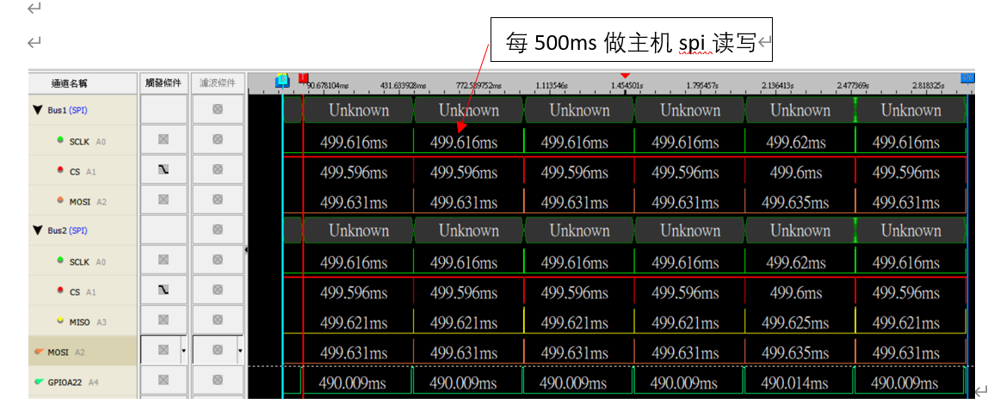
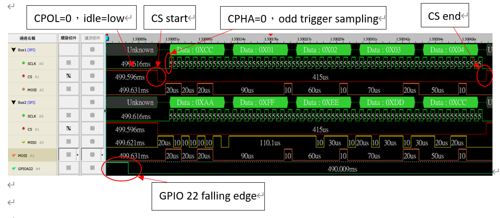
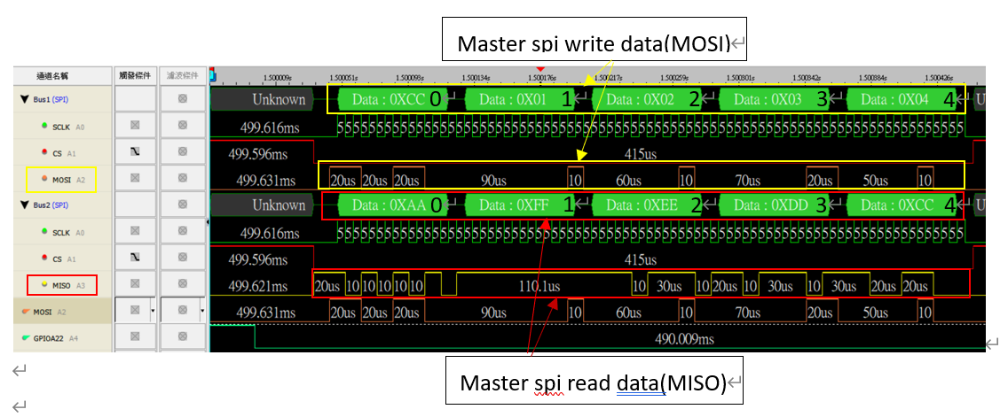
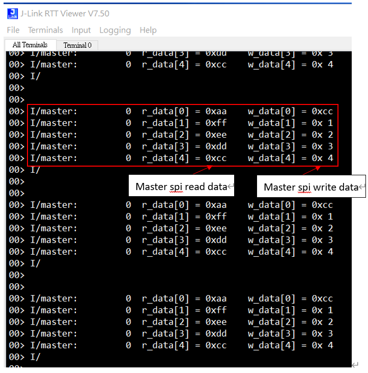

# spi主从搭配【主机例程】使用说明

## 1、概述

​		本文檔介紹spi主機功能例程，采用典型的中断方式进行data收發，此例程需與bxd_spis_intr搭配使用，需要準備兩塊開發板，一塊用作主機，另一塊用作從機。
主要的设计思路为，上电后由从机每500ms发起GPIO22 10ms高电平的下降缘触发给主机，主机在GPIO外部中断函数做主机的spi读写从机，spi主机信号传递到从机，做从机的spi读写主机。

## 2、工程目录

..\SDK3\examples\demo\bxd_spim_intr\mdk

## 3、添加文件

- bxd_spim.h,bxd_spim.h

## 4、编写代码

### 4.1 初始化

app.h


 ```c
	#define	SPI_FIFO_DEPTH	2//spi 深度
 ```

app.c

```c
	uint8_t m_tx_len = 0;//spi tx 长度
	uint8_t m_rx_len = 0;//spi rx 长度
	uint8_t * m_p_tx_buff = 0;//spi tx buffer
	uint8_t * m_p_rx_buff = 0;//spi rx buffer

	struct user_service us_svc = {0};

	u8 w_data[5] = {0xCC, 0x22, 0x33, 0x44, 0x55};     //spi master tx data
	u8 w_data1[5] = {0xFF, 0xBB, 0xCC, 0xDD, 0xEE};   //spi master tx data
	u8 r_data[5] = {0};						       //spi master rx data , feedback from slave
	static bool send_flag = false;
	u32 tx_rx_count = 0;
```

### 4.2 app.c文件实现spi中断使用

```c
	//master spi tx/rx fifo 深度
	void spim_fifo_depth( void )
	{
		BX_MODIFY_REG( BX_SPIM0->TXFTL, SPIM_TXFTL_VAL, ( uint32_t ) ( SPI_FIFO_DEPTH / 2 ) );
		BX_MODIFY_REG( BX_SPIM0->RXFTL, SPIM_RXFTL_VAL, ( uint32_t ) ( SPI_FIFO_DEPTH / 2 ) );
	}

	//master spi 中断mask
	void spim_intr_mask( void )
	{
		BX_SET_BIT( BX_SPIM0->IM, SPIM_IM_MMC );
		BX_SET_BIT( BX_SPIM0->IM, SPIM_IM_RFF );	//Receive FIFO Full Interrupt Mask
		BX_SET_BIT( BX_SPIM0->IM, SPIM_IM_RFO );
		BX_SET_BIT( BX_SPIM0->IM, SPIM_IM_RFU );
		BX_SET_BIT( BX_SPIM0->IM, SPIM_IM_TFO );
		BX_SET_BIT( BX_SPIM0->IM, SPIM_IM_TFE );	//Transmit FIFO Empty Interrupt Mask
	}

	//master spi 初始化		
	void spim_init( void )
	{
		NVIC_DisableIRQ( SPIM0_IRQn );       //disable interrupt

		bxd_spim_open( BX_SPIM0 );//初始化spim0
		bxd_spim_set_speed( BX_SPIM0, 100000 );//设置spi传输速度，单位：hz，此处设为100khz
		bxd_spim_set_data_bit( BX_SPIM0, BX_SPI_DATA_BIT_8B );//spi数据位，此处为8bit
		bxd_spim_use_cs( BX_SPIM0, 0x01 );//spi cs选择
		bxd_spim_set_cs1_pin( BX_SPIM0, 2 );//cs pin

		spim_fifo_depth();
		spim_intr_mask();

		/*the last step*/
		NVIC_ClearPendingIRQ( SPIM0_IRQn );  //clear  interrupt
		NVIC_EnableIRQ( SPIM0_IRQn );        //enable interrupt
	}


	//master spi tx
	bx_err_t spim_transmit_data( uint8_t * pbuff, uint32_t len )
	{
		if( us_svc.m_lock == true ) {
			return -1;
		}

		us_svc.m_lock = true;

		m_tx_len = len;
		m_p_tx_buff = pbuff;

		/*open clock gate*/
		BX_PER->CLKG0 |= PER_CLKG0_32M_SET_SPIM0;
		BX_PER->CLKG0 |= PER_CLKG0_PLL_SET_SPIM0;

		BX_MODIFY_REG( BX_SPIM0->CTRL, SPIM_CTRL_TM, SPIM_CTRL_TM_T_TX );//Transmit Only

		/*start transfer*/
		BX_SET_BIT( BX_SPIM0->IM, SPIM_IM_TFE  );//Transmit FIFO Empty Interrupt Mask

		/*set ssie enable*/
		BX_SET_BIT( BX_SPIM0->SSIE, SPIM_SSIE_BIT );

		return BX_OK;
	}
	//master spi rx
	bx_err_t spim_receive_data( uint8_t * pbuff, uint32_t len )
	{
		if( us_svc.m_lock == true ) {
			return -1;
		}

		us_svc.m_lock = true;

		m_rx_len = len;
		m_p_rx_buff = pbuff;


		/*open clock gate*/
		BX_PER->CLKG0 |= PER_CLKG0_32M_SET_SPIM0;
		BX_PER->CLKG0 |= PER_CLKG0_PLL_SET_SPIM0;

		BX_MODIFY_REG( BX_SPIM0->CTRL, SPIM_CTRL_TM, SPIM_CTRL_TM_T_RX );//Receive Only

		BX_SET_BIT( BX_SPIM0->IM, SPIM_IM_TFE  );//Transmit FIFO Empty Interrupt Mask
		BX_SET_BIT( BX_SPIM0->IM, SPIM_IM_RFF  );//Receive FIFO Full Interrupt Mask

		/*set ssie enable*/
		BX_SET_BIT( BX_SPIM0->SSIE, SPIM_SSIE_BIT );

		return BX_OK;
	}
	//master spi tx&rx
	bx_err_t spim_transmit_receive_data( uint8_t * tx_pbuff, uint32_t tx_len, uint8_t * rx_pbuff, uint32_t rx_len )
	{
		if( us_svc.m_lock == true ) {
			return -1;
		}
	//    LOG_RAW( "spim_transmit_receive_data\n" );

		us_svc.m_lock = true;
		m_tx_len = tx_len;
		m_p_tx_buff = tx_pbuff;
		m_rx_len = rx_len;
		m_p_rx_buff = rx_pbuff;

		/*open clock gate*/
		BX_PER->CLKG0 |= PER_CLKG0_32M_SET_SPIM0;
		BX_PER->CLKG0 |= PER_CLKG0_PLL_SET_SPIM0;

		BX_MODIFY_REG( BX_SPIM0->CTRL, SPIM_CTRL_TM, SPIM_CTRL_TM_T_TXRX );//Transmit&Receive


		BX_SET_BIT( BX_SPIM0->IM, SPIM_IM_TFE  );//Transmit FIFO Empty Interrupt Mask
		BX_SET_BIT( BX_SPIM0->IM, SPIM_IM_RFF  );//Receive FIFO Full Interrupt Mask

		/*set ssie enable*/
		BX_SET_BIT( BX_SPIM0->SSIE, SPIM_SSIE_BIT );


		return BX_OK;
	}
```	
	
  当从机GPIO22外部下降缘触发主机的GPIO22,产生主机的外部中断，在中断回调函数，做主机spi读写从机。
  
```c	
	/** ---------------------------------------------------------------------------
	 * @brief   :
	 * @note    :
	 * @param   :
	 * @retval  :
	-----------------------------------------------------------------------------*/
	//GPIO callback function , do master spi tx/rx
	void gpio_callback( void * hdl, u8 pin_num, u8 reason )
	{
		//tx_rx_count++;
		//set spi tx data[1-4]
		w_data[1] = 0x01;
		w_data[2] = 0x02;
		w_data[3] = 0x03;
		w_data[4] = 0x04;
		//master spi tx/rx
		spim_transmit_receive_data( w_data, 5, r_data, 5 );
	}
```

```c
	/
	/** ---------------------------------------------------------------------------
	 * @brief   :
	 * @note    :
	 * @param   :
	 * @retval  :
	-----------------------------------------------------------------------------*/
	void app_init( void )
	{
		//注册user服务
		struct bx_service svc;
		svc.prop_set_func = NULL;
		svc.prop_get_func = NULL;
		svc.msg_handle_func = user_msg_handle_func;
		svc.name = "user service";
		us_svc.id = bx_register( &svc );
		//spi master 初始化
		spim_init();
		//setup GPIO P22 
		bxd_gpio_open( BX_GPIOA );
		bxd_gpio_set_mode( BX_GPIOA, 22, BX_GPIO_MODE_INPUT );
		bxd_gpio_set_pull( BX_GPIOA, 22, BX_GPIO_PULLUP );
		bxd_gpio_set_mode( BX_GPIOA, 22, BX_GPIO_MODE_EIT_FALLING ); //set external falling trigger interrupt
		bxd_gpio_set_intr_callback( BX_GPIOA, gpio_callback ); //set interrupt callback function
		
		//订阅消息
		bx_subscibe( us_svc.id, BXM_USER_TRANSMIT_DATA, 0, 0 );
		bx_subscibe( us_svc.id, BXM_USER_RECEIVE_DATA_END, 0, 0 );
	}
```
订阅BXM_USER_RECEIVE_DATA_END消息，在消息处理函数处理BXM_USER_RECEIVE_DATA_END消息，打印主机读写数据。

```c
	/** ---------------------------------------------------------------------------
	 * @brief   :
	 * @note    :
	 * @param   :
	 * @retval  :
	-----------------------------------------------------------------------------*/
	bx_err_t user_msg_handle_func( s32 svc, u32 msg, u32 param0, u32 param1 )
	{

		int intRegValue;

		s32 msg_src = bx_msg_source();
		if( msg_src == us_svc.id ) {
			switch( msg ) {
				case BXM_USER_TRANSMIT_DATA: {
					

				}
				break;


				case BXM_USER_RECEIVE_DATA_END: {

					for( u8 i = 0; i < 5; i++ ) {
						LOG_I( "master:%10u\tr_data[%d] = 0x%2x\t\tw_data[%d] = 0x%2x", tx_rx_count, i, r_data[i], i, w_data[i] );
					}
					LOG_I( "\n\n" );

				}


				break;

				default:
					break;
			}

		}
		return BX_OK;
	}
```
### 4.3 bxd_spim.c文件实现spi初始化,TX,RX驱动

```c
	//set spi cs/clock/mosi/miso pin,CPOL/CPHA/ and communication mode
	bx_err_t bxd_spim_open( void * hdl )
	{
		CHECK_HANDLE( hdl );
		reg_spim_t * BX_SPIMx = ( reg_spim_t * )hdl;

		if( BX_SPIMx == BX_SPIM0 ) {
			BX_SET_BIT( BX_PER->CLKG0, PER_CLKG0_32M_SET_SPIM0 );
			BX_SET_BIT( BX_PER->CLKG0, PER_CLKG0_PLL_SET_SPIM0 );
			//复位
			BX_SET_BIT( BX_PER->SRST, PER_SRST_CLR_SPIM0 );
			BX_SET_BIT( BX_PER->SRST, PER_SRST_SET_SPIM0 );

			//引脚配置
			BX_SET_BIT( BX_CPU->PSEN, CPU_PSEN_SPIM0 );//enable SPI master 0(4bit)
		    //P03 spim0_cs0,P04 spim0_clk P05 spim0_miso P06 spim0_mosi
			BX_AWO->GPIOIS |= ( GPIO_PIN_3 | GPIO_PIN_4 | GPIO_PIN_5 | GPIO_PIN_6 );//gpio input select.
			BX_AWO->GPIOIE |= ( GPIO_PIN_3 | GPIO_PIN_4 | GPIO_PIN_5 | GPIO_PIN_6 );//gpio input enable.
			//上拉
			BX_AWO->GPIOPS |= ( GPIO_PIN_3 | GPIO_PIN_4 | GPIO_PIN_6 | GPIO_PIN_5 );//gpio pull select.
			BX_AWO->GPIOPE |= ( GPIO_PIN_3 | GPIO_PIN_4 | GPIO_PIN_6 | GPIO_PIN_5 );//gpio pull enable.

		} else if ( BX_SPIMx == BX_SPIM1 ) {
			BX_SET_BIT( BX_PER->CLKG0, PER_CLKG0_32M_SET_SPIM1 );
			BX_SET_BIT( BX_PER->CLKG0, PER_CLKG0_PLL_SET_SPIM1 );
			//复位
			BX_SET_BIT( BX_PER->SRST, PER_SRST_CLR_SPIM1 );
			BX_SET_BIT( BX_PER->SRST, PER_SRST_SET_SPIM1 );

			//引脚配置
			BX_SET_BIT( BX_CPU->PSEN, CPU_PSEN_SPIM1 );
			BX_AWO->GPIOIS |= ( GPIO_PIN_8 | GPIO_PIN_9 | GPIO_PIN_10 | GPIO_PIN_11 );
			BX_AWO->GPIOIE |= ( GPIO_PIN_8 | GPIO_PIN_9 | GPIO_PIN_10 | GPIO_PIN_11 );
			//上拉
			BX_AWO->GPIOPS |= ( GPIO_PIN_8 | GPIO_PIN_9 | GPIO_PIN_10 | GPIO_PIN_11 );
			BX_AWO->GPIOPE |= ( GPIO_PIN_8 | GPIO_PIN_9 | GPIO_PIN_10 | GPIO_PIN_11 );

		} else {
			return BX_ERR_INVAL;
		}

		//先关闭
		BX_CLR_BIT( BX_SPIMx->SSIE, SPIM_SSIE_BIT );
        //When SCPH = 0, data are captured on the first edge of the serial clock.
		//0: Serial clock toggles in middle of first data bit
		BX_MODIFY_REG( BX_SPIMx->CTRL, SPIM_CTRL_SCPH, SPIM_CTRL_SCPH_T_MIDDLE );//CPHA=0
		//0 – Inactive state of serial clock is low
		BX_MODIFY_REG( BX_SPIMx->CTRL, SPIM_CTRL_SCPOL, SPIM_CTRL_SCPOL_T_LOW );//CPOL=0		
		BX_MODIFY_REG( BX_SPIMx->CTRL, SPIM_CTRL_FF, SPIM_CTRL_FF_T_MOTOROLA_SPI );//00-Motorola SPI

		return BX_OK;
	}
```

### 4.4 bx_apollo00_it.c文件添加中断向量函数

```c
	/** ---------------------------------------------------------------------------
	 * @brief   :
	 * @note    :
	 * @param   :
	 * @retval  :
	-----------------------------------------------------------------------------*/
	static void spim_rx_full_isr( void )//master spi rx接收中断回调函数
	{
		while(BX_READ_BIT(BX_SPIM0->STA, SPIM_STA_RFNE)>>SPIM_STA_RFNE_POS)
		{
			if(BX_READ_BIT(BX_SPIM0->CTRL, SPIM_CTRL_DFS32) <= SPIM_CTRL_DFS32_T_8_BITS)
			{
				*(uint8_t *)m_p_rx_buff = BX_SPIM0->DATA;
				m_p_rx_buff += 1;
			}
			else if(BX_READ_BIT(BX_SPIM0->CTRL, SPIM_CTRL_DFS32) <= SPIM_CTRL_DFS32_T_16_BITS)
			{
				*(uint16_t *)m_p_rx_buff = BX_SPIM0->DATA;
				m_p_rx_buff += 2;
			}
			else
			{
				*(uint32_t *)m_p_rx_buff = BX_SPIM0->DATA;
				m_p_rx_buff += 4;
				
			}
			--m_rx_len;

		}
	
		if(m_rx_len > 0)
			BX_SPIM0->RXFTL = m_rx_len > SPI_FIFO_DEPTH ? SPI_FIFO_DEPTH / 2 - 1:m_rx_len - 1;
		else{
			BX_CLR_BIT( BX_SPIM0->SSIE, SPIM_SSIE_BIT ); 
			BX_SET_REG( BX_SPIM0->SE, 0 ); 
			bx_public(us_svc.id,BXM_USER_RECEIVE_DATA_END,0,0);
			us_svc.m_lock = false;
		}

	}
	/** ---------------------------------------------------------------------------
	 * @brief   :
	 * @note    :
	 * @param   :
	 * @retval  :
	-----------------------------------------------------------------------------*/
	static void spim_tx_empty_isr( void )//master spi tx发送中断回调函数
	{

	   if(m_tx_len)
		{
			while(BX_READ_BIT(BX_SPIM0->STA, SPIM_STA_TFNF)>>SPIM_STA_TFNF_POS)
			{
				if(BX_READ_BIT(BX_SPIM0->CTRL, SPIM_CTRL_DFS32) <= SPIM_CTRL_DFS32_T_8_BITS)
				{
					BX_SPIM0->DATA = *(uint8_t *)m_p_tx_buff;
					m_p_tx_buff += 1;
				}
				else if(BX_READ_BIT(BX_SPIM0->CTRL, SPIM_CTRL_DFS32) <= SPIM_CTRL_DFS32_T_16_BITS)
				{
					BX_SPIM0->DATA = *(uint16_t *)m_p_tx_buff;
					m_p_tx_buff += 2;
				}
				else
				{
					BX_SPIM0->DATA = *(uint32_t *)m_p_tx_buff;
					m_p_tx_buff += 4;
					
				}
				
				--m_tx_len;
			
				if(m_tx_len == 0)
				{
					BX_MODIFY_REG(BX_SPIM0->TXFTL, SPIM_TXFTL_VAL,(uint32_t) 0);
					BX_SET_BIT(BX_SPIM0->IM, SPIM_IM_TFE);
					us_svc.m_lock = false;

					break;
				}
			}
			if((BX_READ_BIT(BX_SPIM0->STA, SPIM_STA_BUSY) == 0)&&(BX_READ_REG(BX_SPIM0->SE) == 0))
			{
					BX_MODIFY_REG(BX_SPIM0->SE,SPIM_SE_VAL,( uint32_t ) 0x01);
			}
		}
	   else
	   {
			if(BX_READ_REG(BX_SPIM0->TXFL))
			{
				BX_MODIFY_REG(BX_SPIM0->TXFTL, SPIM_TXFTL_VAL,(uint32_t) 0);
			}
			else
			{
				BX_CLR_BIT(BX_SPIM0->IM, SPIM_IM_TFE);
				if(BX_READ_BIT(BX_SPIM0->CTRL,SPIM_CTRL_TM) == SPIM_CTRL_TM_T_TX)
				{
					while(BX_READ_BIT(BX_SPIM0->STA,SPIM_STA_BUSY) == 1)
					BX_CLR_BIT(BX_SPIM0->SSIE, SPIM_SSIE_BIT);
					BX_MODIFY_REG(BX_SPIM0->SE, SPIM_SE_VAL,(uint32_t) 0 );
				}
			}
	   }

	}


	/*========================= end of private function ==========================*/

	/*============================ interrupt function ============================*/
	/** ---------------------------------------------------------------------------
	 * @brief   :
	 * @note    :
	 * @param   :
	 * @retval  :
	-----------------------------------------------------------------------------*/
	void SPIM0_IRQHandler( void )//spim0中断向量函数
	{
	{
		uint32_t irq_stat = BX_SPIM0->IS;
		
		if(irq_stat == 0)  return;

		if(irq_stat & SPIM_IS_MMC)
		{
			BX_READ_REG(BX_SPIM0->MMIC);
			LOG_W("SPIM_IS_MMC\n");
		}
		if(irq_stat & SPIM_IS_RFF)
		{
			spim_rx_full_isr();//spi rx接收中断回调函数
		}
		if(irq_stat & SPIM_IS_RFO)
		{
			BX_READ_REG(BX_SPIM0->RXFOIC);
			LOG_W("SPIM_IS_RFO\n");
		}
		if(irq_stat & SPIM_IS_RFU)
		{
			BX_READ_REG(BX_SPIM0->RXFUIC);
			LOG_W("SPIM_IS_RFU\n");
		}
		if(irq_stat & SPIM_IS_TFE)
		{
			spim_tx_empty_isr();//spi tx发送中断回调函数
		}
		if(irq_stat & SPIM_IS_TFO)
		{	   
			BX_READ_REG(BX_SPIM0->TXFOIC);
			LOG_W("SPIM_IS_TFO\n");
		}
	}
		if(BX_READ_BIT( BX_SPIM0->SSIE, SPIM_SSIE_BIT ) == 0)
		{
			BX_PER->CLKG0 &= ~PER_CLKG0_32M_SET_SPIM0;
			BX_PER->CLKG0 &= ~PER_CLKG0_PLL_SET_SPIM0;
		}
	}
```


## 5、演示结果:
1.硬件: 
	将主从两开发板的CS/clk/miso/mosi及P22互连。
2.软件:
	搭配bxd_spis_intr例程,从机每500ms呼叫spis_write_read_data 函数
GPIO22输出下降缘触发主机GPIO22外部下降缘中断，在主机例程中断回调函数gpio_callback里的spim_transmit_receive_data( w_data, 5, r_data, 5 )函数做spi主机读写，
再回到从机例程spis_write_read_data 函数里的 spis_transmit_receive_data( w_data, 5, r_data, 5 )函数做spi从机读写。


### 5.1 按照第4章编写代码并烧录

### 5.2 编译文件，然后烧录文件

### 5.3 演示结果
LA輸出


 

 


J-Link RTT輸出 :訂閱BXM_USER_RECEIVE_DATA_END消息在消息處理函數LOG輸出spi讀寫數據




