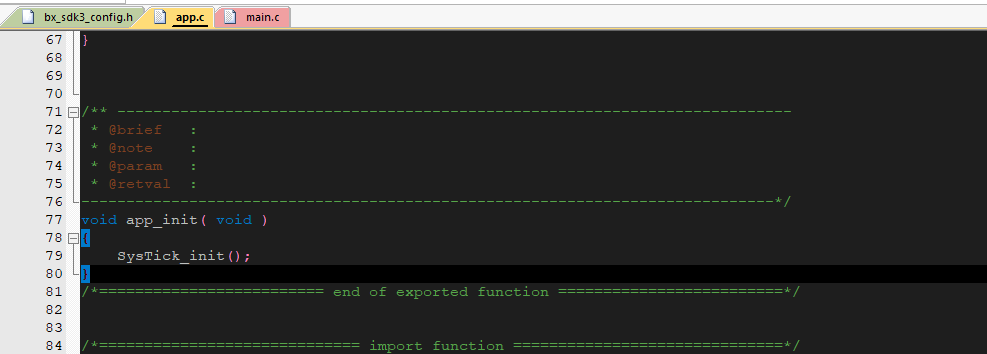

# systick的使用

## 1、概述

本章节主要介绍如何使用systick计数器来达到获取精准时间


## 2、代码编写

打开一个全新的基础工程，在工程中的app.c中，添加如下代码

```
void SysTick_init( void )
{
    SysTick->LOAD  = ( u32 )( MAIN_CLOCK / 1000  - 1UL );                   /* set reload register */
    NVIC_SetPriority ( SysTick_IRQn, ( 1UL << __NVIC_PRIO_BITS ) - 1UL ); /* set Priority for Systick Interrupt */
    SysTick->VAL   = 0UL;                                             /* Load the SysTick Counter Value */
    SysTick->CTRL  = SysTick_CTRL_CLKSOURCE_Msk |
                     SysTick_CTRL_TICKINT_Msk   |
                     SysTick_CTRL_ENABLE_Msk;
	NVIC_ClearPendingIRQ( SysTick_IRQn );
	NVIC_EnableIRQ( SysTick_IRQn );
	__enable_irq();
}

/** ---------------------------------------------------------------------------
@brief   :
@note    :
@param   :
@retval  :
-----------------------------------------------------------------------------*/
void SysTick_Handler( void )
{
 sys_tick++;
}
/** ---------------------------------------------------------------------------
@brief   :
@note    :
@param   :
@retval  :
-----------------------------------------------------------------------------*/
u32 GetSysTick( void )
{
 return sys_tick;
}
```

在app.c中找到app_init,在里面初始化sysytick

 


到此，systick的功能就实现了


## 3、功能验证

为了确认systick有工作起来，可以在SysTick_Handler函数中加入log，如下所示

/** ---------------------------------------------------------------------------

@brief   :

@note    :

@param   :

@retval  :
-----------------------------------------------------------------------------*/
void SysTick_Handler( void )
{
 sys_tick++;
LOG_RAW("systick=%d\r\n\r\n",sys_tick);
}

使用log功能的时候，记得在bx_sdk3_config中设置如图中所示

 


 

 

如图中可知，systick在递增，所以证明systick在不停的进入中断，可以确认systick是正常工作起来了