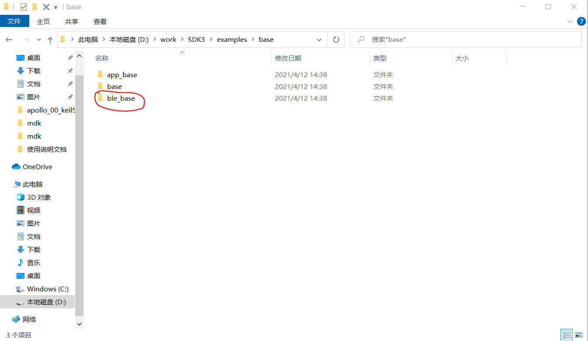
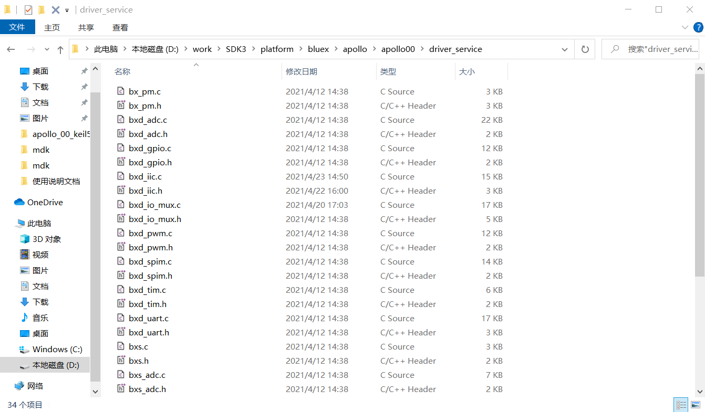
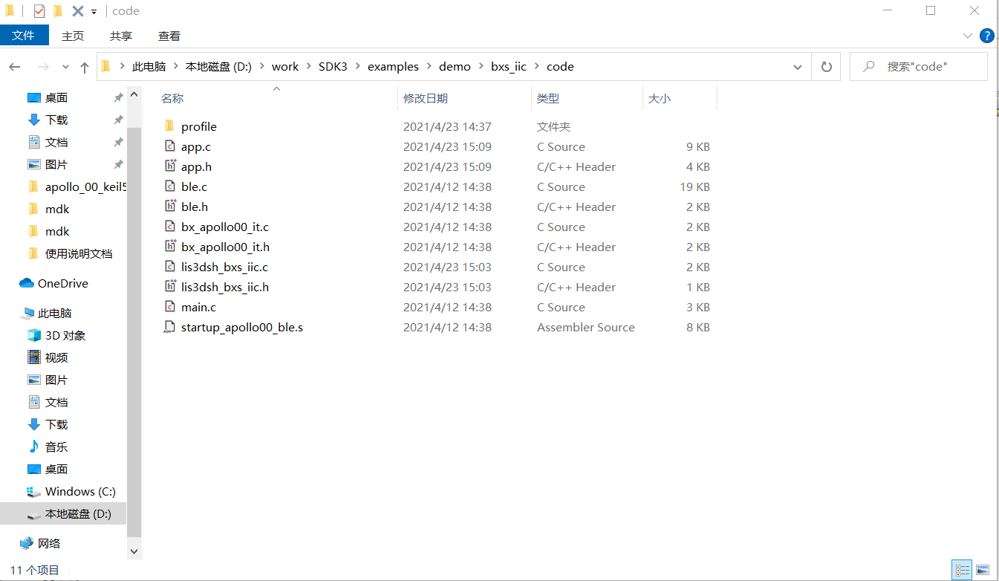
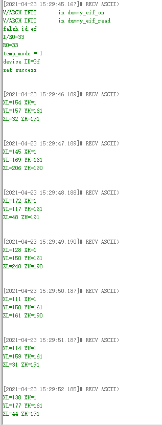

# 1.概述

**本文档使用的消息的方式介绍IIC的配置和lis3dsh传感器使用范例**

# 2.新建工程

新建工程，首先复制下图工程：




粘贴到SDK3\example目录下，改文件名为bxs_iic,将工程名修改为bxs_iic,然后打开工程添加文件

- bxd_iic.c
- bxs_iic.c
- bxd_io_mux.c
- lis3dsh_bxs_iic.c

其中，bxd_iic.c，bxs_iic.c，bxd_io_mux.c在以下文件夹路径



lis3dsh_bxs_iic.c在以下文件夹路径



# 3.编写代码

## 3.1初始化

```c
#define ADD_REG_WHO_AM_I				0x0F
#define ADD_REG_CTRL_4					0x20
#define ADD_REG_OUT_X_L					0x28
#define ADD_REG_OUT_X_H					0x29
#define ADD_REG_OUT_Y_L					0x2A
#define ADD_REG_OUT_Y_H					0x2B
#define ADD_REG_OUT_Z_L					0x2C
#define ADD_REG_OUT_Z_H					0x2D

#define UC_WHO_AM_I_DEFAULT_VALUE		0x3F
#define UC_ADD_REG_CTRL_4_CFG_VALUE		0x77

s32 user_service_id;

uint8_t iic_data[3] = {0x77, 0x02, 0x04};
uint8_t iic_readbuf[3] = {0x01, 0x02, 0x03};
uint8_t lis3_data[2] = {0x8f, 0x00};

void app_init( void )
{
    //初始化用户服务
	struct bx_service svc;//定义一个bx_service变量，用于处理用户的属性、消息等
    svc.prop_set_func = NULL;//设置用户属性的入口，此处为空，可以自行修改
    svc.prop_get_func = NULL;//获取用户属性的入口，此处为空，可以自行修改
    svc.msg_handle_func = user_msg_handle_func;//用户消息的处理入口，默认为user_msg_handle_func,可以自行修改
    svc.name = "user service";//svc的名称
    user_service_id = bx_register(&svc);//将svc注册到内核，并返回id值
	
    //初始化IIC服务
	bxs_iic_register();
	
	 /*-----------iic----------------*/
	bx_call( bxs_iic0_id(), BXM_OPEN, 0, 0 );//打开IIC0的时钟
	bx_set( bxs_iic0_id(), BXP_IIC_PIN_SCL, 2, 0 );//设置P02为时钟线
	bx_set( bxs_iic0_id(), BXP_IIC_PIN_SDA, 3, 0 );//设置P03为数据线

	bx_set( bxs_iic0_id(), BXP_ADDR, 0x3d, 0 );//设置从机设备地址
	bx_set( bxs_iic0_id(), BXP_SUB_ADDR, 0x20, 0 );//写入要操作的寄存器地址
	bx_set( bxs_iic0_id(), BXP_SPEED, BX_IIC_SPEED_HIGHEST, 0 );//选择最高速率输出
	bx_set( bxs_iic0_id(), BXP_ADDR_BIT, BX_IIC_ADDR_BIT_7B, 0 );//选择7位地址寻址模式
	bx_set( bxs_iic0_id(), BXP_MODE, BX_IIC_MODE_MASTER, 0 );//选择主机模式
    
    //以下使用lis3dsh三轴加速度模块做演示范例
	iic_read_lis3dsh( 0x0f, iic_readbuf, 3 );//获取WHO_AM_I的值
	if( iic_readbuf[0] == UC_WHO_AM_I_DEFAULT_VALUE ) {
		bx_log( "device ID=%02x\r\n", iic_readbuf[0] );
		iic_write_lis3dsh( ADD_REG_CTRL_4, iic_data, 3 );//向从机寄存器写数据
		iic_read_lis3dsh( ADD_REG_CTRL_4, iic_readbuf, 3 );//从寄存器读数据
		if( iic_readbuf[0] == 0x77 ) {
			bx_log( "set success\r\n" );//确认读写成功
			bx_repeat( user_service_id, BXM_IIC_TEST, 0, 0, 1000 );//每1000ms向iic服务发送一次获取加速度数据的消息

		}

	} else {
		bx_log( "device get failed\r\n" );
	}
	
}

bx_err_t user_msg_handle_func( s32 svc, u32 msg, u32 param0, u32 param1 )
{

    switch( msg ) {
        case BXM_IIC_TEST:
            iic_read_lis3dsh( 0x28, iic_test_buf, 1 );
            bx_log( "XL=%d", iic_test_buf[0] );
            iic_read_lis3dsh( 0x29, iic_test_buf, 1 );
            bx_log( " XH=%d\r\n", iic_test_buf[0] );
            iic_read_lis3dsh( 0x2a, iic_test_buf, 1 );
            bx_log( "YL=%d", iic_test_buf[0] );
            iic_read_lis3dsh( 0x2b, iic_test_buf, 1 );
            bx_log( " YH=%d\r\n", iic_test_buf[0] );
            iic_read_lis3dsh( 0x2c, iic_test_buf, 1 );
            bx_log( "ZL=%d", iic_test_buf[0] );
            iic_read_lis3dsh( 0x2d, iic_test_buf, 1 );
            bx_log( " ZH=%d\r\n", iic_test_buf[0] );
            break;
        default:
            break;
    }


    return BX_OK;
}

```


# 4.功能演示

按照以上步骤进行代码实现，编译文件，然后烧录固件

以下是获取的加速度数据

 

