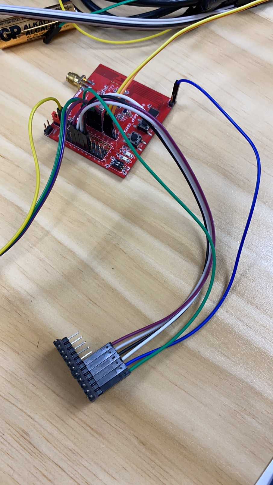
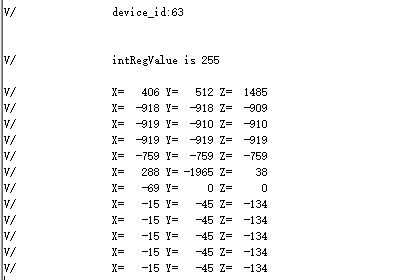

# 1.概述

​		本文的介绍消息方式的spi主机功能例程，打开SDK3/examples/demo路径下的bxs_spi工程


# 2.SPI使用

## 2.1功能代码

在bxs_spi.h文件中：

添加以下宏定义

```c
#define ADD_REG_WHO_AM_I				0x0F
#define ADD_REG_CTRL_4					0x20
#define ADD_REG_OUT_X_L					0x28
#define ADD_REG_OUT_X_H					0x29
#define ADD_REG_OUT_Y_L					0x2A
#define ADD_REG_OUT_Y_H					0x2B
#define ADD_REG_OUT_Z_L					0x2C
#define ADD_REG_OUT_Z_H					0x2D

#define UC_WHO_AM_I_DEFAULT_VALUE		0x3F
#define UC_ADD_REG_CTRL_4_CFG_VALUE		0x77

#define SENS_2G_RANGE_MG_PER_DIGIT		((float)0.06)
#define SET_READ_SINGLE_CMD(x)			(x | 0x80)
#define SET_WRITE_SINGLE_CMD(x)			(x & (~(0xC0)))
```

在bxs_spi.h中找到bx_msg_spim的枚举类型，添加一个自定义msg，BXM_SPIM_SENSOR_TEST,

```c
enum bx_msg_spim{
    BXM_SPIM_FIRST = BXM_FIRST_USER_MSG,
    

    BXM_SPIM_TXRX_START,
    BXM_SPIM_SENSOR_TEST,

};
```

在app.c文件中：

app_init()里的代码；对spi初始化；代码示例如下

```c
void app_init( void )
{
	struct bx_service svc;
	svc.prop_set_func = NULL;
	svc.prop_get_func = NULL;
	svc.msg_handle_func = user_msg_handle_func;
	svc.name = "user service";
	user_service_id = bx_register(&svc);		//注册一个服务
	

	bxs_spim_register();	//注册spi服务
	
	uint8_t device_id;
	int intRegValue;
	
	bx_call( bxs_spim0_id(), BXM_OPEN, 0, 0);	//打开spi服务
	bx_set( bxs_spim0_id(), BXP_SPEED, 100000, 0 );		//设置传输速度
	bx_set( bxs_spim0_id(), BXP_DATA_BIT, BX_SPI_DATA_BIT_8B, 0 );	//设置数据为8bit
	bx_set( bxs_spim0_id(), BXP_SPIM_USE_CS_NUM, 0x01, 0 );		//设置片选引脚( 0x01->cs0 0x02->cs1)
	bx_set( bxs_spim0_id(), BXP_SPIM_CS1_PIN, 3, 0 );	//设置设备上与片选引脚与之对应的引脚( 3->cs0 2->cs1 )
	
	device_id=LIS3DSH_read_reg(ADD_REG_WHO_AM_I);
	if(device_id==UC_WHO_AM_I_DEFAULT_VALUE)
	{
		bx_logln( "device_id:%d\r\n",device_id);
		LIS3DSH_write_reg(ADD_REG_CTRL_4, UC_ADD_REG_CTRL_4_CFG_VALUE);	
		intRegValue = LIS3DSH_read_reg(ADD_REG_CTRL_4);
		 if( intRegValue != UC_ADD_REG_CTRL_4_CFG_VALUE )
		 {
			bx_logln("intRegValue is %d\r\n",intRegValue);
		 }
		bx_repeat( user_service_id, BXM_SPIM_SENSOR_TEST, 0, 0, 2000 );		//循环向服务发送消息
	}
	else
	{
		bx_logln( "device get failed\r\n");
	}

}
```

spi读写代码；代码示例如下：

```c
uint8_t iic_data[3]={0x66,0x02,0x04};
uint8_t iic_readbuf[3]={0x01,0x02,0x03};
uint8_t lis3_data[2]={0x8f,0x00};

uint8_t lis3_rx_data[2]={0x01,0x02};
uint8_t lis3_rx_data2[2]={0x01,0x02};


void LIS3DSH_write_reg(int reg, int data)
{
	  lis3_data[0] = SET_WRITE_SINGLE_CMD(reg);
		lis3_data[1] = data;
	

	 bx_call( bxs_spim0_id(), BXM_WRITE, (uint32_t)lis3_data, 2);

}

int LIS3DSH_read_reg(int reg)
{	
    lis3_data[0] = SET_READ_SINGLE_CMD(reg);
	lis3_data[1] =0xff;
	bx_call( bxs_spim0_id(), BXM_WRITE, (uint32_t)lis3_data, 1);
	bx_call( bxs_spim0_id(), BXM_READ, (uint32_t)lis3_rx_data, 2);

    return lis3_rx_data[1];

}

int twoComplToInt16(int twoComplValue)
{
	  int int16Value = 0;
	  /* conversion */
	  if(twoComplValue > 32768)
	  {
		    int16Value = -(((~twoComplValue) & 0xFFFF) + 1);
	  }
	  else
	  {
		    int16Value = twoComplValue;
	  }

	  return int16Value;

}
```

添加函数user_msg_handle_func( s32 id, u32 msg, u32 param0, u32 param1 )；代码示例如下：

```c
bx_err_t user_msg_handle_func( s32 id, u32 msg, u32 param0, u32 param1 )
{
		int intValueMgX, intValueMgY, intValueMgZ;
		switch(msg)
		{
			case BXM_SPIM_SENSOR_TEST:	//当收到消息，获取三轴传感器的X,Y,Z值
			

			intValueMgX = ((LIS3DSH_read_reg(ADD_REG_OUT_X_H) << 8) | 	LIS3DSH_read_reg(ADD_REG_OUT_X_L));
			intValueMgY = ((LIS3DSH_read_reg(ADD_REG_OUT_Y_H) << 8) | LIS3DSH_read_reg(ADD_REG_OUT_Y_L));
			intValueMgZ = ((LIS3DSH_read_reg(ADD_REG_OUT_Z_H) << 8) | LIS3DSH_read_reg(ADD_REG_OUT_Z_L));
		
			intValueMgX = twoComplToInt16(intValueMgX);
			intValueMgX = intValueMgX * SENS_2G_RANGE_MG_PER_DIGIT;
	
			intValueMgY = twoComplToInt16(intValueMgY);
			intValueMgY = intValueMgY * SENS_2G_RANGE_MG_PER_DIGIT;
	
			intValueMgZ = twoComplToInt16(intValueMgZ);
			intValueMgZ = intValueMgZ * SENS_2G_RANGE_MG_PER_DIGIT;
			bx_log("X=%6d Y=%6d Z=%6d \r\n", intValueMgX, intValueMgY, intValueMgZ);
		break;
		
		default:
			break;
	}
	return BX_OK;

}
```

## 注：

需要在头文件里定义函数user_msg_handle_func；变量user_service_id需要在文件开头处定义；

## 2.2 功能演示

连接好开发板硬件，板子上再连接一个lis3dsh三轴传感器，如图所示：



烧入对应的烧录文件，打开串口工具，复位开发板可以看到串口工具上会不停的打印x,y,z的数据

