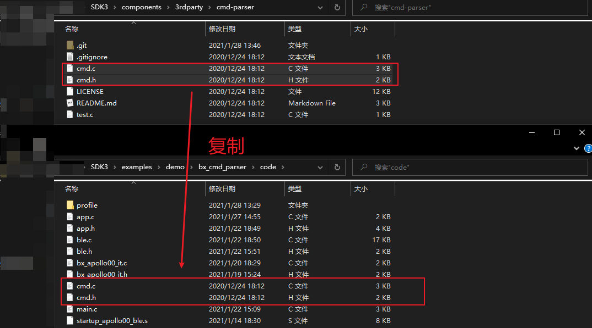
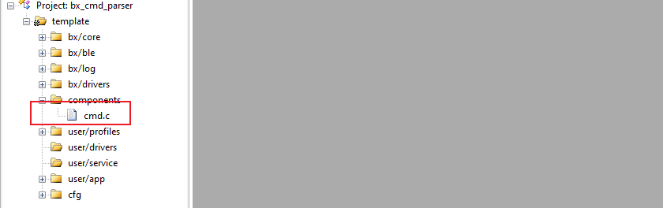
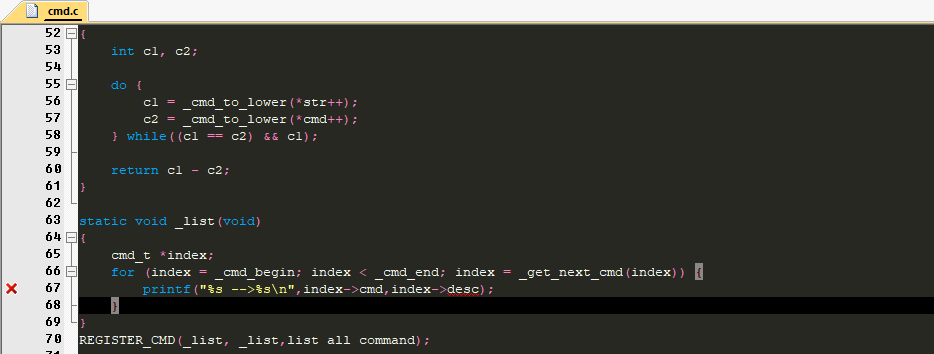
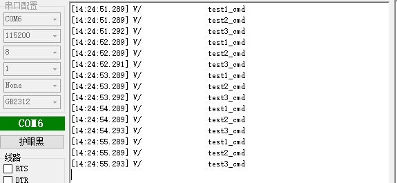
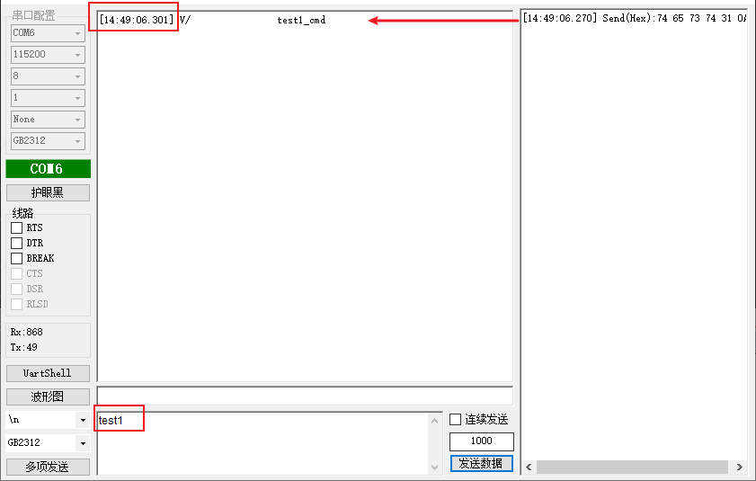
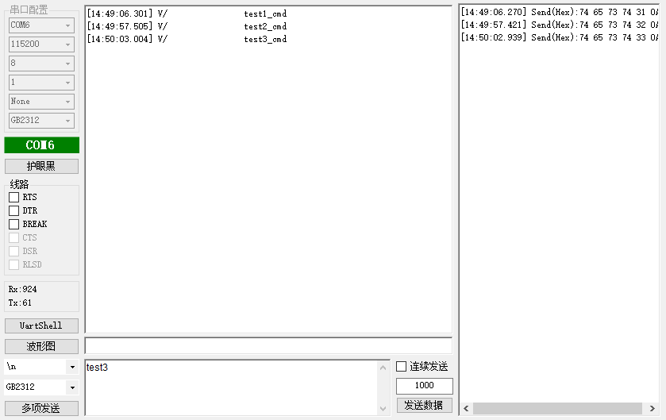

# bx_cmd_parser

## 1、概述

文档介绍如何移植开源项目cmd-parser，作者jiejie，遵循 Apache-2.0 开源许可协议。项目地址：

https://github.com/jiejieTop/cmd-parser

cmd-parser是一款非常轻量级的命令解析器，配合串口，在项目调试过程中经常可以使用，下文主要介绍移植、测试、使用步骤。

## 2、移植cmd-parser

移植主要步骤如下:

- 获取源码。可以自行下载获取。也可以直接在SDK跟目录下打开git bash，执行git submodule init然后 git submodule update获取最新版本的代码。

- 实现接口：（只有一个）
    - cmd_parsing(char *str)
- 添加源码到工程：

 

 

### 注意事项

源码中有不好的地方：

 

- 可以看到第67行有错误的地方，将“desc”其修改为“cmd_mess”即可。

- 此外68行使用了printf函数，如果没有对printf进行重定向，是不会有任何效果的。如确实需要，可以直接将printf直接替换为bx_log即可。

- 个人建议直接将63行到70行直接注释即可。

## 3、简单测试

输入代码:

```c
/**
  ******************************************************************************
  * @file   :   main.c
  * @version:
  * @author :
  * @brief  :
  ******************************************************************************
  * @attention
  *
  * <h2><center>&copy; Copyright(c) . BLUEX Microelectronics.
  * All rights reserved.</center></h2>
  *
  *
  ******************************************************************************
  */

/* includes ------------------------------------------------------------------*/
#include "app.h"
#include "cmd.h"
/* private define ------------------------------------------------------------*/

/* private typedef -----------------------------------------------------------*/

/* private variables ---------------------------------------------------------*/

/* exported variables --------------------------------------------------------*/


/*============================= private function =============================*/

void test1_cmd(void)
{
    bx_logln("test1_cmd");
}

void test2_cmd(void)
{
    bx_logln("test2_cmd");
}

void test3_cmd(void)
{
    bx_logln("test3_cmd");
}
//注册CMD
//参数1是cmd对应的字符串（REGISTER_CMD内部会将其转换为字符串）
//参数2是cmd对应的处理函数
//参数3是cmd对应的描述，（REGISTER_CMD内部会将其转换为字符串）
//整一个 REGISTER_CMD 表达的意思，就是如果在 cmd_parsing 中传入的字符串与参数1匹配，
//则自动调用 参数2 对应的函数 ，参数3只是辅助描述这个 cmd 的功能。
REGISTER_CMD(test1, test1_cmd,test1 demo);
REGISTER_CMD(test2, test2_cmd,test2 demo);
REGISTER_CMD(test3, test3_cmd,test3 demo);
/*========================= end of private function ==========================*/

/*============================= exported function ============================*/

void my_parsing(void * data )
{
    cmd_parsing("test1");
    cmd_parsing("test2");
    cmd_parsing("test3");
}
/** ---------------------------------------------------------------------------
 * @brief   :
 * @note    :
 * @param   :
 * @retval  :
-----------------------------------------------------------------------------*/
void app_init( void )
{
    //先初始化
    cmd_init();
    //如不熟悉bx_dwork的使用，请看bx_api的例程，里面有详细介绍
    bx_dwork(my_parsing,NULL,1000,BX_FOREVER);
}
/*========================= end of exported function =========================*/


/*============================= import function ==============================*/

/*=========================== end of import function =========================*/


/*============================ interrupt function ============================*/

/*========================= end of interrupt function ========================*/


/******************** (C) COPYRIGHT BLUEX **********************END OF FILE****/


```

可以看到结果，每隔1S就输出一次结果：

 

## 4、串口解析器

串口解析器意思是串口输入响应的指令，然后就执行相应的函数，大概思路就是注册一堆cmd，然后检测串口接收的数据，以回车作为结束符，然后传递给cmd_parsing就可以了。具体代码如下:

```c
/**
  ******************************************************************************
  * @file   :   main.c
  * @version:
  * @author :
  * @brief  :
  ******************************************************************************
  * @attention
  *
  * <h2><center>&copy; Copyright(c) . BLUEX Microelectronics.
  * All rights reserved.</center></h2>
  *
  *
  ******************************************************************************
  */

/* includes ------------------------------------------------------------------*/
#include "app.h"
#include "cmd.h"
/* private define ------------------------------------------------------------*/

/* private typedef -----------------------------------------------------------*/

/* private variables ---------------------------------------------------------*/

/* exported variables --------------------------------------------------------*/


/*============================= private function =============================*/
void test1_cmd(void)
{
    bx_logln("test1_cmd");
}

void test2_cmd(void)
{
    bx_logln("test2_cmd");
}

void test3_cmd(void)
{
    bx_logln("test3_cmd");
}
REGISTER_CMD(test1, test1_cmd,test1 demo);
REGISTER_CMD(test2, test2_cmd,test2 demo);
REGISTER_CMD(test3, test3_cmd,test3 demo);


/*========================= end of private function ==========================*/

/*============================= exported function ============================*/
/** ---------------------------------------------------------------------------
 * @brief   :
 * @note    :
 * @param   :
 * @retval  :
-----------------------------------------------------------------------------*/
void my_parsing(void * data )
{
    static u8 uart_buff[128];
    static u32 rx_count=0;
    static u32 time_out = 10;
    while( BX_READ_BIT( BX_UART0->LS, UART_LS_DATA_READY ) ){
        uart_buff[rx_count++] = ( uint8_t )( BX_UART0->RTD );
        //接收到'\n'换行，注意部分串口助手是'\r'或者'\r\n'换行，请注意修改代码
        if( uart_buff[rx_count-1] == '\n'  ){
            uart_buff[rx_count-1] = 0;
            cmd_parsing((char *)uart_buff);
            rx_count = 0;
        }
        time_out = 10;
    }
    //超时则清空原有的数据
    time_out--;
    if( time_out == 0 ){
        time_out = 10;
        rx_count = 0;
    }
}
/** ---------------------------------------------------------------------------
 * @brief   :
 * @note    :
 * @param   :
 * @retval  :
-----------------------------------------------------------------------------*/
void app_init( void )
{
    cmd_init();
    bx_dwork(my_parsing,NULL,100,BX_FOREVER);
}
/*========================= end of exported function =========================*/


/*============================= import function ==============================*/

/*=========================== end of import function =========================*/


/*============================ interrupt function ============================*/

/*========================= end of interrupt function ========================*/


/******************** (C) COPYRIGHT BLUEX **********************END OF FILE****/

```

可以看到结果：

 

 

