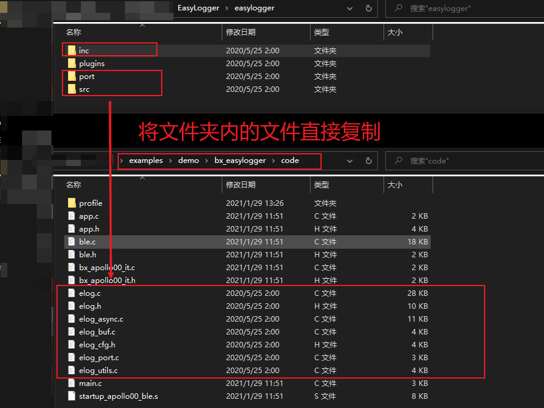
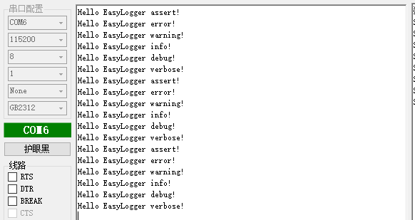
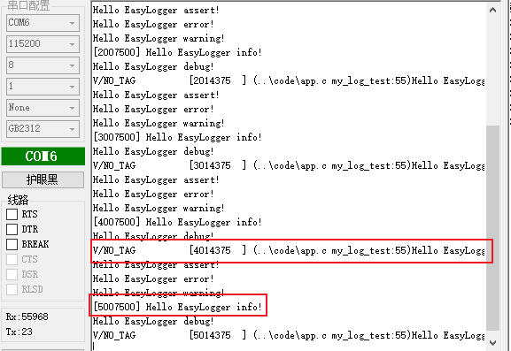
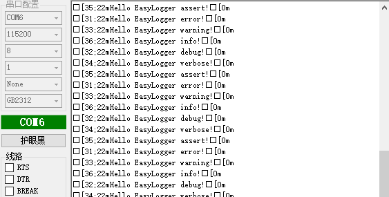
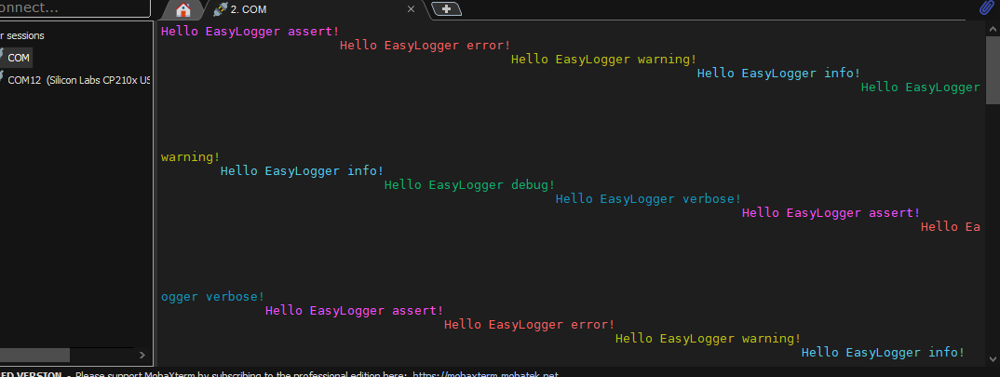

# bx_easylogger

## 1、概述

文档介绍如何移植开源项目easylogger，作者armink，遵循 MIT 开源许可协议。项目地址：

https://github.com/armink/EasyLogger

一款超轻量级(ROM<1.6K, RAM<0.3K)、高性能的 C/C++ 日志库，非常适合对资源敏感的软件项目，在项目调试过程中经常可以使用，下文主要介绍移植、测试、使用步骤。

## 2、移植easylogger

移植主要步骤如下:

- 获取源码。可以自行下载获取。也可以直接在SDK跟目录下打开git bash，执行git submodule init 然后 git submodule update获取最新版本的代码。

- 实现接口：（所有都在 elog_port.c中）
- 添加源码到工程：

 


### 2.1 注意事项

- plugins中为插件部分内容，主要是将log保存到文件和保存到flash中功能，详细使用方法请自行查看easylogger的官方文档，此值仅介绍简单功能。
- easylogger中的"LOG_LVL"以及“LOG_TAG”的命名与我们SDK中的定义一样了，可以把elog.h中的"LOG_LVL"以及“LOG_TAG”直接替换为"ELOG_LVL"以及“ELOG_TAG”即可，双方不影响使用，注意替换"LOG_LVL"时，要避免替换了其它一样的字符

### 2.2 接口实现

- elog_port_init：直接使用默认的即可
- elog_port_output:输出函数

```c
void elog_port_output(const char *log, size_t size) {
    
    /* add your code here */
    bx_log("%.*s",size,log);
}
```

- 输出上锁和解锁：

```c
void elog_port_output_lock(void) {
    __disable_irq();
}
void elog_port_output_unlock(void) {
    __enable_irq();
}
```

- 获取时间：

```c
const char *elog_port_get_time(void) {
    ble_samp_setf(1);
    while (ble_samp_getf());
    u32 time_now =  ble_basetimecnt_get() & MAX_SLOT_CLOCK;//unit 625us
    time_now *= 625;
    static char time_str[16];
    sprintf(time_str,"%u",time_now);
    return time_str;
}
```

上文是使用芯片内部寄存器获取的时间，此时间在休眠时也是有效的。嫌麻烦可以直接返回空字符串。

- elog提供了二获取进程号、获取线程号，因为是裸机系统，无进制线程，直接返回空字符串即可

```c
const char *elog_port_get_p_info(void) {
    return "";
}
const char *elog_port_get_t_info(void) {
    return "";
}
```

完整文件代码：

```c
/*
 * This file is part of the EasyLogger Library.
 *
 * Copyright (c) 2015, Armink, <armink.ztl@gmail.com>
 *
 * Permission is hereby granted, free of charge, to any person obtaining
 * a copy of this software and associated documentation files (the
 * 'Software'), to deal in the Software without restriction, including
 * without limitation the rights to use, copy, modify, merge, publish,
 * distribute, sublicense, and/or sell copies of the Software, and to
 * permit persons to whom the Software is furnished to do so, subject to
 * the following conditions:
 *
 * The above copyright notice and this permission notice shall be
 * included in all copies or substantial portions of the Software.
 *
 * THE SOFTWARE IS PROVIDED 'AS IS', WITHOUT WARRANTY OF ANY KIND,
 * EXPRESS OR IMPLIED, INCLUDING BUT NOT LIMITED TO THE WARRANTIES OF
 * MERCHANTABILITY, FITNESS FOR A PARTICULAR PURPOSE AND NONINFRINGEMENT.
 * IN NO EVENT SHALL THE AUTHORS OR COPYRIGHT HOLDERS BE LIABLE FOR ANY
 * CLAIM, DAMAGES OR OTHER LIABILITY, WHETHER IN AN ACTION OF CONTRACT,
 * TORT OR OTHERWISE, ARISING FROM, OUT OF OR IN CONNECTION WITH THE
 * SOFTWARE OR THE USE OR OTHER DEALINGS IN THE SOFTWARE.
 *
 * Function: Portable interface for each platform.
 * Created on: 2015-04-28
 */
 
#include <elog.h>
#include "bx_log.h"
#include "reg_blecore.h"
/**
 * EasyLogger port initialize
 *
 * @return result
 */
ElogErrCode elog_port_init(void) {
    ElogErrCode result = ELOG_NO_ERR;

    /* add your code here */
    
    return result;
}

/**
 * output log port interface
 *
 * @param log output of log
 * @param size log size
 */
void elog_port_output(const char *log, size_t size) {
    
    /* add your code here */
    printf("%.*s",size,log);
}

/**
 * output lock
 */
void elog_port_output_lock(void) {
    
    /* add your code here */
    __disable_irq();
}

/**
 * output unlock
 */
void elog_port_output_unlock(void) {
    
    /* add your code here */
    __enable_irq();
}

/**
 * get current time interface
 *
 * @return current time
 */

const char *elog_port_get_time(void) {
    ble_samp_setf(1);
    while (ble_samp_getf());
    u32 time_now =  ble_basetimecnt_get() & MAX_SLOT_CLOCK;//unit 625us
    time_now *= 625;
    static char time_str[16];
    sprintf(time_str,"%u",time_now);
    return time_str;
}

/**
 * get current process name interface
 *
 * @return current process name
 */
const char *elog_port_get_p_info(void) {
    
    /* add your code here */
    return "";
}

/**
 * get current thread name interface
 *
 * @return current thread name
 */
const char *elog_port_get_t_info(void) {
    
    /* add your code here */
    return "";
}

```

### 2.3 相关配置

所有配置都在elog_cfg.h，下文中文注释介绍详细功能：

``` c
/*
 * This file is part of the EasyLogger Library.
 *
 * Copyright (c) 2015-2016, Armink, <armink.ztl@gmail.com>
 *
 * Permission is hereby granted, free of charge, to any person obtaining
 * a copy of this software and associated documentation files (the
 * 'Software'), to deal in the Software without restriction, including
 * without limitation the rights to use, copy, modify, merge, publish,
 * distribute, sublicense, and/or sell copies of the Software, and to
 * permit persons to whom the Software is furnished to do so, subject to
 * the following conditions:
 *
 * The above copyright notice and this permission notice shall be
 * included in all copies or substantial portions of the Software.
 *
 * THE SOFTWARE IS PROVIDED 'AS IS', WITHOUT WARRANTY OF ANY KIND,
 * EXPRESS OR IMPLIED, INCLUDING BUT NOT LIMITED TO THE WARRANTIES OF
 * MERCHANTABILITY, FITNESS FOR A PARTICULAR PURPOSE AND NONINFRINGEMENT.
 * IN NO EVENT SHALL THE AUTHORS OR COPYRIGHT HOLDERS BE LIABLE FOR ANY
 * CLAIM, DAMAGES OR OTHER LIABILITY, WHETHER IN AN ACTION OF CONTRACT,
 * TORT OR OTHERWISE, ARISING FROM, OUT OF OR IN CONNECTION WITH THE
 * SOFTWARE OR THE USE OR OTHER DEALINGS IN THE SOFTWARE.
 *
 * Function: It is the configure head file for this library.
 * Created on: 2015-07-30
 */

#ifndef _ELOG_CFG_H_
#define _ELOG_CFG_H_
/*---------------------------------------------------------------------------*/
/* enable log output. */
//总开关，注释的话，所有跟elog的代码都会被关闭
#define ELOG_OUTPUT_ENABLE
/* setting static output log level. range: from ELOG_LVL_ASSERT to ELOG_LVL_VERBOSE */
//log输出的级别，级别有0-5中级别，值越小，级别越高，ELOG_LVL_VERBOSE为第5级别，elog中日志只输出
//小与或等于ELOG_OUTPUT_LVL值的日志
#define ELOG_OUTPUT_LVL                          ELOG_LVL_VERBOSE
/* enable assert check */
//使能assert,没什么好讲的，做过项目都懂
#define ELOG_ASSERT_ENABLE
/* buffer size for every line's log */
//配置每一行的字符串最大长度
#define ELOG_LINE_BUF_SIZE                       1024
/* output line number max length */
//配置最多行号的字符个数（比如十进制的100，它的字符串个数就是3）
#define ELOG_LINE_NUM_MAX_LEN                    5
/* output filter's tag max length */
//标识类过滤器的最大字符长度
#define ELOG_FILTER_TAG_MAX_LEN                  30
/* output filter's keyword max length */
//关键字类过滤器的最大字符长度
#define ELOG_FILTER_KW_MAX_LEN                   16
/* output filter's tag level max num */
//最多支持多少个标识类过滤器
#define ELOG_FILTER_TAG_LVL_MAX_NUM              5
/* output newline sign */
//换行符定义
#define ELOG_NEWLINE_SIGN                        "\n"
/*---------------------------------------------------------------------------*/
/* enable log color */
//带颜色的日志输出开关，注释这无任何颜色输出
#define ELOG_COLOR_ENABLE
/* change the some level logs to not default color if you want */
//颜色定义包括字体颜色、背景颜色、样式三种定义，详细选择看代码即可
#define ELOG_COLOR_ASSERT                        (F_MAGENTA B_NULL S_NORMAL)
#define ELOG_COLOR_ERROR                         (F_RED B_NULL S_NORMAL)
#define ELOG_COLOR_WARN                          (F_YELLOW B_NULL S_NORMAL)
#define ELOG_COLOR_INFO                          (F_CYAN B_NULL S_NORMAL)
#define ELOG_COLOR_DEBUG                         (F_GREEN B_NULL S_NORMAL)
#define ELOG_COLOR_VERBOSE                       (F_BLUE B_NULL S_NORMAL)
/*---------------------------------------------------------------------------*/
/* enable asynchronous output mode */
//异步输出功能，应用程序在进行日志输出时，无需等待日志彻底输出完成，即可直接返回。将会提升用户应用程序的执行效率。
#define ELOG_ASYNC_OUTPUT_ENABLE
/* the highest output level for async mode, other level will sync output */
//异步输出日志的最高级别，日志低于或等于该级别时，才会通过异步输出。
//高于该级别的日志都将按照默认的同步方式输出。这样的好处是，提升了较高级别的日志输出的实时性。
#define ELOG_ASYNC_OUTPUT_LVL                    ELOG_LVL_ASSERT
/* buffer size for asynchronous output mode */
//异步输出模式缓冲区大小
#define ELOG_ASYNC_OUTPUT_BUF_SIZE               (ELOG_LINE_BUF_SIZE * 10)
/* each asynchronous output's log which must end with newline sign */
//异步按行输出日志
//由于异步输出方式内部拥有缓冲区，所以直接输出缓冲区中积累的日志时，日志移植输出方法
//(elog_port_output) 输出的日志将不会按照 行日志 （以换行符结尾）的格式进行输出。
//这使得无法在移植输出方法中完成日志的分析处理。
//开启此功能后，将会最大限度保证移植输出方法每次输出的日志格式都为行日志
#define ELOG_ASYNC_LINE_OUTPUT
/* asynchronous output mode using POSIX pthread implementation */
//异步输出模式默认是使用 POSIX 的 pthread 库来实现，用户的平台如果支持 pthread ，
//则可以开启此宏。对于一些缺少 pthread 的支持平台，可以关闭此宏
#define ELOG_ASYNC_OUTPUT_USING_PTHREAD
/*---------------------------------------------------------------------------*/
/* enable buffered output mode */
//缓冲区输出功能
//开启缓冲输出模式后，如果缓冲区不满，用户线程在进行日志输出时，无需等待日志彻底输出完成，即可直接返回。
//但当日志缓冲区满以后，将会占用用户线程，自动将缓冲区中的日志全部输出干净。
//同时用户也可以在非日志输出线程，通过定时等机制使用 void elog_flush(void) 将缓冲区中的日志输出干净
#define ELOG_BUF_OUTPUT_ENABLE
/* buffer size for buffered output mode */
//所有输出buff的总量
#define ELOG_BUF_OUTPUT_BUF_SIZE                 (ELOG_LINE_BUF_SIZE * 10)

#endif /* _ELOG_CFG_H_ */

```

## 3、简单测试

本文将异步、缓冲区输出功能关闭，仅使用一般功能：

```c
//#define ELOG_ASYNC_OUTPUT_ENABLE
//#define ELOG_BUF_OUTPUT_ENABLE
```

编译之前注意查看注意事项中的第2项。

```c
/**
  ******************************************************************************
  * @file   :   main.c
  * @version:
  * @author :
  * @brief  :
  ******************************************************************************
  * @attention
  *
  * <h2><center>&copy; Copyright(c) . BLUEX Microelectronics.
  * All rights reserved.</center></h2>
  *
  *
  ******************************************************************************
  */

/* includes ------------------------------------------------------------------*/
#include "app.h"
#include "elog.h"
/* private define ------------------------------------------------------------*/

/* private typedef -----------------------------------------------------------*/

/* private variables ---------------------------------------------------------*/

/* exported variables --------------------------------------------------------*/


/*============================= private function =============================*/
/** ---------------------------------------------------------------------------
 * @brief   :
 * @note    :
 * @param   :
 * @retval  :
-----------------------------------------------------------------------------*/
int fputc( int ch, FILE * f )
{
    //因为使用了printf函数，所以要实现printf重定向
    while( BX_READ_BIT( BX_UART0->LS, UART_LS_TX_EMPTY ) == 0 );
    BX_UART0->RTD = ch;
    return ch;
}

/*========================= end of private function ==========================*/

/*============================= exported function ============================*/

void my_log_test(void * data)
{
    log_a("Hello EasyLogger assert!");
    log_e("Hello EasyLogger error!");
    log_w("Hello EasyLogger warning!");
    log_i("Hello EasyLogger info!");
    log_d("Hello EasyLogger debug!");
    log_v("Hello EasyLogger verbose!");
}
/** ---------------------------------------------------------------------------
 * @brief   :
 * @note    :
 * @param   :
 * @retval  :
-----------------------------------------------------------------------------*/
void app_init( void )
{
    elog_init();
    elog_start();
    
    bx_dwork(my_log_test,NULL,1000,BX_FOREVER);
}
/*========================= end of exported function =========================*/


/*============================= import function ==============================*/

/*=========================== end of import function =========================*/


/*============================ interrupt function ============================*/

/*========================= end of interrupt function ========================*/


/******************** (C) COPYRIGHT BLUEX **********************END OF FILE****/

```

可以看到结果，每隔1S就输出一次结果：

 

## 4、其它功能

### 4.1 输出格式

```c
void app_init( void )
{
    elog_init();
    //只输出时间戳
    elog_set_fmt(ELOG_LVL_INFO, ELOG_FMT_TIME);
    //输出所有信息
    elog_set_fmt(ELOG_LVL_VERBOSE, ELOG_FMT_ALL);
    elog_start();
    bx_dwork(my_log_test,NULL,1000,BX_FOREVER);
}
```

可以看到结果：

 

输出格式支持多种，详细可以看elog_set_fmt的api，主要数据类型如下:

```c
typedef enum {
    ELOG_FMT_LVL    = 1 << 0, /**< level */
    ELOG_FMT_TAG    = 1 << 1, /**< tag */
    ELOG_FMT_TIME   = 1 << 2, /**< current time */
    ELOG_FMT_P_INFO = 1 << 3, /**< process info */
    ELOG_FMT_T_INFO = 1 << 4, /**< thread info */
    ELOG_FMT_DIR    = 1 << 5, /**< file directory and name */
    ELOG_FMT_FUNC   = 1 << 6, /**< function name */
    ELOG_FMT_LINE   = 1 << 7, /**< line number */
} ElogFmtIndex;
```

### 4.2 颜色输出

首先在`elog_cfg.h`中使能颜色功能，还需要调用API：elog_set_text_color_enabled

```c
void app_init( void )
{
    elog_init();
    //使能颜色
    elog_set_text_color_enabled(true);
    elog_start();
    
    bx_dwork(my_log_test,NULL,1000,BX_FOREVER);
}
```

可以看到输出效果：

 

此处为何没有颜色？是因为此串口调试助手并不支持该功能，换一个串口助手即可。个人推荐MobaXterm：

 

MobaXterm 的换行符为“\r\n”，到`elog_cfg.h`中修改一下即可：

 

还可以把闪烁、下划线、加粗等：

```c
#define ELOG_COLOR_ASSERT                        (F_MAGENTA B_NULL S_BOLD)
#define ELOG_COLOR_ERROR                         (F_RED B_NULL S_UNDERLINE)
#define ELOG_COLOR_WARN                          (F_YELLOW B_NULL S_BLINK)
#define ELOG_COLOR_INFO                          (F_CYAN B_NULL S_NORMAL)
#define ELOG_COLOR_DEBUG                         (F_GREEN B_NULL S_NORMAL)
#define ELOG_COLOR_VERBOSE                       (F_BLUE B_NULL S_NORMAL)
```

 