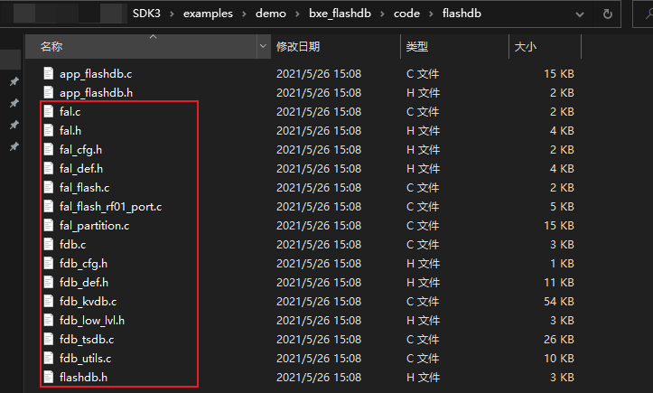
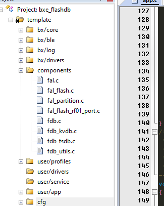
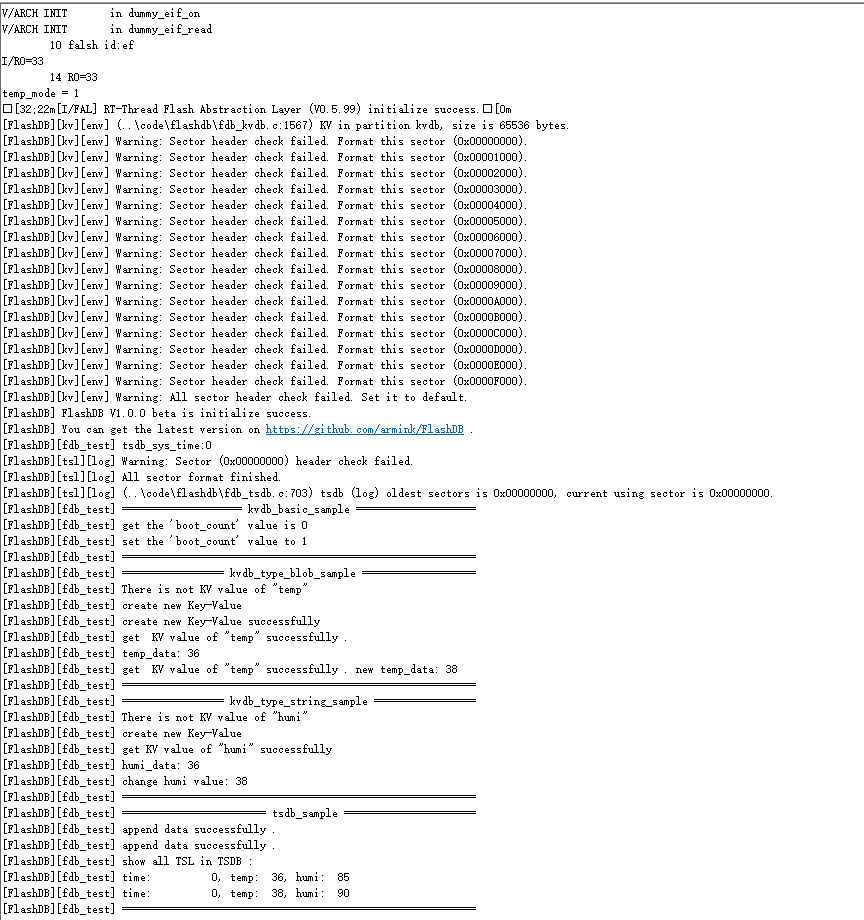
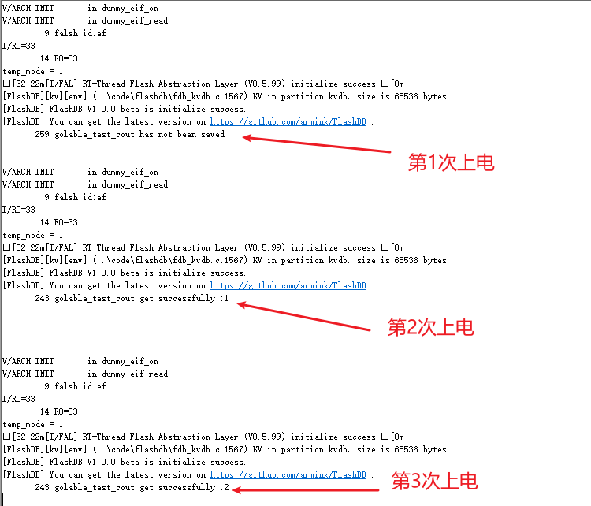
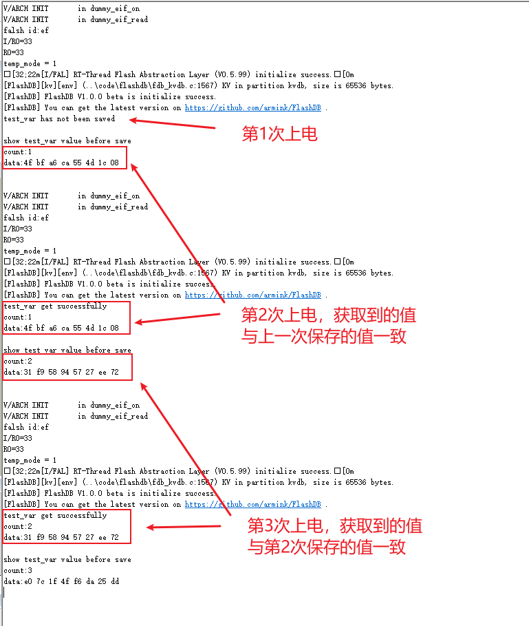

# FlashDB

## 1、获取源码 

在code目录下新建文件夹"flashdb"，从第三方库（components）中，把fal和flashdb相关的.c .h文件添加进来，添加完如下（因为我不喜欢路径藏太深，就把所有相关的文件都放在这个文件夹了）：

 

## 2、添加文件

然后打开工程文件，添加文件，同时把include路径配置好：

- fal.c
- fal_flash.c
- fal_partition.c
- fal_flash_rf01_port.c

- fdb.c
- fdb_kvdb.c
- fdb_tsdb.c
- fdb_utils.c

 


## 3、移植接口

利用fal_flash_stm32f2_port.c，写一个新的.c文件，如fal_flash_rf01_port.c，定义自己的flash设备：

- `static int init(void)`：**可选** 的初始化操作。
- `static int read(long offset, uint8_t *buf, size_t size)`：读取操作。

| 参数   | 描述                      |
| :----- | :------------------------ |
| offset | 读取数据的 Flash 偏移地址 |
| buf    | 存放待读取数据的缓冲区    |
| size   | 待读取数据的大小          |
| return | 返回实际读取的数据大小    |

- `static int write(long offset, const uint8_t *buf, size_t size)` ：写入操作。

| 参数   | 描述                      |
| :----- | :------------------------ |
| offset | 写入数据的 Flash 偏移地址 |
| buf    | 存放待写入数据的缓冲区    |
| size   | 待写入数据的大小          |
| return | 返回实际写入的数据大小    |

- `static int erase(long offset, size_t size)` ：擦除操作。

| 参数   | 描述                      |
| :----- | :------------------------ |
| offset | 擦除区域的 Flash 偏移地址 |
| size   | 擦除区域的大小            |
| return | 返回实际擦除的区域大小    |

用户需要根据自己的 Flash 情况分别实现这些操作函数。在文件最底部定义了具体的 Flash 设备对象 ，如下示例定义了 stm32f2 片上 flash：stm32f2_onchip_flash

```c
const struct fal_flash_dev rf01_flash =
{
    .name       = "rf01_onchip",
    .addr       = 0x08000000,
    .len        = 1024*1024,
    .blk_size   = 4*1024,
    .ops        = {init, read, write, erase},
    .write_gran = 8
};
```

- `rf01_onchip` : Flash 设备的名字。
- `0x08000000`: 对 Flash 操作的起始地址。
- `1024*1024`：Flash 的总大小（1MB）。
- `4*1024`：Flash 块/扇区大小，rf01外挂的flash的
- `{init, read, write, erase}` ：Flash 的操作函数。 如果没有 init 初始化过程，第一个操作函数位置可以置空。
- `8` : 设置写粒度，单位 bit， 0 表示未生效（默认值为 0 ），该成员是 fal 版本大于 0.4.0 的新增成员。各个 flash 写入粒度不尽相同，可通过该成员进行设置。

最后得到的fal_flash_rf01_port.c

```c
/**
  ******************************************************************************
  * @file   :   main.c
  * @version:
  * @author :
  * @brief  :
  ******************************************************************************
  * @attention
  *
  * <h2><center>&copy; Copyright(c) . BLUEX Microelectronics.
  * All rights reserved.</center></h2>
  *
  *
  ******************************************************************************
  */

/* includes ------------------------------------------------------------------*/
#include <fal.h>

#include "flash_wrapper.h"
/* private define ------------------------------------------------------------*/

/* private typedef -----------------------------------------------------------*/
/* private variables ---------------------------------------------------------*/
/* exported variables --------------------------------------------------------*/

/*============================= private function =============================*/
/** ---------------------------------------------------------------------------
 * @brief   :
 * @note    :
 * @param   :
 * @retval  :
-----------------------------------------------------------------------------*/
static int init( void )
{
    flash_wakeup();
    return 0;
}
/** ---------------------------------------------------------------------------
 * @brief   :
 * @note    :
 * @param   :
 * @retval  :
-----------------------------------------------------------------------------*/
static int read( long offset, uint8_t * buf, size_t size )
{
    if( flash_std_read( offset, size, buf ) != PERIPH_NO_ERROR ) {
        return -1;
    }
    return size;
}
/** ---------------------------------------------------------------------------
 * @brief   :
 * @note    :
 * @param   :
 * @retval  :
-----------------------------------------------------------------------------*/
static int write( long offset, const uint8_t * buf, size_t size )
{
    if( flash_program( offset, size, ( uint8_t * )buf ) != PERIPH_NO_ERROR ) {
        return -1;
    }
    return size;
}
/** ---------------------------------------------------------------------------
 * @brief   :
 * @note    :
 * @param   :
 * @retval  :
-----------------------------------------------------------------------------*/
static int erase( long offset, size_t size )
{
    periph_err_t flash_status;
    size_t erased_size = 0;
    uint32_t cur_erase_sector;
    uint32_t addr = rf01_flash.addr + offset;

    /* start erase */
    /* it will stop when erased size is greater than setting size */
    while ( erased_size < size ) {
        cur_erase_sector = ( addr + erased_size ) & 0xFFFFF000;
        flash_status = flash_erase( cur_erase_sector, Sector_Erase );
        if ( flash_status != PERIPH_NO_ERROR ) {
            return -1;
        }
        erased_size += 0x1000;
    }
    return size;
}
/*========================= end of private function ==========================*/

/*============================= exported function ============================*/

/*========================= end of exported function =========================*/
const struct fal_flash_dev rf01_flash = {
    .name       = "rf01_onchip",
    .addr       = 0x800000,
    .len        = 1024 * 1024,
    .blk_size   = 4 * 1024,
    .ops        = {init, read, write, erase},
    .write_gran = 8
};
```

## 4、定义分区表

分区表也定义在 `fal_cfg.h` 头文件中。Flash 分区基于 Flash 设备，每个 Flash 设备又可以有 N 个分区，这些分区的集合就是分区表。在配置分区表前，务必保证已定义好 **Flash 设备** 及 **设备表**。fal_cfg.h 可以参考 [示例文件 fal/samples/porting/fal_cfg.h](https://github.com/RT-Thread-packages/fal/blob/master/samples/porting/fal_cfg.h) 完成。

分区表示例：

```c
#define NOR_FLASH_DEV_NAME             "norflash0"
/* ====================== Partition Configuration ========================== */
#ifdef FAL_PART_HAS_TABLE_CFG
/* partition table */
#define FAL_PART_TABLE                                                               \
{                                                                                    \
    {FAL_PART_MAGIC_WORD,        "bl",     "stm32_onchip",         0,   64*1024, 0}, \
    {FAL_PART_MAGIC_WORD,       "app",     "stm32_onchip",   64*1024,  704*1024, 0}, \
    {FAL_PART_MAGIC_WORD, "easyflash", NOR_FLASH_DEV_NAME,         0, 1024*1024, 0}, \
    {FAL_PART_MAGIC_WORD,  "download", NOR_FLASH_DEV_NAME, 1024*1024, 1024*1024, 0}, \
}
#endif /* FAL_PART_HAS_TABLE_CFG */
```

上面这个分区表详细描述信息如下：

| 分区名      | Flash 设备名   | 偏移地址  | 大小  | 说明               |
| :---------- | :------------- | :-------- | :---- | :----------------- |
| "bl"        | "stm32_onchip" | 0         | 64KB  | 引导程序           |
| "app"       | "stm32_onchip" | 64*1024   | 704KB | 应用程序           |
| "easyflash" | "norflash0"    | 0         | 1MB   | EasyFlash 参数存储 |
| "download"  | "norflash0"    | 1024*1024 | 1MB   | OTA 下载区         |

用户需要修改的分区参数包括：分区名称、关联的 Flash 设备名、偏移地址（相对 Flash 设备内部）、大小，需要注意以下几点：

- 分区名保证 **不能重复**；
- 关联的 Flash 设备 **务必已经在 Flash 设备表中定义好** ，并且 **名称一致** ，否则会出现无法找到 Flash 设备的错误；
- 分区的起始地址和大小 **不能超过 Flash 设备的地址范围** ，否则会导致包初始化错误；

> 注意：每个分区定义时，除了填写上面介绍的参数属性外，需在前面增加 `FAL_PART_MAGIC_WORD` 属性，末尾增加 `0` （目前用于保留功能）

注意把 #define FAL_PART_HAS_TABLE_CFG 添加上

最终得到的fal_cfg.h如下：

```c

#ifndef _FAL_CFG_H_
#define _FAL_CFG_H_

#include "fal_def.h"

#define FAL_PART_HAS_TABLE_CFG

/* ===================== Flash device Configuration ========================= */
extern const struct fal_flash_dev rf01_flash;

/* flash device table */
#define FAL_FLASH_DEV_TABLE                                          \
{                                                                    \
    &rf01_flash,                                                     \
}
/* ====================== Partition Configuration ========================== */
#ifdef FAL_PART_HAS_TABLE_CFG
/* partition table */
#define FAL_PART_TABLE                                                           \
{                                                                                \
    {FAL_PART_MAGIC_WORD,   "bl",   "rf01_onchip",  0,            12*1024,  0},  \
    {FAL_PART_MAGIC_WORD,   "app",  "rf01_onchip",  12*1024,      116*1024, 0},  \
    {FAL_PART_MAGIC_WORD,   "kvdb", "rf01_onchip",  128*1024,     64*1024,  0},  \
    {FAL_PART_MAGIC_WORD,   "tsdb", "rf01_onchip",  192*1024,     64*1024,  0},  \
}
#endif /* FAL_PART_HAS_TABLE_CFG */

#endif /* _FAL_CFG_H_ */

```

## 5、其它配置

- fdb_cfg.h 把 FDB_WRITE_GRAN 的值设置为8，注意与fal_flash_rf01_port.c中的const struct fal_flash_dev rf01_flash的write_gran的值一致
- log接口

```c
// fal_def.h
...
#define FAL_PRINTF(...)                 bx_log(__VA_ARGS__)
...

//fdb_def.h
#define FDB_PRINT(...)                  bx_log(__VA_ARGS__)
```

## 6、实测

至此，我们已经完成FlashDB的移植，把官方的示例代码移植上来，可以实测看看情况：

```c
#include "fal.h"
#include "flashdb.h"

...

void app_init( void )
{
    kvdb_init();
    tsdb_init();

    kvdb_basic_sample();
    kvdb_type_blob_sample();
    kvdb_type_string_sample();
    tsdb_sample();
}

...
```

可以看到结果：

 

kvdb和tsdb都可正常运行，至此即可使用所有flashdb的代码

## 6、优化接口

使用FlashDB原始的API，我们还需要填写较多的参数，因此新增了一些API（这类API主要针对kvdb，tsdb的暂未好方案优化，使用时请先使用原有的API）

- app_fdb_init
- app_fdb_save
- app_fdb_get
- app_fdb_save_easy

- app_fdb_get_easy

这些api放在app_flashdb.c与app_flash.h中

## 7、使用方法

### 示例1：全局变量

```c
// step1: 首先定义要保存的数据（不一定要全局变量，也可以是局部变量）
u32 golable_test_cout = 0;
void app_init( void )
{
    //step2: 初始化 flashDB
    app_fdb_init();
    
    //step3: 先获取数据
    if( app_fdb_get_easy(golable_test_cout) != BX_OK ) {
        bx_logln( "golable_test_cout has not been saved" );
    }else{
        bx_logln( "golable_test_cout get successfully :%u",golable_test_cout );
    }
    
    //step4: 改变数值
    golable_test_cout++;
    
    //step5: 保存数值
    app_fdb_save_easy(golable_test_cout);
    
}
```

可以看到结果如下：

 

### 示例2：结构体

```c
#include "stdlib.h"

// step1: 首先定义要保存的数据结构
struct test_struct {
    u32 count;
    u8  data[8];
};

void app_init( void )
{
    //step2: 初始化 flashDB
    app_fdb_init();

    // step3：定义一个用于测试的变量
    struct test_struct test_var = { 0 };

    //step4: 先获取数据
    if( app_fdb_get_easy( test_var ) != BX_OK ) {
        bx_logln( "test_var has not been saved" );
    } else {
        bx_logln( "test_var get successfully " );
        bx_logln( "count:%u", test_var.count );
        bx_log( "data:" );
        for( u32 i = 0; i < 8; i++ ) {
            bx_log( "%02x ",test_var.data[i] );
        }
        bx_log( "\r\n" );
    }

    //step4: 改变数值
    srand( BX_RTC->CCV );
    test_var.count++;
    for( u32 i = 0; i < 8; i++ ) {
        test_var.data[i] = rand();
    }

    bx_log( "\r\n" );

    //step5: 保存数值
    bx_logln( "show test_var value before save " );
    bx_logln( "count:%u", test_var.count );
    bx_log( "data:" );
    for( u32 i = 0; i < 8; i++ ) {
        bx_log( "%02x ",test_var.data[i] );
    }
    bx_log( "\r\n" );
    app_fdb_save_easy( test_var );
}
```

可以看到结果如下：

 
