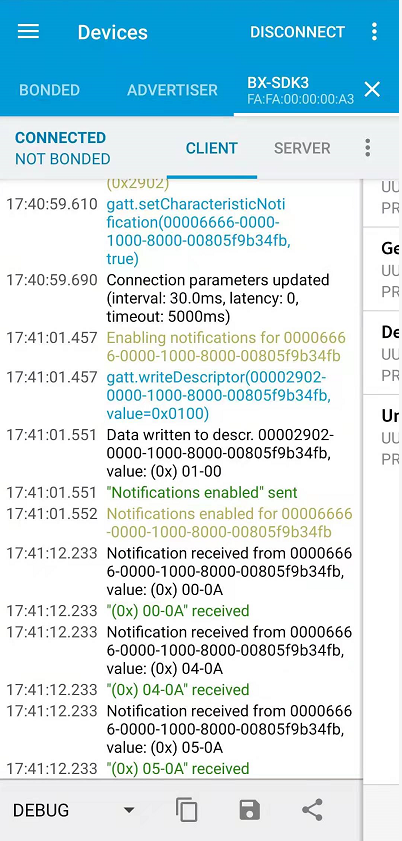
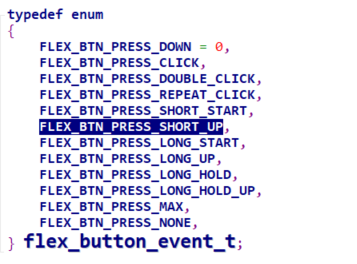
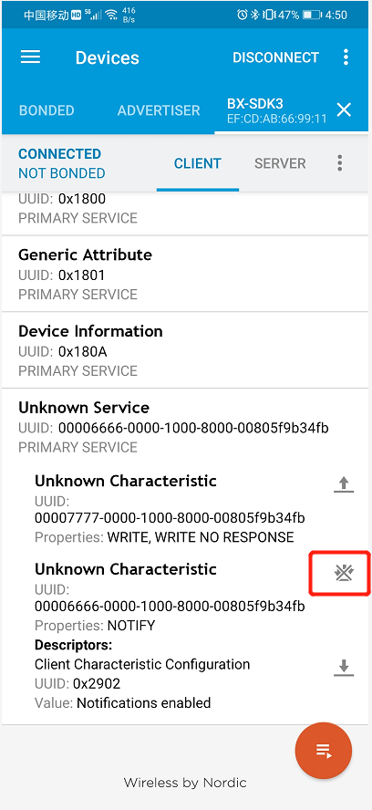
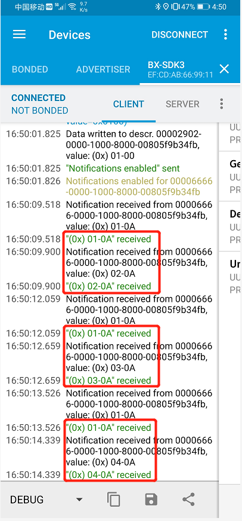
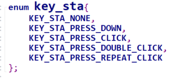

# 可唤醒的矩阵键盘

## 1、概述

​		本文档介绍休眠情况下可唤醒的矩阵键盘的使用，以下分别介绍两种实现方式：定时器扫描方式和中断触发方式，其中定时器扫描方式包括按键按下、单击、双击、多击、短按、长按等，儿中断触发方式进支持按键按下、单击、双击、多击。

## 2、工程目录

..\SDK3\examples\demo\bxe_matrix_keyboard_wakeup\mdk

## 3、添加文件

- bxe_matrix_keyboard_wakeup.h
- bxd_gpio.h
- bx_kernel.h
- flexible_button.h
- gattc_task.h
- ke_msg.h
- rtc.h
- log.h

## 4、编写代码

```c
//1:定时器扫描模式，0：中断触发模式，其中中断触发模式仅有按键按下、单击、双击、多击
#define BUTTON_TIME_SCAN_MODE   1
```

### 4.1 app.c初始化

```c
/** ---------------------------------------------------------------------------
 * @brief   :
 * @note    :
 * @param   :
 * @retval  :
-----------------------------------------------------------------------------*/
void app_init( void )
{
    //初始化key
    key_init();
}
```

### 4.2 bx_sdk3_config.h配置

```c
//开启睡眠模式
#ifndef BX_DEEP_SLEEP
#define BX_DEEP_SLEEP                                   1
#endif
```

### 4.3 bx_apollo00_it.c文件添加外部中断向量函数以及开启扫描

```c
#if BUTTON_TIME_SCAN_MODE == 1
//外部中断转换为pin state，并开启扫描
/** ---------------------------------------------------------------------------
 * @brief   :
 * @note    :
 * @param   :
 * @retval  :
-----------------------------------------------------------------------------*/
u32 ext_int_stat_2_pin_state( u32 ext_int_stat )
{
    u32 ret = 0;
    u32 temp = 0;

    for( u32 i = 0; i < 5; i++ ) {
        if( ext_int_stat & ( 0x01 << i ) ) {
            switch( i ) {
                case 0: {
                    //开启扫描，扫描间隔为10ms
                    bx_dwork( key_scan_process, NULL, 10, BX_FOREVER );
                    //pin state,P15 触发中断
                    temp = 0x01 << 15;
                }
                break;

                case 1: {
                	//开启扫描，扫描间隔为10ms
                    bx_dwork( key_scan_process, NULL, 10, BX_FOREVER );
					//pin state,P16 触发中断
                    temp = 0x01 << 16;
                }
                break;

                case 2: {
                	//开启扫描，扫描间隔为10ms
                    bx_dwork( key_scan_process, NULL, 10, BX_FOREVER );
					//pin state,P17 触发中断
                    temp = 0x01 << 17;
                }
                break;

                case 3: {
                	//开启扫描，扫描间隔为10ms
                    bx_dwork( key_scan_process, NULL, 10, BX_FOREVER );
					//pin state,P22 触发中断
                    temp = 0x01 << 22;
                }
                break;

                case 4: {
                	//开启扫描，扫描间隔为10ms
                    bx_dwork( key_scan_process, NULL, 10, BX_FOREVER );
					//pin state,P23 触发中断
                    temp = 0x01 << 23;
                }
                break;

                default:
                    break;
            }
        }
        ret |= temp;
    }
    return ret;
}
#elif BUTTON_TIME_SCAN_MODE == 0
//外部中断转换为pin state，并获取当前时间戳
/** ---------------------------------------------------------------------------
 * @brief   :
 * @note    :
 * @param   :
 * @retval  :
-----------------------------------------------------------------------------*/
u32 ext_int_stat_2_pin_state( u32 ext_int_stat )
{
    u32 ret = 0;
    u32 temp = 0;
    u32 pin_value = 0;

	//读取当前输入pin的io状态
    bxd_gpio_read( BX_GPIOA, &pin_value );

    for( u32 i = 0; i < 5; i++ ) {
        if( ext_int_stat & ( 0x01 << i ) ) {
            switch( i ) {
                case 0: {
                    //判断当前是否为上升沿模式，若否则为下降沿模式
                    if( ext_trigger_mode[i] == TRIGGER_RISING_MODE ) {
                        //当前为上升沿模式，并且电平为高，说明上升沿触发，此时应当切换边沿模式
                        if( ( pin_value >> 15 ) & 0x01 ) {
                            //模式切换为下降沿模式
                            ext_trigger_mode[i] = TRIGGER_FALLING_MODE;
                            //下降沿模式io的配置
                            bxd_gpio_set_mode( BX_GPIOA, 15, BX_GPIO_MODE_EIT_FALLING );
							//获取当前时间戳
                            get_trigger_timestamp( BX_GPIO_MODE_EIT_RISING, i );
                        }
                    } else {
                        //当前为下降沿模式，并且电平为低，说明下降沿触发，此时应当切换边沿模式
                        if( !( ( pin_value >> 15 ) & 0x01 ) ) {
                            //模式切换为上升沿模式
                            ext_trigger_mode[i] = TRIGGER_RISING_MODE;
                            //上升沿模式io的配置
                            bxd_gpio_set_mode( BX_GPIOA, 15, BX_GPIO_MODE_EIT_RISING );
							//获取当前时间戳
                            get_trigger_timestamp( BX_GPIO_MODE_EIT_FALLING, i );
                        }

                    }
					//pin state,P15 触发中断
                    temp = 0x01 << 15;
                }
                break;

                case 1:
                    //判断当前是否为上升沿模式，若否则为下降沿模式
                    if( ext_trigger_mode[i] == TRIGGER_RISING_MODE ) {
                        //当前为上升沿模式，并且电平为高，说明上升沿触发，此时应当切换边沿模式
                        if( ( pin_value >> 16 ) & 0x01 ) {
                            //模式切换为下降沿模式
                            ext_trigger_mode[i] = TRIGGER_FALLING_MODE;
                            //下降沿模式io的配置
                            bxd_gpio_set_mode( BX_GPIOA, 16, BX_GPIO_MODE_EIT_FALLING );
							//获取当前时间戳
                            get_trigger_timestamp( BX_GPIO_MODE_EIT_RISING, i );
                        }
                    } else {
                        //当前为下降沿模式，并且电平为低，说明下降沿触发，此时应当切换边沿模式
                        if( !( ( pin_value >> 16 ) & 0x01 ) ) {
                            //模式切换为上升沿模式
                            ext_trigger_mode[i] = TRIGGER_RISING_MODE;
                            //上升沿模式io的配置
                            bxd_gpio_set_mode( BX_GPIOA, 16, BX_GPIO_MODE_EIT_RISING );
							//获取当前时间戳
                            get_trigger_timestamp( BX_GPIO_MODE_EIT_FALLING, i );
                        }
                    }
                    //pin state,P16 触发中断
                    temp = 0x01 << 16;
                    break;

                case 2:
                    //判断当前是否为上升沿模式，若否则为下降沿模式
                    if( ext_trigger_mode[i] == TRIGGER_RISING_MODE ) {
                        //当前为上升沿模式，并且电平为高，说明上升沿触发，此时应当切换边沿模式
                        if( ( pin_value >> 17 ) & 0x01 ) {
                            //模式切换为下降沿模式
                            ext_trigger_mode[i] = TRIGGER_FALLING_MODE;
                            //下降沿模式io的配置
                            bxd_gpio_set_mode( BX_GPIOA, 17, BX_GPIO_MODE_EIT_FALLING );
							//获取当前时间戳
                            get_trigger_timestamp( BX_GPIO_MODE_EIT_RISING, i );
                        }
                    } else {
                        //当前为下降沿模式，并且电平为低，说明下降沿触发，此时应当切换边沿模式
                        if( !( ( pin_value >> 17 ) & 0x01 ) ) {
                            //模式切换为上升沿模式
                            ext_trigger_mode[i] = TRIGGER_RISING_MODE;
                            //上升沿模式io的配置
                            bxd_gpio_set_mode( BX_GPIOA, 17, BX_GPIO_MODE_EIT_RISING );
							//获取当前时间戳
                            get_trigger_timestamp( BX_GPIO_MODE_EIT_FALLING, i );
                        }
                    }
                    //pin state,P17 触发中断
                    temp = 0x01 << 17;
                    break;

                case 3:
                    //判断当前是否为上升沿模式，若否则为下降沿模式
                    if( ext_trigger_mode[i] == TRIGGER_RISING_MODE ) {
                        //当前为上升沿模式，并且电平为高，说明上升沿触发，此时应当切换边沿模式
                        if( ( pin_value >> 22 ) & 0x01 ) {
                            //模式切换为下降沿模式
                            ext_trigger_mode[i] = TRIGGER_FALLING_MODE;
                            //下降沿模式io的配置
                            bxd_gpio_set_mode( BX_GPIOA, 22, BX_GPIO_MODE_EIT_FALLING );
							//获取当前时间戳
                            get_trigger_timestamp( BX_GPIO_MODE_EIT_RISING, i );
                        }
                    } else {
                        //当前为下降沿模式，并且电平为低，说明下降沿触发，此时应当切换边沿模式
                        if( !( ( pin_value >> 22 ) & 0x01 ) ) {
                            //模式切换为上升沿模式
                            ext_trigger_mode[i] = TRIGGER_RISING_MODE;
                            //上升沿模式io的配置
                            bxd_gpio_set_mode( BX_GPIOA, 22, BX_GPIO_MODE_EIT_RISING );
							//获取当前时间戳
                            get_trigger_timestamp( BX_GPIO_MODE_EIT_FALLING, i );
                        }
                    }
                    //pin state,P22 触发中断
                    temp = 0x01 << 22;
                    break;

                case 4:
                    //判断当前是否为上升沿模式，若否则为下降沿模式
                    if( ext_trigger_mode[i] == TRIGGER_RISING_MODE ) {
                        //当前为上升沿模式，并且电平为高，说明上升沿触发，此时应当切换边沿模式
                        if( ( pin_value >> 23 ) & 0x01 ) {
                            //模式切换为下降沿模式
                            ext_trigger_mode[i] = TRIGGER_FALLING_MODE;
                            //下降沿模式io的配置
                            bxd_gpio_set_mode( BX_GPIOA, 23, BX_GPIO_MODE_EIT_FALLING );
							//获取当前时间戳
                            get_trigger_timestamp( BX_GPIO_MODE_EIT_RISING, i );
                        }
                    } else {
                        //当前为下降沿模式，并且电平为低，说明下降沿触发，此时应当切换边沿模式
                        if( !( ( pin_value >> 23 ) & 0x01 ) ) {
                            //模式切换为上升沿模式
                            ext_trigger_mode[i] = TRIGGER_RISING_MODE;
                            //上升沿模式io的配置
                            bxd_gpio_set_mode( BX_GPIOA, 23, BX_GPIO_MODE_EIT_RISING );
							//获取当前时间戳
                            get_trigger_timestamp( BX_GPIO_MODE_EIT_FALLING, i );
                        }
                    }
                    //pin state,P23 触发中断
                    temp = 0x01 << 23;
                    break;

                default:
                    break;
            }
        }
        当前io state
        ret |= temp;
    }
    return ret;
}
#endif
/** ---------------------------------------------------------------------------
 * @brief   :
 * @note    :
 * @param   :
 * @retval  :
-----------------------------------------------------------------------------*/

void EXT_INTR_IRQHandler( void )
{
    uint8_t ext_int_stat = BX_FIELD_RD( BX_AWO->EIVAL, AWO_EIVAL_VAL ) ;
    BX_AWO->EICLR |= ext_int_stat;
    u32 pin_state = ext_int_stat_2_pin_state( ext_int_stat );

//    LOG_I( "EXT_INTR_IRQHandler = %d,ext_int_stat=%d", pin_state ,ext_int_stat);
}
```

### 4.4 bxe_matrix_keyboard_wakeup.c 矩阵实现代码

```c
//矩阵按键个数
#define USER_BUTTON_MAX	12
#if BUTTON_TIME_SCAN_MODE == 1
//定义按键个数
static flex_button_t user_button[USER_BUTTON_MAX] = {0};
#elif BUTTON_TIME_SCAN_MODE == 0
#define portMAX_32_BIT_NUMBER       (0xffffffff)
//定义按键个数
struct key_tag us_key[USER_BUTTON_MAX] = {0};
#endif

/*
      P13      P12      P2
P15____|________|________|      S0      S1      S2
       |        |        |
P17____|________|________|      S3      S4      S5
       |        |        |
P22____|________|________|      S6      S7      S8
       |        |        |
P23____|________|________|      S9      S10     S11

*/
//按键列设置的pin num
u8 column_key_pin[3] = {13, 12, 2};
//按键行设置的pin num
u8 raw_key_pin[4] = {15, 17, 22, 23};
#if BUTTON_TIME_SCAN_MODE == 0
//外部中断对应的bit
u8 ext_trigger_mode[5] = {0};
#endif
#if BUTTON_TIME_SCAN_MODE == 0
//当前时间，单位：ms
/** ---------------------------------------------------------------------------
 * @brief   :
 * @note    :
 * @param   :
 * @retval  :
-----------------------------------------------------------------------------*/
uint32_t system_time_ms( void )
{
    u32 time = 0;
	static uint32_t tick_count_last = 0;
		uint32_t tick_count_current = RTC_CURRENTCNT_GET();
		uint32_t tick_temp;
		if( tick_count_current > tick_count_last ) {
			tick_temp = tick_count_current - tick_count_last;
		} else if( tick_count_current < tick_count_last ) {
			tick_temp = ( portMAX_32_BIT_NUMBER - tick_count_last ) + tick_count_current;
		}

		time = tick_temp * 1000/32768;

	return time;
}
#endif
//notify 具体的按键消息，实现此函数要新建一个user proflie，具体可参考user proflie的建立demo介绍
/** ---------------------------------------------------------------------------
 * @brief   :
 * @note    :
 * @param   :
 * @retval  :
-----------------------------------------------------------------------------*/
bx_err_t ble_send_data_notify( u8 * data, u8 length, u16 handle )
{
    struct gattc_send_evt_cmd * notify_cmd = KE_MSG_ALLOC_DYN( GATTC_SEND_EVT_CMD,
            TASK_GATTC, TASK_APP,
            gattc_send_evt_cmd, length );
    CHECK_POINTER( notify_cmd );
    static u16 notify_seq_num = 0;
    notify_cmd->operation = GATTC_NOTIFY;
    notify_cmd->seq_num = notify_seq_num++;
    notify_cmd->length = length;
    notify_cmd->handle = handle;

    memcpy( notify_cmd->value, data, length );

    ke_msg_send( notify_cmd );
    return BX_OK;
}
#if BUTTON_TIME_SCAN_MODE == 1
//按键值读取函数
/** ---------------------------------------------------------------------------
 * @brief   :
 * @note    :
 * @param   :
 * @retval  :
-----------------------------------------------------------------------------*/
static uint8_t common_btn_read( void * arg )
{

    uint8_t value = 0;

    flex_button_t * btn = ( flex_button_t * )arg;
    u32 colum_size = ARRAY_SIZE( column_key_pin );

    for( u32 i = 0; i < colum_size  ; i++ ) {
        if( i == ( btn->id % colum_size ) ) {
            //扫描过程中检测的当前列输出为0
            bxd_gpio_write( BX_GPIOA, column_key_pin[i], 0 );
        } else {
            //扫描过程中非检测的当前列输出为1
            bxd_gpio_write( BX_GPIOA, column_key_pin[i], 1 );
        }
    }
    u32 port_value = 0;
    //读取io输入pin的值
    bxd_gpio_read( BX_GPIOA, &port_value );
    //当前按键的逻辑电平
    value = ( ( port_value >> raw_key_pin[btn->id / colum_size] ) & 0x01 );
    return value;
}

//按键回调函数
/** ---------------------------------------------------------------------------
 * @brief   :
 * @note    :
 * @param   :
 * @retval  :
-----------------------------------------------------------------------------*/
static void common_btn_evt_cb( void * arg )
{
    flex_button_t * btn = ( flex_button_t * )arg;

    LOG_I( "btn->event = %d,btn->id = %d", btn->event, btn->id );
	//notify的参数
    u8 notify_buf[2] = {0};
    //触发的具体事件
    notify_buf[0] = btn->event;
    //触发事件对应的按键
    notify_buf[1] = btn->id;
    //notify 当前触发的事件以及按键值
    ble_send_data_notify( notify_buf, sizeof( notify_buf ), 30 );

    switch( btn->event ) {
        //按键按下事件
        case FLEX_BTN_PRESS_DOWN:
            break;
		//单击、双击、多击事件
        case FLEX_BTN_PRESS_CLICK:
        case FLEX_BTN_PRESS_DOUBLE_CLICK:
        case FLEX_BTN_PRESS_REPEAT_CLICK:
            //弹起后延迟50ms关掉扫描
            bx_dwork( key_scan_process, NULL, 50, 1 );
            //弹起后延迟51ms停止扫描，恢复列设置
            bx_dwork( key_scan_stop_process, NULL, 51, 1 );
            break;

		//短按按下、长按按下、长按住事件
        case FLEX_BTN_PRESS_SHORT_START:
        case FLEX_BTN_PRESS_LONG_START:
        case FLEX_BTN_PRESS_LONG_HOLD:
            break;
		//短按释放、长按释放、长按住释放事件
        case FLEX_BTN_PRESS_SHORT_UP:
        case FLEX_BTN_PRESS_LONG_UP:
        case FLEX_BTN_PRESS_LONG_HOLD_UP:
            //弹起后延迟50ms关掉扫描
            bx_dwork( key_scan_process, NULL, 50, 1 );
            //弹起后延迟51ms停止扫描，恢复列设置
            bx_dwork( key_scan_stop_process, NULL, 51, 1 );
            break;
    }

}

//按键初始化
void key_init( void )
{
    //开启io配置
    bxd_gpio_open( BX_GPIOA );
    //由于外部中断唤醒的pin num为P15、P16、P17、P22、P23，因为此处选择行作为输入口
    for( u8 i = 0; i < sizeof( raw_key_pin ) / sizeof( raw_key_pin[0] ); i++ ) {
        //矩阵行设置为输入模式
        bxd_gpio_set_mode( BX_GPIOA, raw_key_pin[i], BX_GPIO_MODE_INPUT );
        //矩阵行设置为内部上拉
        bxd_gpio_set_pull( BX_GPIOA, raw_key_pin[i], BX_GPIO_PULLUP );
        //矩阵行设置为外部下降沿触发
        bxd_gpio_set_mode( BX_GPIOA, raw_key_pin[i], BX_GPIO_MODE_EIT_FALLING );
    }

    for( u8 i = 0; i < sizeof( column_key_pin ) / sizeof( column_key_pin[0] ); i++ ) {
        //矩阵列设置为输出模式
        bxd_gpio_set_mode( BX_GPIOA, column_key_pin[i], BX_GPIO_MODE_OUTPUT );
        //矩阵列设置为低电平
        bxd_gpio_write( BX_GPIOA, column_key_pin[i], 0 );
    }

    for( u8 i = 0; i < USER_BUTTON_MAX; i++ ) {
        //设置矩阵id
        user_button[i].id = i;
        //设置按键读取函数
        user_button[i].usr_button_read = common_btn_read;
        //设置按键回调函数
        user_button[i].cb = common_btn_evt_cb;
        //设置按键按下的逻辑电平
        user_button[i].pressed_logic_level = 0;
        //触发短按按下的时长设置
        user_button[i].short_press_start_tick = FLEX_MS_TO_SCAN_CNT( 1000 / FLEX_BTN_SCAN_FREQ_HZ );
        //触发长按按下的时长设置
        user_button[i].long_press_start_tick = FLEX_MS_TO_SCAN_CNT( 2000 );
        //触发长按按住不放的时长设置
        user_button[i].long_hold_start_tick = FLEX_MS_TO_SCAN_CNT( 4500 );
        //配置按键属性
        flex_button_register( &user_button[i] );
    }
}

//按键扫描函数
void key_scan_process( void * data )
{
    //按键扫描
    flex_button_scan();
}
//按键停止执行函数
void key_scan_stop_process( void * data )
{
    for( u32 i = 0; i < sizeof( column_key_pin ) / sizeof( column_key_pin[0] ); i++ ) {
        //按键扫描停止后，恢复列的io电平的低电平
        bxd_gpio_write( BX_GPIOA, column_key_pin[i], 0 );
    }
}
#elif BUTTON_TIME_SCAN_MODE == 0
//按键初始化
void key_init( void )
{
    //开启io配置
    bxd_gpio_open( BX_GPIOA );
    //由于外部中断唤醒的pin num为P15、P16、P17、P22、P23，因为此处选择行作为输入口
    for( u8 i = 0; i < sizeof( raw_key_pin ) / sizeof( raw_key_pin[0] ); i++ ) {
        //矩阵行设置为输入模式
        bxd_gpio_set_mode( BX_GPIOA, raw_key_pin[i], BX_GPIO_MODE_INPUT );
        //矩阵行设置为内部上拉
        bxd_gpio_set_pull( BX_GPIOA, raw_key_pin[i], BX_GPIO_PULLUP );
        //矩阵行设置为外部下降沿触发
        bxd_gpio_set_mode( BX_GPIOA, raw_key_pin[i], BX_GPIO_MODE_EIT_FALLING );
    }
    //外部中断初始模式均配置为下降沿模式
    for( u8 i = 0; i < 5; i++ ) {
        ext_trigger_mode[i] = TRIGGER_FALLING_MODE;
    }
    
    for( u8 i = 0; i < sizeof( column_key_pin ) / sizeof( column_key_pin[0] ); i++ ) {
        //矩阵列设置为输出模式
        bxd_gpio_set_mode( BX_GPIOA, column_key_pin[i], BX_GPIO_MODE_OUTPUT );
        //矩阵列设置为低电平
        bxd_gpio_write( BX_GPIOA, column_key_pin[i], 0 );
    }

    for( u8 i = 0; i < USER_BUTTON_MAX; i++ ) {
		//设置按键按下的逻辑电平
        us_key[i].pressed_logic_level = 0;
        //设置矩阵id
        us_key[i].id = i;
        //按键初始电平
        us_key[i].logic_level = 1;
        //两次短按按下的最小间隔，单位：ms
        us_key[i].max_multiple_clicks_interval = 300;
    }
}

//按键状态机
/** ---------------------------------------------------------------------------
 * @brief   :
 * @note    :
 * @param   :
 * @retval  :
-----------------------------------------------------------------------------*/
void key_state_machine( u32 key_value, u32 key_sta )
{
	//notify data
    u8 notify_buf[2] = {0};
    //按键状态，参见enum key_sta
    notify_buf[0] = key_sta;
    //触发的按键键值
    notify_buf[1] = key_value;
    //notify 按键data
    ble_send_data_notify( notify_buf, sizeof( notify_buf ), 30 );

    //按键状态处理
    switch( key_sta ) {
        case KEY_STA_NONE: {

        }
        break;
		//按键按下
        case KEY_STA_PRESS_DOWN: {
        }
        break;
		//单击释放
        case KEY_STA_PRESS_CLICK: {

        }
        break;
		//双击释放
        case KEY_STA_PRESS_DOUBLE_CLICK: {

        }
        break;
		//三击及以上释放
        case KEY_STA_PRESS_REPEAT_CLICK: {

        }
        break;

        default:
            break;
    }
}

//按键停止执行函数
void key_scan_stop_process( void * data )
{
    for( u32 i = 0; i < sizeof( column_key_pin ) / sizeof( column_key_pin[0] ); i++ ) {
        //按键扫描停止后，恢复列的io电平的低电平
        bxd_gpio_write( BX_GPIOA, column_key_pin[i], 0 );
    }
}
//外部中断bit转换为具体的io pin
/** ---------------------------------------------------------------------------
 * @brief   :
 * @note    :
 * @param   :
 * @retval  :
-----------------------------------------------------------------------------*/
int ext_to_pin( u8 ext_state )
{
    u32 pin_value = 0;

    switch( ext_state ) {
        case 0:
            pin_value = 15;
            break;

        case 1:
            pin_value = 16;
            break;

        case 2:
            pin_value = 17;
            break;

        case 3:
            pin_value = 22;
            break;

        case 4:
            pin_value = 23;
            break;

        default:
            break;

    }
    return pin_value;
}
//按键按下处理
/** ---------------------------------------------------------------------------
 * @brief   :
 * @note    :
 * @param   :
 * @retval  :
-----------------------------------------------------------------------------*/
void key_press_process( void * data )
{
    u32 time = 0;
	//获取当前时间
    time = system_time_ms();//unit:ms

    for( u8 i = 0; i < USER_BUTTON_MAX; i++ ) {
        //若当前按键按下的时间戳跟前一次按下的时间戳不相同，则说明此按键按下
        if( us_key[i].now_press_timestamp != us_key[i].pre_press_timestamp ) {
			//判断当前按下的按键与上一次按键按下的时间间隔是否大于所设的两次按键按下的时间间隔，若是则表示短按按下
            if( ( us_key[i].now_press_timestamp - us_key[i].release_timestamp  ) > us_key[i].max_multiple_clicks_interval ) {
                //click 计数初始值
                us_key[i].click_cnt = 1;
				//当前的时间戳赋值，以便下一次按键按下作比较
                us_key[i].pre_press_timestamp = us_key[i].now_press_timestamp;
                //更新按键事件
                us_key[i].key_sta = KEY_STA_PRESS_DOWN;
                //事件处理状态机
                key_state_machine( i, us_key[i].key_sta );
            //判断当前按下的按键与上一次按键按下的时间间隔是否大于20ms（滤波间隔），并且此时间间隔小于所设的两次按键按下的时间间隔，则表示为多击事件    
            } else if( ( us_key[i].now_press_timestamp - us_key[i].release_timestamp > 20 ) && ( ( us_key[i].now_press_timestamp - us_key[i].release_timestamp ) <= us_key[i].max_multiple_clicks_interval ) ) {
                //click 计数累计
                us_key[i].click_cnt++;
                //当前的时间戳赋值，以便下一次按键按下作比较
                us_key[i].pre_press_timestamp = us_key[i].now_press_timestamp;
            }
        }
    }
}
//按键释放处理，根据click次数判断是单击、双击还是多击事件
/** ---------------------------------------------------------------------------
 * @brief   :
 * @note    :
 * @param   :
 * @retval  :
-----------------------------------------------------------------------------*/
void key_release_process( void * data )
{
    u32 time = 0;
	//获取当前时间
    time = system_time_ms();//unit:ms

    for( u8 i = 0; i < USER_BUTTON_MAX; i++ ) {
        //若click 不为0，说明有按键按下事件，当前转换为按键释放状态
        if( us_key[i].click_cnt != 0 ) {
            //若click > 2,表示多击释放
            if( us_key[i].click_cnt > 2 ) {
                us_key[i].key_sta = KEY_STA_PRESS_REPEAT_CLICK;
            } else {
                //click = 1为单击释放，click = 2为双击释放
                us_key[i].key_sta = KEY_STA_PRESS_DOWN + us_key[i].click_cnt;
            }
            //事件处理状态机
            key_state_machine( i, us_key[i].key_sta );
            //释放后，清除click计数器
            us_key[i].click_cnt = 0;

        }
    }
}
//获取当前的时间戳
/** ---------------------------------------------------------------------------
 * @brief   :
 * @note    :
 * @param   :
 * @retval  :
-----------------------------------------------------------------------------*/
void get_trigger_timestamp( u8 mode, u8 ext_value )
{
    u32 time = 0;
    u32 pin_num = 0;
    u32 key_value = 0;
	//获取当前时间
    time = system_time_ms();//unit:ms
    //获取当前中断触发的pin num
    pin_num = ext_to_pin( ext_value );
	//根据当前触发的模式，获取按下/释放时间戳
    switch( mode ) {
        //上升沿时间戳获取
        case BX_GPIO_MODE_EIT_RISING: {
            //按键释放，恢复列的pin state
            for( u8 i = 0; i < sizeof( column_key_pin ); i++ ) {
                bxd_gpio_write( BX_GPIOA, column_key_pin[i], 0 );
            }

            for( u8 i = 0; i < USER_BUTTON_MAX; i++ ) {
                //判断按键按下的键值，从而确定按键释放的键值
                if( us_key[i].logic_level == us_key[i].pressed_logic_level ) {
                    //按键释放后，恢复逻辑电平
                    us_key[i].logic_level = 1;
					//获取按键释放的时间戳
                    us_key[i].release_timestamp = time;
					//取消按键释放函数的处理
                    bx_dwork_cancel( key_release_process );
                    //200ms后才执行按键释放，避免200ms内再次按下时click被清除
                    bx_dwork( key_release_process, NULL, 200, 1 );

                    break;
                }
            }
        }
        break;
		//下降沿时间戳获取
        case BX_GPIO_MODE_EIT_FALLING: {
            for( u8 i = 0; i < sizeof( raw_key_pin ); i++ ) {
				//确定按键触发的pin num所处的行
                if( raw_key_pin[i] == pin_num ) {
                    //按键扫描，确认按键按下的列
                    for( u8 j = 0; j < sizeof( column_key_pin ); j++ ) {
                        for( u8 m = 0; m < sizeof( column_key_pin ); m++ ) {
                            if( m == j ) {
                                bxd_gpio_write( BX_GPIOA, column_key_pin[m], 0 );
                            } else {
                                bxd_gpio_write( BX_GPIOA, column_key_pin[m], 1 );
                            }
                        }
                        u32 pin_value = 0;
                        bxd_gpio_read( BX_GPIOA, &pin_value );
                        //确认按键按下的列
                        if( ( ( pin_value >> raw_key_pin[i] ) & 0x01 ) == us_key[i].pressed_logic_level ) {
                            //根据按键按下的行、列，确定当前按键按下的键值
                            key_value = i * sizeof( column_key_pin ) + j;
                            //按下的按键的逻辑电平
                            us_key[key_value].logic_level = us_key[i].pressed_logic_level;
                            break;
                        }
                    }
                    break;
                }
            }

            for( u8 i = 0; i < USER_BUTTON_MAX; i++ ) {
                //判断按键按下的键值
                if( us_key[i].logic_level == us_key[i].pressed_logic_level ) {
					//获取当前按键按下的时间戳
                    us_key[i].now_press_timestamp = time;
                    //取消按键释放事件的处理
                    bx_dwork_cancel( key_release_process );
                    //按键按下事件的处理
                    bx_dwork( key_press_process, NULL, 10, 1 );

                    break;
                }
            }
        }
        break;

        default:
            break;
    }
}
#endif
```


## 5、演示结果

### 5.1 定时器扫描方式

```
#define BUTTON_TIME_SCAN_MODE   1
```

#### 5.1.1 按照第4章中定时器扫描方式编写代码并烧录

#### 5.1.2 连接设备并开启监听


#### 5.1.3 按键按下事件监听



对照按键事件表：



可知：

（0x）00-0A，00表示按键按下事件（FLEX_BTN_PRESS_DOWN），0A表示按键10

（0x）04-0A，04表示短按按下事件（FLEX_BTN_PRESS_SHORT_START），0A表示按键10

（0x）05-0A，05表示短按释放事件（FLEX_BTN_PRESS_SHORT_UP），0A表示按键10

### 5.2 中断触发方式

```
#define BUTTON_TIME_SCAN_MODE   0
```

#### 5.2.1 按照第4章编写代码并烧录

#### 5.2.2 连接设备并开启监听



#### 5.2.3 按键按下事件监听



对照按键事件表：



可知：

（0x）01-0A，01表示按键按下事件（KEY_STA_PRESS_DOWN），0A表示按键10

（0x）02-0A，02表示单击释放事件（KEY_STA_PRESS_CLICK），0A表示按键10

（0x）03-0A，03表示双击释放事件（KEY_STA_PRESS_DOUBLE_CLICK），0A表示按键10

（0x）04-0A，04表示多击释放事件（KEY_STA_PRESS_REPEAT_CLICK），0A表示按键10

