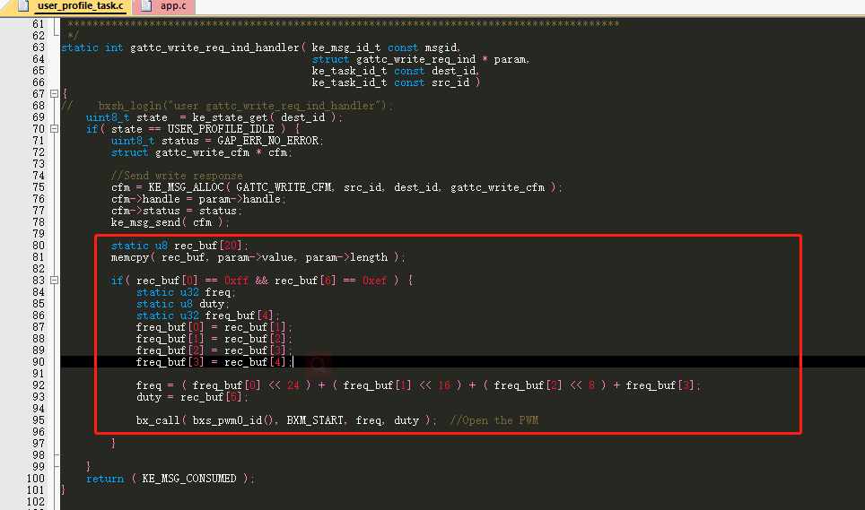
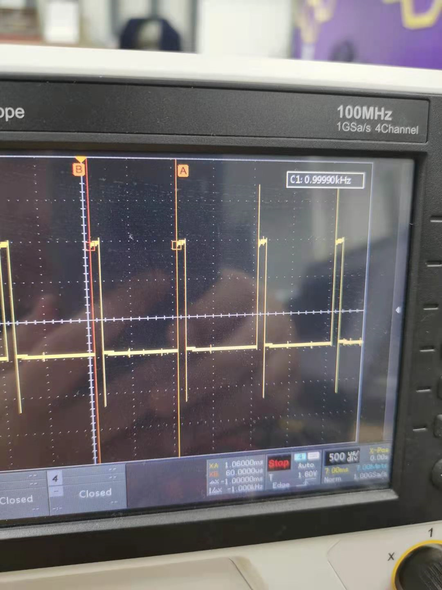
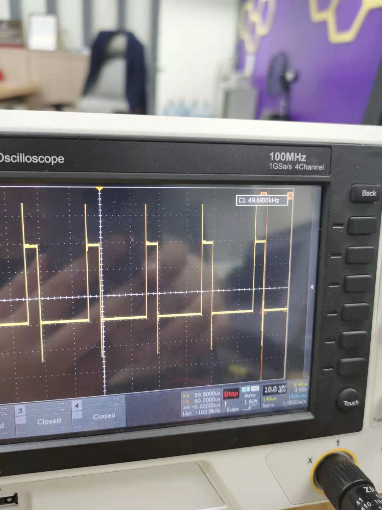
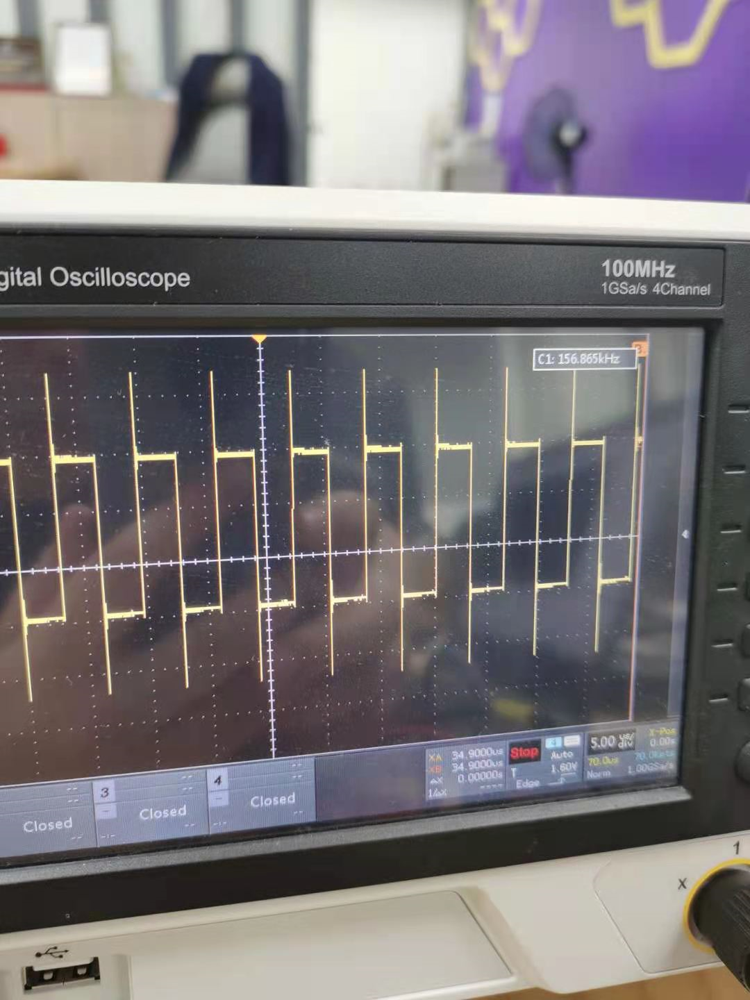

# 手机控制pwm的输出

## 1、概述

本章节主要讲叙使用手机app和ble设备端通信实现pwm的控制，包括频率和占空比

## 2、代码实现

打开一个全新的工程，找到app.c中的app_init()函数，在里面添加pwm的初始化，如下所示

```c
/** ---------------------------------------------------------------------------
@brief   :
@note    :
@param   :
@retval  :
-----------------------------------------------------------------------------*/
void app_init( void )
{
 bxs_pwm_register();

 bx_call( bxs_pwm0_id(), BXM_OPEN, 0, 0 );
 bx_set( bxs_pwm0_id(), BXP_PIN, 2, 0 );

}
```

这里注册了pwm的服务，打开pwm已经设置pwm的输出脚位

在user_profile_task.c中的写回调函数gattc_write_req_ind_handler中添加协议和pwm输出的代码，user_profile的添加请参考profile添加的相关文档

 


如上所示，这里自定义协议 

| 协议头 | 频率 | 频率 | 频率 | 频率 | 占空比 | 协议尾 |
| ------ | ---- | ---- | ---- | ---- | ------ | ------ |
| 0xFF   | 0x00 | 0x00 | 0x03 | 0xe8 | 0x0a   | 0xef   |

协议可以有用户自定义，这里为了方便演示举例子说明

表壳中的频率代表0x000003e8也就是1000hz


## 3、功能验证

编译代码，烧录代码到开发板中，使用示波器来观察pwm的输出口

使用nrfconnect连接上设备，发送命令ff000003e80aef即频率为1000hz，占空比为10%波形如下

 


发送ff0000c35014ef即频率为50000hz，占空比为20%波形如下

 


发送命令ff0002710032ef即频率为160000hz，占空比为50%波形如下 

 